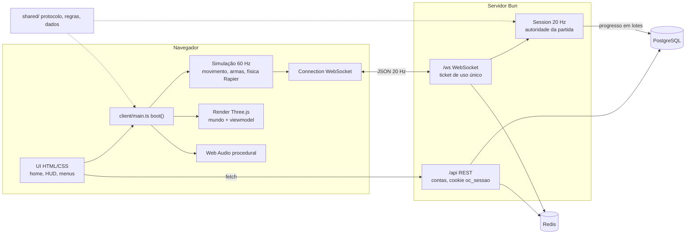

# Visão geral da arquitetura

Visão de alto nível. O detalhe de código está em [[Code Architecture Overview]], [[Client Architecture]] e [[Server Architecture]].

Offensive Combat é um **monorepo TypeScript** rodando inteiro em **Bun 1.4**, com um único `package.json` e três partes:

| Parte | Pasta | Papel |
|---|---|---|
| Cliente | `client/` | Jogo no navegador: Three.js r186 (render), Rapier (física WASM), Web Audio, UI em HTML/CSS. Empacotado pelo Vite em `dist/`. |
| Servidor | `server/` | Um `Bun.serve` na porta 8787: API REST `/api`, WebSocket `/ws` e arquivos estáticos. Autoridade das partidas online. |
| Compartilhado | `shared/` (alias `@shared/*`) | Protocolo, constantes, dados de armas e progressão, fórmulas de dano, movimento, mapas e aparência. Compilado nos dois lados. |

Também há `tools/` (CLI `offensive`, console de moderação `admin`, gerador de glTF de exemplo) e `deploy/` (nginx e systemd).

## Fluxo de execução

1. **Cliente:** `index.html` carrega `client/main.ts`, e o `boot()` cria a física, o contexto de render e o áudio. A tela inicial (`client/ui/home.ts`) devolve a escolha (`offline`, `bots` ou `online`). O mapa é construído em código ou a partir de glTF ([[World Structure]]), os sistemas viram variáveis locais da closure e `startLoop(step, render)` roda a simulação em passo fixo de 1/60 s com render interpolado ([[ADR - Simulação em passo fixo com render interpolado]], [[ADR - Bootstrap do cliente numa única closure]]).
2. **Servidor:** `server/index.ts` chama `startServer()` (`server/app.ts`). As salas abrem sob demanda (`play`: uma sala da versão atual do mapa com vaga, ou uma nova) e fecham vazias, e cada `Session` (`server/session.ts`) roda a 20 Hz. Ela é autoritativa para vida, dano, abates, pontos, respawn, corpos e coletáveis, e valida cada relato do cliente com regras compartilhadas e tolerância de lag. O movimento é confiado ao cliente ([[ADR - Movimento confiado ao cliente]], [[ADR - Acertos informados pelo cliente com tolerância de lag]]).
3. **Dados:** PostgreSQL guarda contas, perfis, progresso, sanções e auditoria; as migrations rodam na subida ([[Database]], [[Data Migrations]]). Redis guarda limites de taxa, tickets do WebSocket e os canais pub/sub de revogação e silêncio ([[Cache]]).
4. **Deploy:** Docker Compose (nginx público, jogo, Postgres 18, Redis 8) ou nginx + systemd numa VPS ([[Infrastructure Overview]], [[Hosting]]).

## Princípios que atravessam o projeto

- **Regras num lugar só:** `shared/` define protocolo, dano e movimento para cliente e servidor ([[ADR - Código compartilhado entre cliente e servidor]], [[Shared Systems]]).
- **Servidor como autoridade do resultado, cliente como autoridade da posição:** detalhado em [[Client Server Model]] e [[Trust Boundaries]].
- **Tudo procedural:** texturas, personagens, armas e sons são gerados em código, sem arquivos de asset ([[Art Direction]], [[ADR - Áudio procedural em Web Audio]]).
- **Mesma lógica de combate nos 3 modos:** só muda quem aplica o resultado (servidor, `BotManager` ou `Dummy`) ([[Client Architecture]]).

## Ver também

[[Systems Map]] · [[Dependencies Map]] · [[Networking Overview]] · [[Backend Overview]] · [[Performance Overview]]
