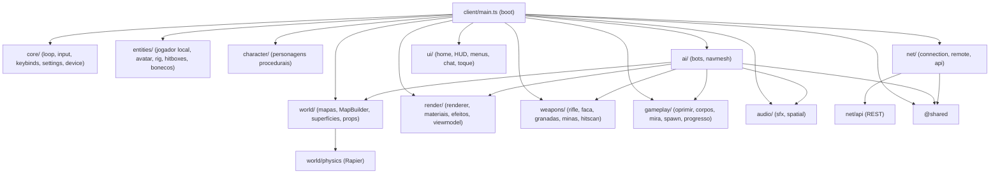
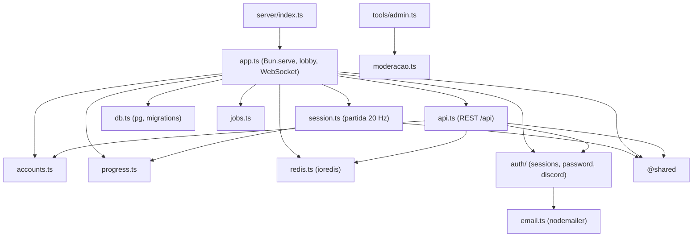

# Mapa de dependências

Quem depende de quem, levantado dos `import` reais (código confirmado em 2026-10-05). Para o papel de cada módulo, ver [[Modules]]. Para bibliotecas externas e versões, ver [[External References]].

## Cliente

`client/main.ts` é o ponto de integração: importa todas as pastas do cliente e as amarra dentro de `boot()` ([[ADR - Bootstrap do cliente numa única closure]]). As pastas não se conhecem diretamente, exceto onde o diagrama mostra.

## Servidor

- `session.ts` só depende de `progress.ts` e de `@shared`: a lógica da partida não acessa banco nem Redis diretamente. O progresso é gravado por `app.ts` ([[ADR - Progresso gravado em lotes por delta]]).
- A moderação (`moderacao.ts`) é usada pelo console `tools/admin.ts`. O aviso de silêncio ou revogação chega às partidas pelos canais Redis ([[Moderation]], [[Events & Messaging]]).

## Compartilhado

`shared/` não importa nada de `client/` nem de `server/`. Cliente e servidor importam `@shared/*` (protocolo, constantes, armas, movimento, mapas, progressão, aparência e catálogo) ([[ADR - Código compartilhado entre cliente e servidor]], [[Shared Systems]]).

## Bibliotecas externas e onde entram

| Biblioteca | Usada em | Para |
|---|---|---|
| `three` | cliente inteiro | render ([[Rendering Overview]]) |
| `@dimforge/rapier3d-compat` | `client/main.ts`, `client/world/` | física e raycasts ([[World Structure]], [[Spatial Audio]]) |
| `recast-navigation` | `client/ai/navmesh.ts` | navmesh dos bots ([[Navigation]]) |
| `pg` | `server/db.ts` | PostgreSQL ([[Database]]) |
| `ioredis` | `server/redis.ts` | Redis ([[Cache]]) |
| `arctic` | `server/auth/discord.ts` | OAuth do Discord ([[Authentication]]) |
| `nodemailer` | `server/email.ts` | e-mail SMTP ([[External Services]]) |

## Dependências de sistema (comportamento)

| Sistema | Depende de |
|---|---|
| [[Damage System]] | [[Weapons]], regiões de [[Combat]] e hitboxes, penetração das superfícies ([[Cover & Combat Spaces]]) |
| [[Scoring]] | [[Damage System]] (tipo do abate), [[Humiliation]] |
| [[Progression]] | [[Scoring]] (pontos por arma), [[Player Data]] |
| [[Humiliation]] | corpos e tempo de morte de [[Respawn]], [[Interaction System]] |
| [[Buffs & Debuffs]] | [[Pickups]], [[Map Gags]], [[Health System]] |
| [[Versus Bots]] | [[NPC Behavior]], [[Navigation]] (navmesh dos colisores do mapa) |
| [[Spatial Audio]] | colisores e superfícies do mapa (oclusão por raycast) |
| [[Free For All]] online | [[Sessions]], [[Authentication]] (ticket), [[Validation]] |
