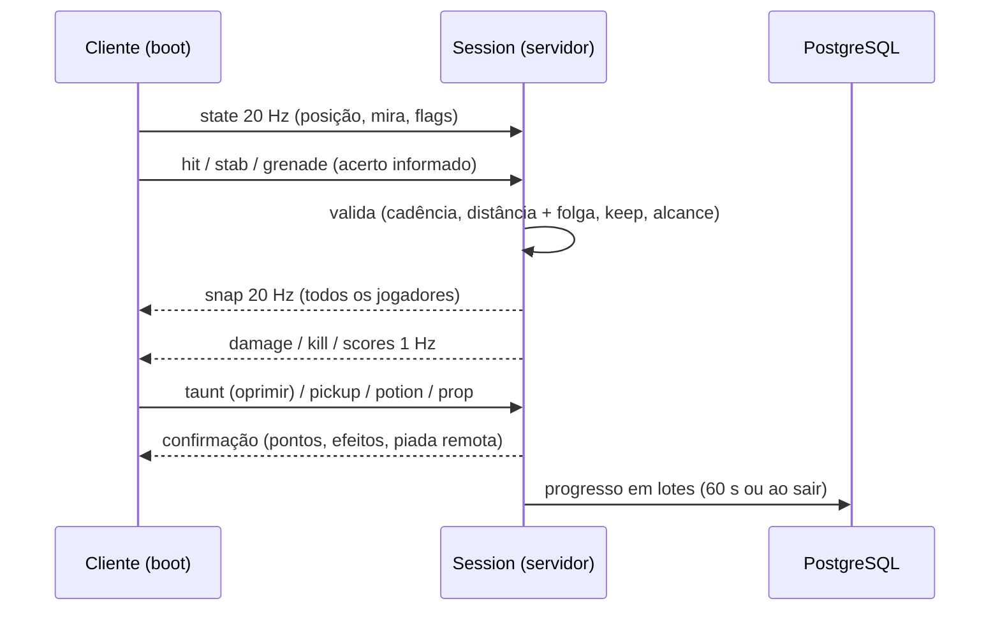

# Mapa dos sistemas

Lista cada sistema do jogo, o que ele faz e onde está documentado (comportamento, implementação, apresentação e rede), seguindo a separação do README do cofre. As dependências entre eles estão em [[Dependencies Map]].

## Sistemas de jogo

| Sistema | O que faz | Comportamento | Implementação / apresentação / rede |
|---|---|---|---|
| Movimento | Andar, correr, agachar, deslizar, pular, dano de queda | [[Movement]] | [[Shared Systems]] · [[Animation]] · [[Replication]] |
| Armas | Rifle (primária) e pistola ou submetralhadora (secundária), hitscan com dispersão, recuo, mira e penetração; melhorias por nível ([[Progression]]) | [[Weapons]] · [[Combat]] | [[Weapon Models]] · [[Remote Calls]] |
| Dano e vida | Fórmula de dano, regiões, regeneração, morte | [[Damage System]] · [[Health System]] | [[Validation]] · [[Client Server Model]] |
| Faca | Golpe fatal com investida e bônus pelas costas | [[Melee]] | [[Validation]] |
| Granadas e minas | Granada de impacto, mina (nível 2), Dose Dupla (nível 3) | [[Grenades]] · [[Land Mines]] | [[Particles]] · [[Anti Exploit]] |
| Opressão | Dança sobre o corpo, 150 pontos | [[Humiliation]] | [[Music]] · [[HUD]] |
| Interação | Tecla de contexto (Oprimir, Beber Poção) | [[Interaction System]] | [[Input & Controls]] |
| Coletáveis e bônus | Cereja, biscoito, carpas, rato, poções, tiro ao alvo | [[Pickups]] · [[Buffs & Debuffs]] · [[Objectives]] | [[HUD]] · [[Remote Calls]] |
| Piadas de mapa | Objetos que reagem a tiro e faca, sincronizados | [[Map Gags]] · [[Interactive Objects]] | [[Events & Messaging]] · [[Audio Events]] |
| Assistência de mira | Ajuda no toque e no controle | [[Aim Assist]] | [[Touch Controls]] |
| Pontuação | Pontos por abate e bônus, placar | [[Scoring]] | [[Scoreboard]] |
| Respawn | Atraso, escolha de ponto seguro | [[Respawn]] · [[Spawn Design]] | [[Flow - Death and Respawn]] |
| Progressão | XP por arma, níveis, nível de conta | [[Progression]] | [[Player Data]] · [[Save System]] |

## Sistemas de mundo e apresentação

| Sistema | Nota principal | Relacionadas |
|---|---|---|
| Construção de mapas (código e glTF) | [[World Structure]] | [[Environment Pieces]] · [[Asset Pipeline]] · [[Maps Index]] |
| Renderização | [[Rendering Overview]] | [[Camera]] · [[Lighting]] · [[Materials]] · [[Shaders]] · [[Performance Rendering]] |
| Texturas e materiais | [[Texture System]] | [[Procedural Textures]] · [[Material Palette]] |
| Personagens | [[Character Models]] | [[Character Customization]] · [[Animation]] |
| Efeitos visuais | [[Visual Effects]] | [[Particles]] · [[Decals]] · [[VFX Assets]] |
| Áudio | [[Audio Overview]] | [[SFX]] · [[Spatial Audio]] · [[Ambient Audio]] · [[Audio Events]] |
| Interface | [[UI Overview]] | [[HUD]] · [[Menus]] · [[Chat]] · [[Settings]] · [[Notifications]] |
| Entrada | [[Input & Controls]] | [[Touch Controls]] · [[ADR - Teclas remapeáveis com primária e alternativa]] |
| IA | [[AI Overview]] | [[NPC Behavior]] · [[Navigation]] · [[States]] · [[AI Decisions]] |

## Sistemas de plataforma

| Sistema | Nota principal | Relacionadas |
|---|---|---|
| Arquitetura do cliente | [[Client Architecture]] | [[State Management]] · [[Modules]] · [[Controllers]] |
| Servidor e partidas | [[Server Architecture]] | [[Sessions]] · [[Match Services]] |
| Rede | [[Networking Overview]] | [[Client Server Model]] · [[Synchronization]] · [[Replication]] · [[Remote Calls]] |
| Salas (lobby) | [[Matchmaking]] | [[Matchmaking UI]] · [[Flow - Join Online Match]] |
| Contas e autenticação | [[Authentication]] | [[APIs]] · [[Flow - First Access]] · [[Sensitive Data]] |
| Moderação | [[Moderation]] | [[Chat]] · [[Database]] |
| Persistência | [[Data Architecture]] | [[Database]] · [[Cache]] · [[Data Migrations]] · [[Configuration Data]] |
| Segurança | [[Security Overview]] | [[Trust Boundaries]] · [[Validation]] · [[Anti Exploit]] · [[Anti Cheat]] |
| Infraestrutura | [[Infrastructure Overview]] | [[Build Pipeline]] · [[Hosting]] · [[CI CD]] · [[Logging]] |
| Testes | [[Testing Overview]] | [[Unit Tests]] · [[Integration Tests]] · [[Gameplay Tests]] |

## Como os sistemas conversam numa partida online

Detalhes das mensagens: [[Remote Calls]]. Tempos e relógio: [[Synchronization]].
