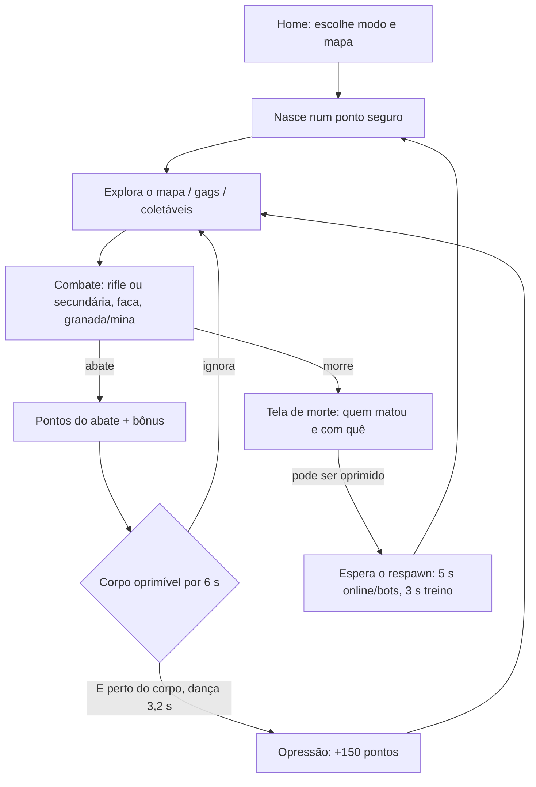
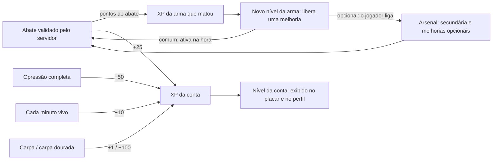

# Core Loop

O jogo tem três laços encaixados: o **laço de combate** (segundos), o **laço da vida** (de um nascimento ao próximo) e o **laço de progressão** (entre sessões, só online).

## Laço de combate e de vida

1. **Nascer**: o cliente escolhe um ponto de nascimento seguro ([[Respawn]]).
2. **Procurar briga**: andar, correr, deslizar ([[Movement]]). No caminho há coletáveis e gags ([[Objectives]], [[Map Gags]]).
3. **Combater**: rifle ou a secundária (pistola ou submetralhadora, trocadas com 1/2/roda), todas hitscan; faca que mata com um golpe; granada de impacto ou mina ([[Combat]], [[Weapons]]).
4. **Abater**: o abate vale 100 pontos, mais os bônus (cabeça, virilha, faca, pelas costas, longa distância) ([[Scoring]]).
5. **Oprimir (opcional, risco × recompensa)**: o corpo fica oprimível por 6 s. Dançar sobre ele dura 3,2 s, o jogador não pode atirar e só a morte interrompe a dança. Ao completar, ganha +150 pontos ([[Humiliation]]).
6. **Morrer e voltar**: online, o respawn leva 5 s, tempo para a vítima assistir à própria opressão.

## Laço de progressão (só online, com conta)

- Os pontos de cada abate viram XP **só da arma que matou** (rifle, pistola, submetralhadora, faca ou granada). Cada nível novo libera uma **melhoria**: as comuns ficam ativas na hora; as opcionais têm uma troca e o jogador as liga no Arsenal ([[Progression]], [[ADR - Progressão por melhorias de arma]]).
- O nível da conta é só exibido: não libera nada no código atual.
- O treino e o modo contra bots **usam** os níveis e a escolha do Arsenal da conta, mas **não dão** pontos.

## Laço de sessão

> [!info] Comportamento confirmado
> O código não tem **fim de partida**. A sessão online é contínua: o jogador entra e sai quando quiser. Os pontos e abates da sessão vivem em memória e recomeçam do zero ao entrar de novo. Só a progressão da conta e as estatísticas persistem ([[Free For All]], [[Problem - Partidas sem fim]]).

## Notas relacionadas

[[Game Concept]] · [[Core Pillars]] · [[Game Rules]] · [[Player Experience]] · [[Flow - Death and Respawn]] · [[Flow - Join Online Match]]

## Código relacionado

- `client/main.ts`: loop de simulação, respawn, prêmios (`award`), dança
- `server/session.ts`: `kill`, `onTauntEnd`, `tick` (XP por tempo vivo)
- `server/progress.ts`: `addWeaponXp`, `addAccountXp`, `addTime`
- `shared/constants.ts`: `SCORE`, `HUMILIATION`
