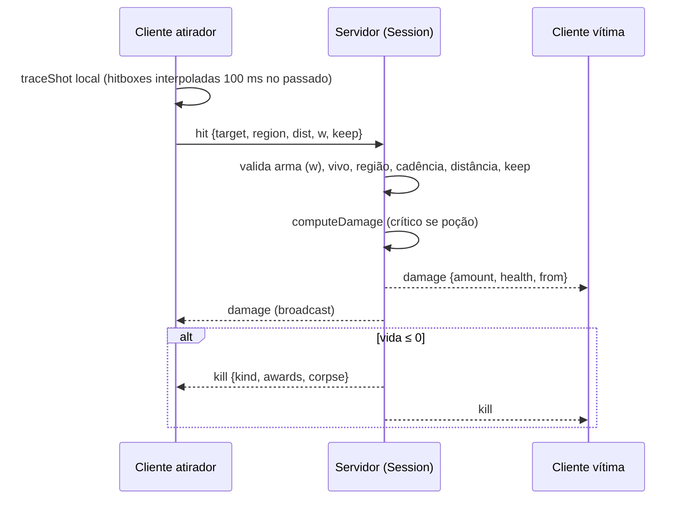

# Damage System

Nota central de **todas as fórmulas de dano**. Outras notas ([[Weapons]], [[Melee]], [[Grenades]], [[Combat]]) apontam para cá.

> [!info] Evidência
> Código confirmado: `shared/weapons.ts` (fórmulas compartilhadas por cliente e servidor), `server/session.ts` (aplicação autoritativa online), `client/entities/hitboxes.ts` (zonas).

## Objetivo

Transformar um acerto (bala, faca, explosão, queda, mapa) em perda de vida de forma idêntica offline, contra bots e online, com o servidor como autoridade online.

## Tipos de dano (`KillKind`)

| Tipo | Origem | Dano |
|---|---|---|
| `gun` | arma de fogo no corpo | fórmula da arma de fogo |
| `head` | arma de fogo na cabeça | fórmula da arma de fogo (×2,5 no rifle) |
| `groin` | arma de fogo na virilha | **morte instantânea** (9999) |
| `knife` | faca | **morte instantânea** (`letal: true`) |
| `grenade` | granada/mina de outro | fórmula de explosão |
| `explosion` | sua própria granada/mina | fórmula de explosão (sem proteção) |
| `fall` | queda > 6 m | `round((h − 6) × 15 + 10)` |
| `void` | cair abaixo do `killY` do mapa | 9999 |
| `dog` | mordida da Amora ([[Map - Rua dos Vizinhos]]) | 9999 |
| `thorns` | espinhos da grade e da sebe do [[Map - Cemitério da Capela]] (modo [[Zombie]]): o golpe e o sangramento | `espinhos.dano` (10) e `espinhos.sangraDano` (2 por segundo) |

`LETHAL_DAMAGE = 9999`.

## Arma de fogo: fórmula

A mesma fórmula vale para o rifle e todas as secundárias. Na **garrucha** (`bagos: 8`), a fórmula vale **por bago**: cada bago é um raio próprio, com a sua distância, região e `keep`, e cada um que acerta é um acerto (e um dano) separado; `dano` no JSON é o de um bago (20 → 4, queda entre 5 e 15 m). Ver [[Weapons#Secundárias]]. Os números saem de `gunStats(arma, melhorias)` (`shared/arsenal.ts`): o JSON da arma com as melhorias ativas aplicadas (o silenciador, por exemplo, multiplica o dano por 0,9). Valores de cada arma em [[Weapons]]; os exemplos abaixo são do rifle sem melhorias.

```
dano = max(1, round( danoPorDistância(dist) × multiplicador[região] × keep ))
```

1. **Queda por distância** (`damageAtDistance`): dano máximo até `distMax` (20 m), interpolação linear até o mínimo em `distMin` (45 m), mínimo depois disso. Nível 1: 30 → 20. A distância é o caminho total da bala, incluindo superfícies atravessadas.
2. **Multiplicador por região** (nível 1, `rifle_padrao.json`):

| Região (`HitRegion`) | Multiplicador | Dano nível 1 a ≤ 20 m |
|---|---|---|
| `cabeca` | 2,5 | 75 |
| `pescoco` | 1,5 | 45 |
| `peito` | 1,0 | 30 |
| `abdomen` | 1,0 | 30 |
| `quadril` | 0,9 | 27 |
| `bracos` | 0,75 | 23 (22,5 arredondado) |
| `maos` | 0,5 | 15 |
| `coxas` | 0,75 | 23 |
| `canelas` | 0,6 | 18 |
| `virilha` | — | 9999 (instantâneo) |

3. **`keep`** (penetração): produto das frações de cada superfície atravessada (madeira 0,6, vidro 0,9, papel 0,95; até 2 superfícies). Menor `keep` possível do rifle = 0,6² = 0,36; da pistola e das outras secundárias (1 superfície, madeira 0,5) = 0,5; a garrucha não atravessa nada (sem `penetracao`, `keep` = 1).
4. **Virilha ignora tudo**: mata mesmo atravessando madeira.
5. **Poção do crítico**: enquanto ativa, todo tiro do jogador é calculado como `cabeca` (o acerto continua contando onde caiu para pontos), **exceto a virilha**, que continua morte instantânea. A regra é `critRegion` (`shared/weapons.ts`), usada no servidor (jogadores e zumbis) e no jogo offline (bots e campo de tiro). Até 2026-10-06 a virilha também virava cabeça: o abate contava "No pássaro" mas com dano de cabeça. Ver [[Buffs & Debuffs]].

## Hitboxes

15 formas (esferas/cápsulas) presas aos ossos do esqueleto canônico, **iguais para todos os corpos** e independentes de roupas/altura (decisão em [[ADR - Altura e biotipo apenas visuais]]):

- Cabeça: esfera de 12 cm × 1,12 (10–15% maior que a visual, para tiros de raspão contarem).
- Pescoço, peito, abdômen, quadril: cápsulas.
- Braços (braço + antebraço por lado), mãos (esfera), coxas, canelas.
- **Virilha**: caixa no espaço do osso do quadril; um acerto em `quadril`, `abdomen` ou `coxas` que cai dentro dela é reclassificado como `virilha` ("No pássaro!") por `refineRegion`.
- Modo PCD: membro ausente não tem hitbox (sem perna fica só o coto da coxa).
- As poses (agachar, mirar, recarregar, dançar, slide) movem as hitboxes; F4 as mostra (virilha em amarelo). Ver [[Character Models]].

## Faca

`letal: true` ⇒ 9999 em qualquer acerto válido. Se algum dia `letal` for `false`, o código usa 55 fixo. Detalhes de alcance em [[Melee]].

## Explosão (granada e mina)

```
dist ≤ raioDanoMaximo (2,5 m) → 85
2,5 m < dist ≤ raioDano (7 m) → interpolação linear 85 → 12 (arredondado)
dist > 7 m → 0
```

- A distância é medida da explosão a 3 pontos do corpo (pés + 0,3 m, 1,1 m e 1,6 m), usando o mais próximo **com linha livre** (paredes bloqueiam). Se todos estão bloqueados, não há dano.
- `podeMatar: false` limitaria o dano a deixar o alvo com ≥ 1 HP — **só protege os outros, nunca o lançador**. O nível 1 atual tem `podeMatar: true` (ver [[Problem - Comentários dizem que a granada nível 1 não é letal]]).
- A explosão vem de `grenadeStats(melhorias).explosao` (`shared/arsenal.ts`): o nível 1 do JSON, com os raios ×1,2 na melhoria Pólvora. O servidor guarda a explosão de cada granada no momento do lançamento. Os tipos (mina, dupla) mudam o **comportamento**, não o dano. Ver [[Grenades]].

## Fluxo autoritativo online



Validações do servidor (`server/session.ts`):

| Ação | Verificação |
|---|---|
| `hit` | atirador e alvo vivos; região válida; `w` é a arma em mãos (`FLAG.secondary`) ou a guardada há < 1 s (`SWITCH_GRACE_MS`), e está no loadout; ≤ `ceil(cadência/60) + 2` acertos por segundo; distância servidor (olho 1,6 m → peito 1,1 m) ≤ alcance e `|servidor − relatado| ≤ 4 m + 10%`; `keep` limitado a [`minPenetrationKeep` da arma; 1]. Cadência, dano, alcance e penetração são os de `gunStats` daquela arma com as melhorias do jogador |
| `stab` | intervalo ≥ 75% do `intervalo` da faca; distância horizontal ≤ `alcanceInvestida + 1,5 m` |
| `boom` | granada registrada; mina a ≤ 1,5 m de onde foi plantada; granada de impacto dentro do alcance físico possível (`v·t + 4,9·t² + 3`) e do tempo máximo de voo; granada por pavio não antes de `pavio − 0,5 s`; por alvo, distância ≤ `raioDano + 3` e `|servidor − relatado| ≤ 3` |
| `selfDamage` | só quantidades positivas finitas, limitadas a 9999; causas `fall`/`void`/`dog` |

Não há rewind de hitboxes nem checagem de linha de visão no servidor ("Not yet" no cabeçalho de `session.ts`). Ver [[Anti Cheat]], [[Validation]].

## Aplicação

`damage()` (servidor) e `LocalPlayer.damage()` / `Dummy.applyHit()` (cliente offline): `dealt = min(vida, quantidade)`, marca `lastDamageAt` (reinicia a regeneração — ver [[Health System]]); vida ≤ 0 ⇒ morte, corpo e pontos (ver [[Scoring]], [[Respawn]], [[Humiliation]]).

## Exceções

- Dano mínimo de bala é 1.
- Offline (campo de tiro) o boneco recebe o dano direto; contra bots o `BotManager` aplica as mesmas regras do servidor.
- Online o cliente só **mostra** hitmarker e o número de dano na hora; vida e morte vêm do servidor.

## Número de dano na tela

Cada tiro que acerta mostra, só para quem atirou, o dano causado num número flutuante: amarelo no acerto comum, laranja quando o dano usa o multiplicador da cabeça (tiro na cabeça ou poção do crítico, a regra de `critRegion`) e vermelho no pássaro (virilha). O valor é o desta nota, limitado à vida que o alvo tinha. Detalhes (de onde sai cada valor, previsão online e no zumbi) em [[HUD#Números de dano]].

## Código relacionado

- `shared/weapons.ts` — `computeDamage`, `damageAtDistance`, `explosionDamage`, `clampExplosionDamage`, `minPenetrationKeep`, `INSTANT_KILL_REGIONS`, `LETHAL_DAMAGE`.
- `client/entities/hitboxes.ts` — `ZONES`, `zonesFor`, `GROIN`, `GROIN_FROM`, `isBehind`.
- `client/entities/rig.ts` — `refineRegion`.
- `client/main.ts` — `shoot` hook, `resolveMelee`, `explode`, `blastDistance`.
- `server/session.ts` — `onHit`, `firedGun`, `onStab`, `onBoom`, `damage`, `kill`.
- `shared/arsenal.ts` — `gunStats`, `meleeStats`, `grenadeStats` (atributos com as melhorias).

## Configurações relacionadas

`dano`, `multiplicadores`, `penetracao` (`rifle_padrao.json`, `pistola.json`, `smg.json` e os das outras armas), `bagos` (`garrucha.json`); efeitos das melhorias (`progression.json`); `niveis` (`granada_frag.json`); `letal` (`faca.json`); `MOVE.fallDamageHeight/fallDamagePerMeter`. Ver [[Constants Reference]].
