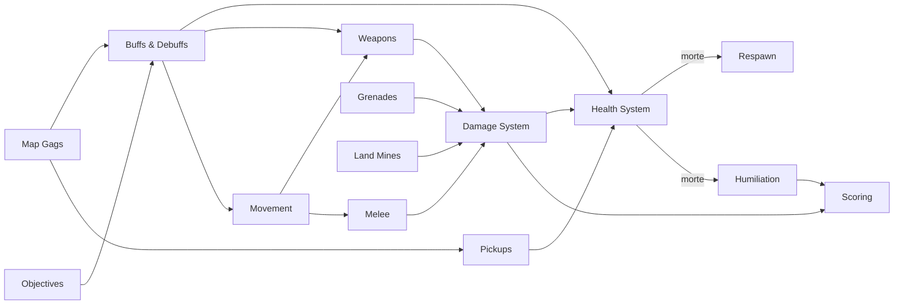

# Mechanics Index

Porta de entrada das mecânicas de **Offensive Combat**: FPS de arena "todos contra todos" no navegador, com arsenal fixo (rifle, faca, granada), mortes instantâneas especiais e a **Opressão** (dançar no corpo de quem você matou). Regras de design globais em [[Game Rules]]; loop em [[Core Loop]].

## Mapa das mecânicas

## Núcleo

| Nota | Resumo |
|---|---|
| [[Movement]] | andar 5,5 / correr 8 / agachar 2,8 m/s, pulo 1,1 m, slide até 10,5 m/s, degraus 0,4 m, dano de queda acima de 6 m |
| [[Combat]] | visão geral, prioridades por tick (tiro > sprint/granada), autoridade por modo |
| [[Weapons]] | rifle (primária) + pistola ou submetralhadora (secundária), hitscan, dispersão em 4 estados, recuo semi-determinístico, ADS, penetração, troca de arma com tempo de saque, melhorias por nível |
| [[Damage System]] | **fonte única das fórmulas**: queda por distância, multiplicadores por região, virilha/faca instantâneas, explosão, validação no servidor |
| [[Health System]] | 100 HP, regeneração 25/s após 4 s, vida máxima dinâmica (até 200) |
| [[Interaction System]] | tecla de contexto E (Oprimir / Beber Poção), encostar, atirar em objetos |
| [[Respawn]] | atraso e escolha de ponto de renascimento |
| [[Scoring]] | pontos por abate e bônus, XP de conta |
| [[Objectives]] | não há objetivos de modo; metas de mapa e recompensas |

## Itens e coletáveis

| Nota | Resumo |
|---|---|
| [[Inventory]] | **não existe** — loadout: rifle + secundária (troca 1/2/roda) + faca + granada |
| [[Items]] | as armas (sete rifles, pistola, submetralhadora, sete facas, granada) e suas melhorias (miras, granada/mina/Dose Dupla) |
| [[Pickups]] | Cereja do Dragão (+50 vida máx. por 30 s) e Biscoito Scooby (cura total) |

## Outras mecânicas (`Other Mechanics/`)

| Nota | Resumo |
|---|---|
| [[Humiliation]] | Opressão: dançar 3,2 s num corpo em até 6 s após a morte → 150 pontos |
| [[Grenades]] | granada de impacto, cozinhar até 3 s, 2 cargas (+1/10 s), Dose Dupla |
| [[Land Mines]] | granada nível 2: mina plantada, arma em 1 s, até 3, some ao renascer |
| [[Melee]] | faca F mata com um golpe, investida de 3,2 m, bônus pelas costas |
| [[Aim Assist]] | só toque/controle, desligado por padrão: desacelera e acompanha |
| [[Buffs & Debuffs]] | cereja, humanidade, mira afiada, 5 poções da bruxa, modificadores PCD |
| [[Map Gags]] | piadas ambientais sincronizadas pelo `PropBus` (hidrantes, sinos, abóboras, armário...) |

## Mecânicas que não existem

Para evitar invenções futuras: não há inventário, armas/munição no chão, armadura, times, objetivos de modo (bandeira/zona), compra de armas na partida, *killstreaks* nem fim de partida (ver [[Problem - Partidas sem fim]]).

## Referências

- Valores numéricos: [[Constants Reference]].
- Modos: [[Game Modes Index]] ([[Free For All]], [[Training]], [[Versus Bots]]).
- Mapas: [[Maps Index]].
- Rede e validação: [[Client Server Model]], [[Anti Cheat]].
- Termos: [[Glossary]].
