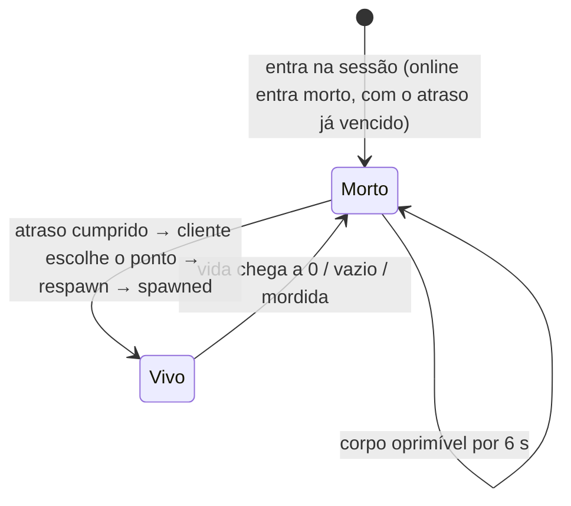

# Respawn

## Objetivo

Devolver o jogador à partida depois da morte. O intervalo é curto, mas longo o bastante para a vítima ver a própria [[Humiliation]], e o ponto de nascimento deve ser justo (nem em cima de alguém nem na mira de alguém).

## Atraso por modo

| Modo | Atraso | Fonte | Proteção ao nascer |
| --- | --- | --- | --- |
| [[Free For All]] (online) | **5 s** (`NET.respawnDelay`). O servidor aceita a partir de 4,75 s, e o cliente espera 5,3 s | `shared/protocol.ts`, `server/session.ts`, `client/main.ts` | não |
| [[Versus Bots]] | **5 s** (jogador e bots) | `client/main.ts`, `RESPAWN` em `client/ai/bots.ts` | **2 s** |
| [[Training]] | **3 s** | `RESPAWN_DELAY` em `client/entities/localPlayer.ts` | não |

O comentário de `NET.respawnDelay` diz: *"long enough to watch your own humiliation"*. Ver [[ADR - Atraso de respawn de 5 s online]].

## Como o jogador interage

Nenhuma ação: o respawn é **automático** quando o tempo acaba. A tela de morte mostra "Renascendo em {s}…", quem matou e com qual arma ([[Flow - Death and Respawn]]).

## Escolha do ponto de nascimento

**Quem escolhe é o cliente**, inclusive online. Ele manda `respawn { p, yaw }` e o servidor só confere o formato e o tempo (não a posição). Ver [[Trust Boundaries]].

### Mata-mata livre (online e contra bots): `pickSafeSpawn`

Usa os pontos neutros `spawnsFFA` do mapa: **21** na Rua dos Vizinhos, **28** no Jardim do Dragão e **25** na Vila Assombrada. Num mapa glTF, sem `SPAWN_FFA_*`, usa A + B. Cada ponto recebe uma nota:

| Critério (contra cada ameaça viva) | Efeito na nota |
| --- | --- |
| Base aleatória | +0 a 4 |
| Distância até a ameaça mais próxima (até 60 m) | + distância |
| Ameaça a menos de **2 m** | −1000 (praticamente proibido) |
| Ameaça a menos de **15 m** | −25 |
| Ameaça com **linha de visão** até a cabeça do ponto | −20 |

O ponto é **sorteado entre os 3 melhores**, para não ficar previsível. Online, as ameaças são os jogadores remotos vivos, e o último ponto usado fica de fora. Contra bots, as ameaças são todos os combatentes vivos (o seletor do `BotManager` não exclui o último ponto). Ver [[Spawn Design]].

### Treino

Sorteio simples entre os `spawnsA` do mapa, sem repetir o último.

## O que acontece ao nascer

- Vida cheia na máxima do corpo (100) ([[Health System]]).
- Pente, reserva e cargas de granada recarregados (`weapon.refill`, `thrower.refill`).
- As **minas do jogador somem** (só existem durante a vida em que foram plantadas): `mines.clearOwner` no cliente, e o servidor apaga as minas do jogador no `respawn`. Os outros clientes as removem ao receber `spawned` ([[Land Mines]]).
- Contra bots, começa a **proteção de 2 s**: o jogador pisca, não recebe dano e os bots o ignoram. A proteção **acaba ao atirar** (`unprotect`).

## O que se perde ao morrer

Bônus da cereja, humanidade do rato, efeito de poção (inclusive o pato), mira afiada (carpa dourada ou tiro ao alvo), granadas em voo (o servidor limpa a lista) e o segundo lançamento pendente da "Dose Dupla". Ver [[Buffs & Debuffs]].

## Estados

## Exceções e casos especiais

- **Entrar numa sessão online:** o jogador entra morto, com `deadAt` recuado em 5 s, e nasce na hora.
- **Respawn recusado (online):** se o servidor ainda não aceitou (pedido cedo demais), o cliente reenvia o pedido depois de 1,5 s, quando percebe pelo `snap` que continua morto.
- **Online sem proteção de nascimento:** só o modo contra bots tem proteção.
- **Bonecos de treino** renascem sozinhos: 6,8 s depois da morte, ou 2,4 s depois de uma opressão, e só se ninguém estiver em cima ([[Training]]).

## Dependências

[[Spawn Design]] · [[Health System]] · [[Humiliation]] · [[Land Mines]] · [[Buffs & Debuffs]] · [[Sessions]] · [[Synchronization]]

## Código relacionado

- `client/main.ts`: `pickSpawn`, `respawn`, ramo `player.dead` no `stepInner`, reenvio no handler `snap`
- `client/gameplay/spawnPicker.ts`: `pickSafeSpawn`
- `client/entities/localPlayer.ts`: `respawnDelay`, `canRespawn`, `respawnIn`
- `server/session.ts`: `case 'respawn'` (tempo mínimo, vida, limpeza de minas), `kill` (limpeza de bônus)
- `client/ai/bots.ts`: `RESPAWN`, `SPAWN_PROTECTION`, `protect` / `unprotect`, `pickSpawn`
- `client/entities/dummy.ts`: respawn dos bonecos

## Configurações relacionadas

`NET.respawnDelay`, `NET.corpseWindow` (`shared/protocol.ts`); `RESPAWN_DELAY` (`client/entities/localPlayer.ts`); `RESPAWN` e `SPAWN_PROTECTION` (`client/ai/bots.ts`); listas `spawnsA`, `spawnsB` e `spawnsFFA` de cada mapa; marcadores `SPAWN_*` em mapas glTF ([[Map Design Rules]]).
