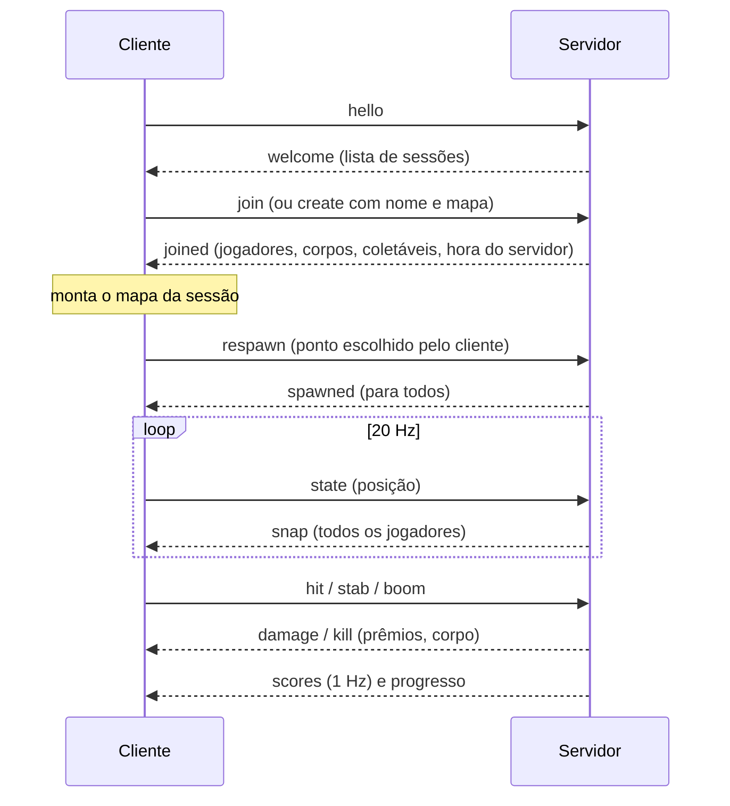

# Free For All

**Mata-mata livre online** ("Sessão: {nome} · mata-mata livre"): cada sessão é uma sala de até **10 jogadores**, todos contra todos, com regras aplicadas pelo servidor. É o único modo online.

> O modo [[Versus Bots]] usa as mesmas regras de mata-mata livre, mas offline e com bots. Esta nota trata da versão online.

## Objetivo

Fazer o máximo de **pontos** ([[Scoring]]): abater (100 + bônus) e oprimir corpos (150). O placar ordena por pontos, depois por abates (mais) e por mortes (menos).

## Condição de vitória

**Não existe.** O código não tem limite de abates, limite de tempo, rodada nem tela de fim de partida. O README lista "fim de partida (limite de abates e tempo) e votação de mapa" como **ainda não feito**. Ver [[Problem - Partidas sem fim]].

## Condição de derrota

Não existe. Morrer só soma uma morte e espera o respawn.

## Times

Nenhum: todos contra todos. Não há fogo amigo porque não há times ([[Team Deathmatch]]).

## Regras

- **Entrada:** exige conta. O WebSocket abre com um ticket de uso único. A mesma conta só joga em um lugar: uma conexão nova derruba a antiga (código de fechamento `4002`). Ver [[Authentication]].
- **Sessões:**
  - Uma **sessão permanente por mapa**, sempre presente: "Rua dos Vizinhos" (id `principal`), "Jardim do Dragão" (`jardim`) e "Vila Assombrada" (`halloween`).
  - Qualquer jogador pode **criar** uma sessão com nome (até 24 caracteres; vazio vira "Sala de {Nome}") e mapa. Ela é apagada quando fica vazia.
  - A lista mostra primeiro as permanentes, depois as mais cheias. Entrar numa sessão lotada responde "Sessão lotada."
- **Nomes repetidos** na mesma sessão ganham sufixo: "Nome (2)".
- **Regras de combate e opressão:** as globais ([[Game Rules]], [[Combat]], [[Humiliation]]), validadas pelo servidor ([[Validation]]).
- **Coletáveis e bônus do mapa** (cereja, biscoito, carpas, rato, poções): validados e aplicados pelo servidor ([[Objectives]], [[Buffs & Debuffs]]).
- **Armas:** cada jogador entra com o loadout da conta (rifle, a secundária escolhida, faca e granada, com as melhorias liberadas), resolvido pelo servidor e enviado a todos (`playerLoadout`). Dano, cadência e alcance são os da arma que atirou com as melhorias do jogador ([[Weapons]], [[Validation]]).
- **Granadas:** a explosão vem de `grenadeStats` (nível 1 do JSON, raio ×1,2 com a Pólvora). O tipo (granada, mina ou dupla) segue a melhoria opcional ligada ([[Grenades]]).

## Fluxo da partida

1. O jogador entra **morto**, com o atraso de respawn já vencido, e o cliente pede o nascimento na hora.
2. Joga indefinidamente. `Esc` → "Sair para o início" sai da sessão (`leave`).
3. Ao sair, a participação é fechada no banco e o progresso é gravado.

Detalhes de protocolo em [[Remote Calls]] e [[Sessions]]. Detalhes do fluxo de interface em [[Flow - Join Online Match]].

## Respawn

- Atraso de **5 s** (`NET.respawnDelay`). O servidor aceita a partir de 4,75 s, e o cliente espera 5,3 s. Se o servidor recusar, o cliente pede de novo depois de 1,5 s.
- Pontos neutros `spawnsFFA` com o seletor seguro. **Sem proteção de nascimento.**
- Ver [[Respawn]] e [[ADR - Atraso de respawn de 5 s online]].

## Pontuação

- A tabela `SCORE`, calculada no servidor ([[Scoring]]).
- O placar da sessão (pontos, abates, mortes, opressões) fica **em memória** e recomeça do zero a cada entrada.
- Persistem na conta: XP das armas, a escolha do Arsenal, XP da conta, estatísticas e a participação (pontos, abates e mortes daquela entrada). Ver [[Progression]] e [[Player Data]].

## Limites de tempo

Nenhum limite de partida. Os temporizadores existentes são de regra: janela de opressão de 6 s, respawn de 5 s e bônus de 30–60 s.

## Configurações

| Constante | Valor | Arquivo |
| --- | --- | --- |
| `NET.maxPlayers` | 10 | `shared/protocol.ts` |
| `NET.respawnDelay` | 5 s | `shared/protocol.ts` |
| `NET.corpseWindow` | 6 s (= `HUMILIATION.window`) | `shared/protocol.ts` |
| `NET.tickRate` / `stateRate` | 20 Hz | `shared/protocol.ts` |
| `NET.sessionNameMax` | 24 | `shared/protocol.ts` |
| `SWITCH_GRACE_MS` | 1000 ms (acertos da arma guardada após a troca) | `server/session.ts` |
| Sessões permanentes | `rua`, `jardim`, `halloween` | `server/app.ts` |
| Gravação do progresso | a cada 60 s e ao sair | `server/app.ts` (`FLUSH_EVERY_MS`) |

## Sistemas utilizados

[[Combat]] · [[Damage System]] · [[Health System]] · [[Humiliation]] · [[Grenades]] · [[Land Mines]] · [[Melee]] · [[Pickups]] · [[Buffs & Debuffs]] · [[Map Gags]] · [[Progression]] · [[Client Server Model]] · [[Replication]] · [[Synchronization]] · [[Chat]] · [[Moderation]]

## Código relacionado

- `server/session.ts`: a classe `Session` (regras, validação, tick, placar)
- `server/app.ts`: lobby, sessões permanentes, criação e remoção, gravação do progresso
- `client/ui/home.ts`: lista de sessões, criar e entrar
- `client/main.ts`: handlers `conn.on(...)`, respawn online
- `client/gameplay/spawnPicker.ts`: escolha do ponto de nascimento

## UI relacionada

[[Matchmaking UI]] (lista de sessões) · [[HUD]] · [[Scoreboard]] (`Tab`) · [[Chat]] · [[Notifications]] (kill feed, entrou/saiu)
