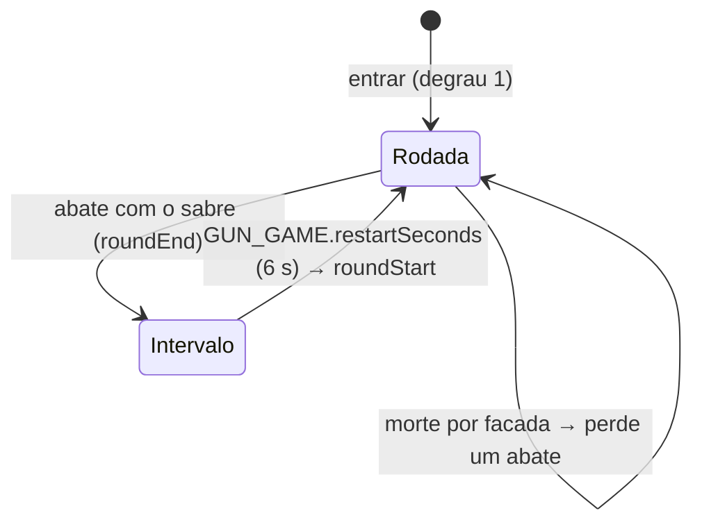

# Gun Game

**Corrida armada** (`'corrida-armada'` em [[Shared Systems|shared/modes.ts]]): todos sobem a **mesma escada de armas**. Cada degrau é uma arma com atributos fixos; quem faz **3 abates com a arma do degrau** sobe um degrau, quem **morre por facada perde um abate** (e, sem abates no degrau, volta uma arma), e o **abate com o Sabre de Luz**, no último degrau, vence a rodada. Existe online (servidor com autoridade) e contra bots (o `BotManager` aplica as mesmas regras).

> As regras globais (vida, dano, opressão, coletáveis, respawn) são as de [[Game Rules]], [[Combat]] e [[Respawn]]. Esta nota só registra o que difere. Decisão: [[ADR - Corrida armada]].

## Objetivo

Ser o primeiro a passar por toda a escada e matar alguém com o **Sabre de Luz**.

## Condição de vitória

O **abate final com o sabre** no último degrau (`GUN_GAME.finalKills` = 1 abate, de `abatesFinais` em `shared/data/corrida_armada.json`). O servidor anuncia `roundEnd {winner, name, restartAt}` para a sala; todos veem o cartão "{nome} venceu a corrida armada!" (ou "VOCÊ VENCEU…") com a contagem "Nova rodada em N…".

## Condição de derrota

Não há eliminação. Perde quem não chega ao fim antes de outro jogador.

## Times

Nenhum: todos contra todos.

## Regras

### A escada (`shared/data/corrida_armada.json`)

| Degrau | id (texto `ladder_<id>`) | Arma | Melhorias fixas | Abates para passar |
|---|---|---|---|---|
| 1 | `rifleCompleto` — Rifle Completo | Rifle Padrão | ponto vermelho, empunhadura, pente | 3 |
| 2 | `smgTurbo` — Liquidificador Turbo | Submetralhadora | motor, holográfica, coronha | 3 |
| 3 | `rifleLuneta` — Rifle com Luneta | Rifle Padrão | empunhadura, luneta | 3 |
| 4 | `rifleSilenciado` — Rifle Silenciado | Rifle Padrão | silenciador (mira de ferro) | 3 |
| 5 | `pistolaRapida` — Pistola Ligeira | Pistola | gatilho, ponto vermelho, coldre | 3 |
| 6 | `pistolaBatata` — Pistola da Batata | Pistola | silenciador de batata | 3 |
| 7 | `sabre` — Sabre de Luz | Faca (`"faca": "sabre"`) | — | **1 abate vence** |

- Os atributos vêm de `gunStats(arma, melhorias)` / `meleeStats('sabre', [])` com **as melhorias do degrau**, nunca as liberadas pelo jogador: todo mundo tem a mesma arma no mesmo degrau ([[Weapons]]).
- A escada usa só o Rifle Padrão (os rifles e as facas antigos do Arsenal não entram na corrida — [[ADR - Rifles e facas antigos como armas próprias]]). Como as melhorias não mudam mais a pintura, o Rifle Completo (com o pente) e o Rifle com Luneta têm a pintura do Rifle Padrão.
- Cada degrau dá **só aquela arma** (sem secundária) e a **faca de cozinha** para o golpe rápido (`F`/`V`), qualquer que seja a faca do Arsenal (`ladderLoadout` devolve `faca: 'faca'`). Não há granadas (`MODE_RULES['corrida-armada'].grenades = false`): o servidor ignora `grenade` e o cliente zera a carga.
- O total é 6 × 3 + 1 = **19 abates** para vencer. A ordem vai das armas mais fáceis (automáticas com mira) às mais difíceis (pistola com silenciador, sabre).

### Subir, descer, vencer (`shared/gunGame.ts`, funções puras)

- `afterKill(pos, kind, arma)`: o abate só conta se foi **com a arma do degrau** (`gun`/`head`/`groin` com a mesma `GunId`; no último degrau, `knife`). Ao completar 3, o jogador sobe com 0 abates e recebe a arma nova **na hora**, com pente cheio.
- Facada (faca comum) em outros degraus **não conta** para quem esfaqueou.
- `afterDeath(pos, kind)`: morrer por **facada** (`kind: 'knife'`, faca ou sabre) tira **um abate** (sem abates no degrau, volta à arma anterior com um abate a menos que o necessário; no começo da escada, nada). Ex.: degrau 3 com 2 abates → degrau 3 com 1; degrau 3 com 0 → degrau 2 com 2 de 3; do sabre → última arma com 2 de 3. Até 2026-10-06 a facada descia o degrau inteiro e zerava os abates. Quedas, cachorro, a própria granada e tiros não fazem descer.
- Quem entra no meio da rodada começa no primeiro degrau.

### O Sabre de Luz na mão

No último degrau o loadout é `{ soFaca: true, faca: 'sabre' }` (a faca Sabre de Luz, sem melhorias; `ladderProblems` confere que o último degrau é ela):

- O sabre fica **sempre visível na mão** em primeira pessoa (`Viewmodel.setBladeOnly`, pose `VM_FEEL.blade`) e em terceira pessoa (`AvatarPose.blade`: pose de guarda; as armas de fogo nem aparecem nas costas).
- O **botão de tiro golpeia** (e a tecla de faca também); não há mira, recarga nem troca de arma. O HUD esconde a munição.
- O servidor recusa tiros de armas de fogo (`gunOf` devolve null para `soFaca`).
- Esse "andar com a faca na mão" **só existe neste modo**: os outros continuam com a faca só no golpe rápido ([[Melee]]).

## Fluxo da partida

- **Intervalo** (`roundEnd` → `roundStart`, 6 s, `reinicioSegundos`): ninguém causa dano a ninguém (`combatOpen()` falso; quedas e o mapa ainda matam). O cartão do vencedor fica na tela.
- **Nova rodada** (`roundStart {players}`): o servidor zera degraus, abates, mortes, pontos e opressões, devolve o primeiro degrau (`playerLoadout` de cada um) e deixa todos **mortos com o respawn liberado**; cada cliente nasce na hora num ponto seguro.

## Respawn

Igual ao [[Free For All]] online (5 s) e ao [[Versus Bots]] offline (5 s, proteção de 2 s). Na troca de rodada, todos renascem imediatamente.

## Pontuação

- A tabela `SCORE` continua valendo para os pontos da rodada (popups, placar), mas **o placar é ordenado pela escada** (degrau, depois abates no degrau), com a coluna **Arma** ("3/7 · 1/3").
- **XP** (online): os abates **não dão pontos às armas** (`weaponXp: false`), porque as armas são da escada e não do Arsenal do jogador. A conta ganha XP como nos outros modos (abate, opressão, minuto vivo, peixe) e o vencedor ganha **+150 XP de conta** (`xpVitoria`). As estatísticas da conta (abates, mortes, tiros na cabeça, facadas…) contam normalmente. Ver [[Progression]].
- Contra bots não há progresso (como em todo modo offline).

## Limites de tempo

Nenhum limite de rodada. Só o intervalo de 6 s entre rodadas.

## Configurações

| Dado | Valor | Arquivo |
|---|---|---|
| `abatesPorArma` | 3 | `shared/data/corrida_armada.json` |
| `abatesFinais` | 1 | idem |
| `reinicioSegundos` | 6 | idem |
| `xpVitoria` | 150 | idem |
| `escada` | 7 degraus | idem |
| `MODE_RULES['corrida-armada']` | `weapons: 'mode'`, `lockedLoadout`, sem granadas, sem XP de arma, com rodadas, com bots | `shared/modes.ts` |
| Salas fixas | `corrida-armada-rua`, `corrida-armada-jardim`, `corrida-armada-halloween` | `server/app.ts` |

## Sistemas utilizados

[[Weapons]] · [[Melee]] · [[Combat]] · [[Damage System]] · [[Humiliation]] · [[Respawn]] · [[Progression]] · [[Sessions]] · [[Matchmaking]] · [[Client Server Model]] · [[Validation]] · [[Remote Calls]]

## Código relacionado

- `shared/gunGame.ts`: escada, `ladderLoadout`, `killCounts`, `afterKill`, `afterDeath`, `ladderProblems` (checado nos testes)
- `shared/data/corrida_armada.json`: degraus e números do modo
- `server/modes.ts`: `GunGameMode` (degrau por jogador, armas, rodada, XP de vitória)
- `server/session.ts`: ganchos do modo, `setLoadout` (manda `playerLoadout` a todos), `resetForRound`, tiros em voo da arma anterior aceitos por 1 s
- `client/ai/bots.ts` (`climb`, `newRound`) e `client/ai/bot.ts` (`arm`, bot só com lâmina corre para esfaquear)
- `client/main.ts`: `takeLadderWeapons`, `watchLadder`, `endRound`, `startRound`, modo lâmina (`bladeOnly`)
- Testes: `server/tests/modes.test.ts`

## UI relacionada

- [[HUD]]: faixa "ARMA N/7 · nome · ●●○" sob o placar (rosa no sabre), banners "Próxima arma!", "Esfaqueado! Perdeu um abate (n/3)", "Esfaqueado! Voltou para…", cartão do vencedor.
- [[Menus]]: na pausa, a escada inteira (degrau atual em amarelo) no lugar do Arsenal.
- [[Scoreboard]]: coluna Arma e ordem pela escada.
- [[Matchmaking UI]]: "Tipo de partida" e etiqueta do modo na lista de sessões.
