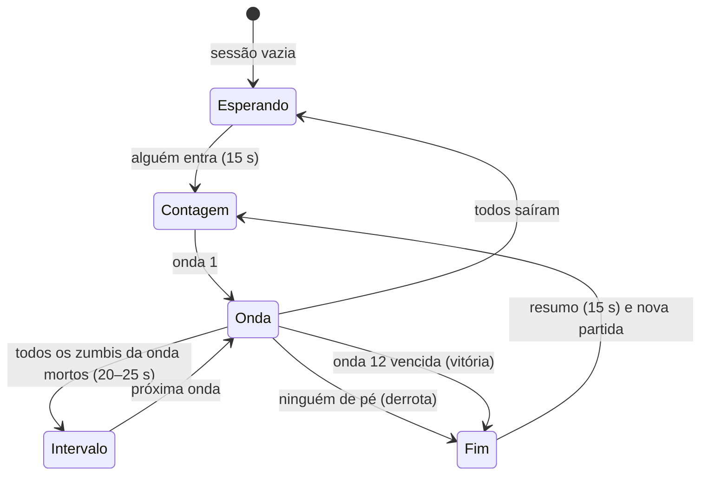

# Zombie

**Zumbi** (`'zumbi'` em [[Shared Systems|shared/modes.ts]]): sobrevivência **cooperativa em ondas** na [[Map - Vila Assombrada]]. A vizinhança morreu e voltou: os zumbis saem das covas do cemitério, do esgoto, da floresta e da estrada e vêm atrás de quem está de pé. Cada zumbi morto dá **XP de conta** a quem matou (só online, decidido pelo servidor) e **dinheiro da partida**, gasto no **Caixão Misterioso** para sortear armas melhores. Todo mundo começa com o mesmo Rifle Padrão sem melhorias: **comprar armas é a progressão do modo**. São **12 ondas** e **3 chefes**; sobreviver à última vence.

> As regras globais (movimento, tiro, hitboxes, coletáveis) são as de [[Game Rules]], [[Combat]] e [[Damage System]]. Esta nota registra o que difere. Decisões: [[ADR - Modo zumbi cooperativo com caixão e raridades]] (design) e [[ADR - Zumbis simulados no servidor sobre navmesh pré-gerada]] (arquitetura).

## Ambientação

- **Onde:** só na Vila Assombrada (`MODE_RULES.zumbi.maps = ['halloween']`): a noite, o cemitério com covas, a mansão, o esgoto e a praça aberta já são o cenário de um filme de zumbi. Os outros mapas (de dia, ou o jardim oriental) não combinam com a ficção e precisariam de pontos de surgimento e de uma navmesh própria (ver "Limites").
- **Clima** (`client/zombies/ambience.ts`): a névoa chega mais perto e fica esverdeada (10–90 m, `#2c3a30`) e o luar escurece 15%; numa **onda de chefe** a névoa vai ficando vermelho-sangue. Isso também poupa a GPU da metade distante do mapa.
- **Som** ([[SFX]], Web Audio procedural): o **sino da capela** toca três vezes a cada onda (mais grave numa onda de chefe), um acorde de órgão quando ela acaba, gemidos dos 6 zumbis mais próximos, terra rachando quando um sai do chão, o "ka-ching" da caixa registradora a cada dinheiro, a caixinha de música do caixão, rugidos e telegrafias dos chefes, batimento cardíaco quando você está caído.
- **Os zumbis são os vizinhos** (`client/zombies/looks.ts`), montados com o mesmo sistema de personagens dos jogadores ([[Character Customization]]): pele verde-acinzentada, olhos amarelos ou vermelhos e caídos, cicatrizes, roupas do catálogo. O vizinho de pijama, o turista de camisa havaiana, o mecânico **sem um braço** (modo PCD: sem braço e sem a hitbox dele), o executivo de gravata, a roqueira, a vovó de cardigã. Os chefes ganham adereços próprios: a pá do Coveiro, o véu da Noiva, a faixa de prefeito.

## Objetivo

Sobreviver às 12 ondas com o time, matando todos os zumbis de cada uma, e derrotar os chefes das ondas 4, 8 e 12.

## Condição de vitória

Matar todos os zumbis da **onda 12** (o Prefeito e a escolta dele). Todos na partida ganham **+250 XP de conta** (`xp.vitoria`) e veem o resumo ("SOBREVIVERAM À HORDA!").

## Condição de derrota

Durante uma onda, **ninguém de pé**: todos caídos ou mortos. Sozinho, cair é perder (não há quem reanime). O resumo diz "A HORDA VENCEU".

## Times

Um só time: todos os jogadores da sessão contra os zumbis. **Não há fogo amigo** (`combatOpen()` sempre falso: tiros, facadas e granadas de um jogador não ferem outro; a própria granada ainda fere você). Não se oprime corpo de colega e as estatísticas de abates/mortes da conta não mudam ([[ADR - Modo zumbi cooperativo com caixão e raridades]]).

## Regras

### O que todo mundo carrega

| Item | No modo zumbi |
|---|---|
| Primária | **Rifle Padrão sem melhorias**, o mesmo para todos: as melhorias e a secundária do Arsenal da conta **não valem** aqui (`startItems`, `zombieLoadout`) |
| Secundária | vazia até sair uma do caixão |
| Faca | a comum (golpe rápido `F`/`V`): **120 de dano** contra zumbis (mata um zumbi da onda 1, depois só ajuda); o Sabre de Luz do caixão multiplica pela raridade |
| Granadas | 2 granadas de fragmentação básicas (sem mina nem Dose Dupla), **devolvidas só no intervalo** entre ondas (não recarregam com o tempo). Contra zumbis o dano cresce 25% por onda (`armas.granadaPorOnda`) |
| Munição | reserva **×3** (`armas.municaoReserva`), cheia de novo em todo intervalo |

### As ondas (`ondas` em `shared/data/zumbi.json`)

Zumbis por onda para 1 jogador; com mais gente, × (1 + 0,6 × (jogadores − 1)) (4 jogadores: ×2,8). No máximo `min(24, 8 + 4 × jogadores + ⌊onda/2⌋)` andando ao mesmo tempo; os outros esperam a vez.

| Onda | Zumbis (1 / 4 jog.) | Vida do comum | Surge a cada | Comuns correndo | Variantes (chance) | Chefe |
|---|---|---|---|---|---|---|
| 1 | 8 / 22 | 100 | 2,2 s | 0% | — | |
| 2 | 12 / 34 | 118 | 2,0 s | 0% | — | |
| 3 | 16 / 45 | 139 | 1,8 s | 15% | Maratonista 10% | |
| 4 | 10 / 28 | 164 | 1,8 s | 20% | Maratonista 15% | **O Coveiro** |
| 5 | 22 / 62 | 194 | 1,5 s | 30% | Maratonista 15%, Tio do Churrasco 8% | |
| 6 | 26 / 73 | 229 | 1,4 s | 40% | + Segurança 6% | |
| 7 | 30 / 84 | 270 | 1,2 s | 50% | + Tia da Fofoca 8% | |
| 8 | 14 / 39 | 319 | 1,2 s | 50% | Maratonista 20%, Tia 12% | **A Noiva** |
| 9 | 34 / 95 | 376 | 1,0 s | 60% | todas (10–18%) | |
| 10 | 38 / 106 | 444 | 0,9 s | 70% | todas (12–20%) | |
| 11 | 42 / 118 | 524 | 0,8 s | 75% | todas (12–22%) | |
| 12 | 18 / 50 | 618 | 0,8 s | 80% | todas (12–25%) | **O Prefeito** |

- A vida cresce ~18% por onda e o golpe dos zumbis 4% por onda (`danoPorOnda`: 25 na onda 1, 36 na 12). A dificuldade também vem de **mais corredores, mais variantes e menos tempo entre eles**.
- **Contagem regressiva** de 15 s antes da onda 1 (`inicioSegundos`: hora de achar o caixão), **intervalo** de 20 s (25 s depois de chefe) entre ondas. No intervalo a munição e as granadas enchem, quem estava caído levanta e quem morreu volta.
- Uma onda acaba quando os zumbis dela (os do chefe inclusive) morreram todos. Em média, 1,5–3 minutos por onda: uma partida inteira leva 25–35 minutos.

### Tipos de zumbi (`tipos`)

| Tipo (no jogo) | id | Visual | Vida | Velocidade | Ataque | Comportamento | $ / XP | Desde |
|---|---|---|---|---|---|---|---|---|
| Zumbi | `comum` | os vizinhos (6 visuais) | ×1 | anda 1,4–1,9 m/s; corre 3,2–3,8 | arranhão 25 (alcance 1,3 m, preparo 0,5 s, a cada 1,3 s) | vem atrás do jogador de pé mais próximo e arranha; a **virilha mata na hora** ("No pássaro!") | 60 / 3 | 1 |
| Maratonista | `corredor` | agasalho e faixa na testa | ×0,6 | 5,4–6,2 m/s (mais que andar, menos que correr) | 15 (preparo 0,35 s) | chega rápido, pouco resistente | 70 / 4 | 3 |
| Tio do Churrasco | `inchado` | regata, bermuda de praia, barrigão | ×1,6 | lento | — | a 2,2 m de alguém **incha 1 s e estoura** (3,5 m: até 50 nos jogadores, 150 nos zumbis). Morto, estoura também: os zumbis que a explosão mata pagam a quem matou o tio ("explosão em cadeia") | 80 / 6 | 5 |
| Segurança da Balada | `brutamontes` | camiseta preta, óculos escuros, 1,25× | ×3,5 | lento | 45 (alcance 1,7 m) | tanque | 120 / 8 | 6 |
| Tia da Fofoca | `cuspidor` | bata, coque, lenço | ×1,2 | 2,0–2,4 | cuspe 15 (raio 1,3 m), arranhão 10 | de 5 a 14 m e com linha aberta (raycast na navmesh), para e **cospe** uma bola verde que cai **onde você estava** (13 m/s): dá para desviar. A cada 3,2 s | 90 / 6 | 7 |

Todo zumbi **sai do chão** (1,2 s, já pode levar tiro) num ponto de surgimento a pelo menos 14 m de todos os jogadores de pé (a altura conta dobrado), entre os 6 mais próximos de alguém, para chegar logo. Zumbi parado por 8 s longe do alvo volta a sair do chão perto dos jogadores (destrava).

### Chefes (`chefes`)

Vida × (1 + 0,75 × (jogadores − 1)). Chefe não morre de um tiro na virilha: lá o dano é **dobrado**. Cada golpe especial é **telegrafado** (anel ou faixa no chão que enche até o golpe cair, pose e som), e o servidor aplica o dano quando ele cai (`t1`).

| Chefe | Onda | Onde surge | Vida (1 / 4 jog.) | Tamanho, velocidade | Golpes |
|---|---|---|---|---|---|
| **O Coveiro** (macacão, chapéu de palha, pá) | 4 | centro do cemitério | 3.500 / 11.375 | 1,6×, 2,4 m/s, pá 40 | **Pancada de pá**: alguém a 5 m → ergue a pá 1,2 s (anel vermelho de 4,5 m) → 45 em todos no anel; a cada 7 s. **Chamar os mortos**: ajoelha 1,5 s (anel verde) → 4 zumbis saem do chão em volta (40% correndo); o primeiro 6 s depois de surgir, depois a cada 16 s |
| **A Noiva** (vestido branco, coroa de flores, véu) | 8 | oeste do cemitério, perto da capela | 6.000 / 19.500 | 1,3×, **4,2 m/s**, 30 | **Grito**: alguém a ~10 m → inspira 1 s (anel roxo de 12 m) → 15 de dano e **lentidão** (55% da velocidade por 3 s, "Arrepiado") em todos a 12 m; a cada 10 s. **Sumir**: some 0,7 s (sem hitbox, fumaça roxa) e reaparece ~3 m **depois** do alvo, já arranhando; quando o alvo está a 15 m ou mais (ou de surpresa), a cada 8 s |
| **O Prefeito** (terno, gravata, fedora, faixa de prefeito) | 12 | Praça da Lua Cheia | 12.000 / 39.000 | **1,8×**, 2,2 m/s, 50 (alcance 2,8 m) | **Investida**: alvo a 6–22 m no mesmo nível → 1,1 s de aviso (faixa vermelha) → corre em linha a 13 m/s por até 18 m (para antes das paredes: raycast na navmesh): 50 de dano e **arremessa** quem estiver no caminho; a cada 9 s. **Tremor**: alguém a 12 m → 1,4 s erguendo os punhos (anel laranja) → uma onda de choque cresce a 9 m/s até 15 m: 35 em quem estiver **no chão** quando ela passa — **pular a onda** escapa ("PULE A ONDA!"); a cada 12 s. **Fúria** (metade da vida): +40% de velocidade, recargas ×0,7 e chama 3 Maratonistas a cada 15 s |

Quem mata o chefe ganha $500 e 50 XP; **todo o time** que não está morto ganha $1.000 ($1.500 do Prefeito) e 100 XP (150 do Prefeito). A barra de vida do chefe fica no alto da tela.

### Dinheiro (`dinheiro`) — só da partida, nunca salvo

| Evento | $ |
|---|---|
| Começo da partida (e ao entrar no meio) | 500 |
| Abate | do tipo (60–120; chefe 500) |
| + tiro na cabeça | +40 |
| + facada | +60 |
| Ajuda (≥ 10% da vida do zumbi, outro matou) | +25 |
| Reanimar um colega | +100 |
| Onda vencida (quem não está morto) | +100 |
| Chefe derrotado (o time, menos os mortos) | +1.000 / +1.500 |

### O Caixão Misterioso (`caixa`, `itens`, `raridades`)

Um caixão velho com um "?" brilhando e um **feixe de luz** que se vê de longe, num de **5 lugares** do mapa (sorteado no começo): trilha do cemitério, praça (lado oeste), jardim da mansão, parque (fora dos carrinhos de bate-bate) e calçada da vila.

- `E` perto dele (2,2 m): paga **$950** e gira (3,5 s, as armas passam piscando). Para numa arma, que fica flutuando, na cor da raridade, por **8 s** só para quem pagou: `E` de novo pega. Não pegou, perdeu.
- O sorteio é **no servidor** online (`rollBox`, `Math.random` do servidor): primeiro a raridade pelo peso, depois uma arma dela. **Nunca sai a arma que você já tem naquele lugar.**
- A arma nova vai para o **lugar dela** (rifle → primária; pistola/submetralhadora → secundária; sabre → faca) e a que estava lá **é jogada fora**.
- **A raridade multiplica o dano contra zumbis** (não muda o comportamento da arma): é a "força" do modo, já que as melhorias de arma mexem em cadência, mira e pente, mas quase nunca em dano.

| Raridade | Chance | Dano × | Armas (arma + melhorias fixas) |
|---|---|---|---|
| Inicial | — | 1,0 | Rifle Padrão (só no começo) |
| Comum | 50% | 1,4 | Rifle com Ponto Vermelho; Rifle Silencioso (ponto vermelho + silenciador); Pistola do Porteiro; Pistola da Batata; Liquidificador |
| Rara | 32% | 1,9 | Rifle Firme (ponto vermelho + empunhadura); Rifle do Vovô (empunhadura + luneta); Pistola Ligeira (gatilho + ponto vermelho + coldre); Liquidificador com Motor (motor + holográfica) |
| Épica | 14% | 2,6 | Rifle Remendado (empunhadura + pente); Liquidificador Turbo (motor + holo + coronha); Liquidificador Pipoqueiro (motor + holo + tambor) |
| Lendária | 4% | 3,5 | Rifle Completo (ponto vermelho + empunhadura + pente); Liquidificador Supremo (as 4); **Sabre de Luz Paraguaio** (a faca vira sabre: 420 por golpe) |

- **O pato de borracha**: a partir da 4ª rodada no mesmo lugar, cada rodada tem 15% de chance (+5% a cada uma depois, até 90%, `duckChance`) de sair um **pato** em vez de arma: quack, **o dinheiro volta**, e o caixão sobe girando na noite e reaparece noutro dos lugares 9 s depois ("Procure a luz no céu").
- Na pausa, o painel do Arsenal vira a página do caixão: o que você carrega (com a cor da raridade) e as chances.

### Caído, reanimar, morrer

- Vida a zero **durante uma onda** (zumbi, chefe, queda, a própria granada; **não** cair para fora do mapa): você **cai** (`Session.onLethal` → `ZombieMatch.lethal`). Caído não anda, não atira, a câmera fica rente ao chão, a tela mostra "CAÍDO!" e quanto falta para sangrar; os zumbis passam a ignorar você.
- Um colega fica a até 2,5 m e **segura E por 3 s** ("Segure para reanimar Fulano", cruz vermelha sobre quem caiu, vista através das paredes): você levanta com 50% da vida e ele ganha $100 e 10 XP. Afastar-se ou soltar cancela.
- Ninguém veio em **30 s**: você **sangra até morrer** e fica fora até o **intervalo**; volta lá com o **rifle inicial** (as armas do caixão se perdem) e com o seu dinheiro.
- No fim de cada onda, quem está caído levanta sozinho. Morrer fora de uma onda (uma queda no intervalo) é o renascimento comum de 5 s ([[Respawn]]).
- Quem entra no meio da partida já entra de pé, com $500 e o rifle inicial. Sair e voltar zera dinheiro e armas.

## Fluxo da partida

- **Resumo** (`zend`): título, onda alcançada, tempo e, por jogador, abates, tiros na cabeça, dinheiro ganho, quantas vezes caiu, quantos reanimou e o XP ganho (online). Depois de 15 s (`fimSegundos`), uma partida nova começa para quem está lá (`roundStart`): todos renascem com $500 e o rifle inicial.

## Respawn

Ver "Caído, reanimar, morrer". Na troca de partida todos renascem na hora. O ponto de nascimento evita zumbis (12 m) e prefere ficar perto de um colega de pé (`pickSpawn` em `client/main.ts`).

## Pontuação

- **Placar** (`Tab`, [[Scoreboard]]): abates de zumbi, dinheiro atual, vezes caído, reanimações e ping; quem está caído aparece com "✚". O número "Pontos" do HUD é o dinheiro ganho na partida.
- **XP de conta** (só online, sempre do servidor, [[Progression]]): por abate 3–8 XP conforme o tipo, chefe (50 a quem mata, 100–150 ao time), onda vencida +10, reanimar +10, vitória +250, além do XP por minuto vivo que vale em todo modo. Uma partida vencida de ~30 min dá em torno de 1.500–1.700 XP.
- **Sem XP de arma** (`weaponXp: false`): as armas são do caixão, não do Arsenal do jogador (mesmo motivo da [[Gun Game]]), e o PvE não vira atalho para as melhorias do PvP.
- **Sem estatística de abates/mortes da conta**: zumbis não são jogadores, e morrer para eles não mexe no K/D.
- Sozinho (offline) não há XP, como em todo modo offline.

## Limites de tempo

Nenhum limite por onda. Contagem de 15 s, intervalos de 20/25 s, resumo de 15 s.

## Configurações

Tudo em `shared/data/zumbi.json` (lido por `shared/zombies.ts` como o objeto `ZOMBIE`; os testes encurtam os tempos e preços nele):

| Chave | Valor | O que é |
|---|---|---|
| `inicioSegundos` / `intervaloSegundos` / `intervaloChefeSegundos` / `fimSegundos` | 15 / 20 / 25 / 15 | os tempos da partida |
| `dinheiroInicial` | 500 | |
| `jogadoresFator` / `chefeVidaFator` | 0,6 / 0,75 | escala com o número de jogadores |
| `maxVivosBase` / `maxVivosPorJogador` / `maxVivosTeto` | 8 / 4 / 24 | quantos andam ao mesmo tempo |
| `danoPorOnda` | 0,04 | +4% de golpe por onda |
| `ondas[]` | 12 | ver a tabela |
| `tipos`, `chefes` | | vida, velocidade, ataque, golpes, $ e XP |
| `dinheiro`, `xp` | | prêmios |
| `jogador` | caído 30 s, reanimar 3 s, volta com 50%, alcance 2,5 m | |
| `armas` | faca 120, granada +25%/onda, reserva ×3 | |
| `caixa` | $950, gira 3,5 s, oferta 8 s, pato depois de 3 rodadas (15% +5%) | |
| `raridades`, `itens`, `inicial` | | o caixão |
| `mapas.halloween` | 25 pontos de surgimento, 5 lugares do caixão, onde cada chefe surge | |
| `MODE_RULES.zumbi` | `weapons: 'mode'`, `lockedLoadout`, `grenades`, sem XP de arma, `rounds`, `bots` (jogo solo), `coop`, `maps: ['halloween']` | `shared/modes.ts` |
| Sala fixa | `zumbi-halloween` | `server/app.ts` |

## Sistemas utilizados

[[Weapons]] · [[Melee]] · [[Grenades]] · [[Combat]] · [[Damage System]] · [[Health System]] · [[Respawn]] · [[Progression]] · [[Economy Design]] · [[Sessions]] · [[Client Server Model]] · [[Validation]] · [[Remote Calls]] · [[AI Overview]] · [[Navigation]] · [[NPC Behavior]]

## Código relacionado

- `shared/data/zumbi.json`: todos os números do modo.
- `shared/zombies.ts`: regras puras (`waveSpec`, `pickType`, `zombieHp`, `zombieHit`, `gunDamageToZombie`, `knifeDamageToZombie`, `grenadeDamageToZombie`, `killMoney`, `killXp`, `rollBox`, `duckChance`, `startItems`, `zombieLoadout`, `weaponMul`, flags `ZF` e o formato `ZNet`, `zombieProblems` checado nos testes).
- `shared/zombieMatch.ts`: o motor da partida (`ZombieMatch`): ondas, zumbis numa `Crowd` do Detour, ataques, chefes, cuspes e ondas de choque, o caixão, caído/reanimar, resumo. Roda no servidor e no navegador (solo).
- `server/modes.ts` (`ZombieMode`): liga o motor à `Session`, valida `zhit`/`zstab`/granadas contra as posições do servidor, dá o XP. `server/navmesh.ts`: carrega a navmesh pré-gerada. `server/session.ts`: ganchos novos e o estado `downed`.
- `tools/bake-navmesh.ts` (`bun run navmesh`) e `shared/data/navmesh/halloween.json`: a navmesh do mapa para o servidor ([[ADR - Zumbis simulados no servidor sobre navmesh pré-gerada]]).
- `client/zombies/`: `client.ts` (eventos, HUD, `E` no caixão e para reanimar, caído, renascimento), `view.ts` (zumbis desenhados e interpolados, hitboxes, telegrafias), `coffin.ts` (o caixão), `looks.ts` (visuais), `local.ts` (o jogo solo: o mesmo motor no navegador), `link.ts` (a interface `ZombieLink` entre o lado do cliente e a partida, online ou solo; sem DOM, para o jogo solo rodar nos testes), `ambience.ts` (névoa e a página do caixão na pausa).
- `client/character/animator.ts` (`zombie()`: pose de zumbi e dos golpes de chefe), `client/entities/rig.ts` (hitboxes com escala), `client/entities/avatar.ts` (`disarm`, `zombie`), `client/net/remote.ts` (colega caído deitado).
- Testes: `server/tests/zombies.test.ts` (inclui progressão de armas no modo, chefes contra vários jogadores, entrar no meio da onda e sangrar até o intervalo), `server/tests/progression-modes.test.ts` (matriz de modos) e `client/tests/offlineModes.test.ts` (jogo solo). Ver [[Integration Tests]].

## UI relacionada

- [[HUD]]: "ONDA 3/12 · 14 zumbis" (ou a contagem, ou o intervalo) sob o placar, barra do chefe, dinheiro sobre a vida, "+$100 Tiro na cabeça" nos pop-ups, nomes das armas na cor da raridade, faixas de onda e de chefe, "PULE A ONDA!", tela de caído, prompts do caixão e de reanimar, cartão de resumo.
- [[Scoreboard]]: colunas do modo.
- [[Matchmaking UI]]: "Zumbi" no tipo de partida (online e contra bots: "ENCARAR A HORDA SOZINHO"), só a Vila Assombrada nos mapas.
- [[Menus]]: a página do Caixão Misterioso na pausa.

## Limites e próximos passos

- Só um mapa. Outro mapa precisa de `mapas.<id>` no JSON, de uma navmesh pré-gerada (`BUILDERS` em `tools/bake-navmesh.ts`, `BAKED` em `server/navmesh.ts`) e de entrar em `MODE_RULES.zumbi.maps`.
- Zumbis não sobem em lugares fora da navmesh (em cima de um carro, de uma caixa): o jogador lá em cima ainda leva cuspe e golpes de chefe, mas foge dos arranhões. Ver [[Navigation]].
- O caixão tem colisão para os jogadores, mas não está na navmesh: um zumbi pode atravessá-lo (os lugares foram escolhidos fora das rotas).
- O ponto de surgimento do Prefeito (`mapas.halloween.chefe.prefeito` = `[0, 0, 38]`) fica em cima do banco da praça (`bench` em `(0, 38.6)` no `client/world/hauntedTown.ts`): a malha o põe na borda do banco, em `(0, 0.1, 37.8)`. Dali o raycast da investida bate na borda em quase toda direção, então a primeira investida só sai depois que ele anda alguns metros (no jogo ele anda logo atrás do alvo, por isso o efeito é pequeno; visto nos testes, onde ele fica parado). Mudar o ponto é decisão de mapa; não foi mudado.
- Não há "loja" de munição, perks nem portas pagas (ideias para depois).
