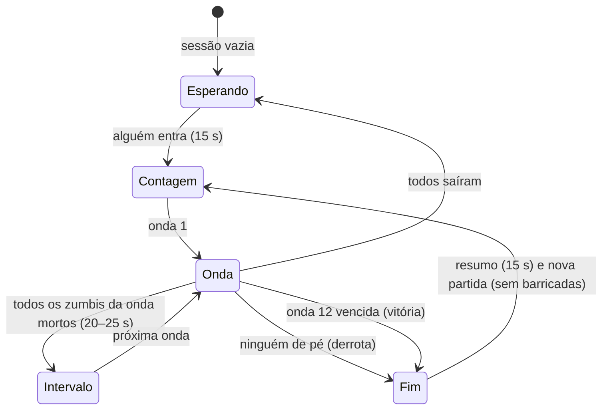

# Zombie

**Zumbi** (`'zumbi'` em [[Shared Systems|shared/modes.ts]]): sobrevivência **cooperativa em ondas** no [[Map - Cemitério da Capela]], um mapa **só deste modo**. A vizinhança morreu e voltou: os zumbis sobem das covas do campo do lado de fora do muro do cemitério e só entram pelas **cinco brechas** dele, que o time pode **barricar** para mandar a horda para onde quer. Cada zumbi morto dá **XP de conta** a quem matou (só online, decidido pelo servidor) e **dinheiro da partida**, gasto no **Caixão Misterioso** (armas aleatórias, que às vezes vêm **danificadas**) e em **barricadas**. Todo mundo começa com o mesmo Rifle Padrão sem melhorias: **comprar armas é a progressão do modo**. São **12 ondas** e **3 chefes**; sobreviver à última vence.

> As regras globais (movimento, tiro, hitboxes, coletáveis) são as de [[Game Rules]], [[Combat]] e [[Damage System]]. Esta nota registra o que difere. Decisões: [[ADR - Modo zumbi cooperativo com caixão e raridades]] (design original), [[ADR - Mapa exclusivo e barricadas no modo zumbi]] (mapa e barricadas), [[ADR - Caixão fixo com armas danificadas]] (o caixão, no lugar do pato), [[ADR - Zumbis simulados no servidor sobre navmesh pré-gerada]] e [[ADR - Barricadas como polígonos próprios na navmesh]] (arquitetura).

## Ambientação

- **Onde:** só no Cemitério da Capela (`MODE_RULES.zumbi.maps = ['cemiterio']`), e o cemitério só neste modo (`MAPS.cemiterio.exclusivo = 'zumbi'`: fora das salas, dos seletores e do campo de tiro dos outros modos). Pátio murado de 40 × 36 m em volta de uma capela num pedestal, campo de covas antigas fora do muro, sebe e mata seca em volta. Feito para **ler a horda**: muro de pedra baixa (0,6 m) com grades até 2,4 m (vê-se e atira-se através), covas baixas, lanternas em cada brecha.
- **Clima** (o próprio mapa e `client/zombies/ambience.ts`): noite de lua, **névoa verde `#2c3a30` afastada (18–85 m)** para as brechas e o campo continuarem visíveis de qualquer ponto do pátio; numa **onda de chefe** a névoa vai ficando vermelho-sangue.
- **Som** ([[SFX]], Web Audio procedural): o **sino da capela** toca três vezes a cada onda (mais grave numa onda de chefe), um acorde de órgão quando ela acaba, gemidos dos 6 zumbis mais próximos, **terra rachando e um gemido alto no ponto onde um zumbi vai sair** (3D), o "ka-ching" da caixa registradora a cada dinheiro, a caixinha de música do caixão e um **acorde azedo** quando sai arma danificada, **serrote e martelo** ao erguer barricada, martelada a cada tábua, pancadas e madeira estalando quando a horda bate, rugidos e telegrafias dos chefes, batimento cardíaco quando você está caído.
- **Os zumbis são os vizinhos** (`client/zombies/looks.ts`), montados com o mesmo sistema de personagens dos jogadores ([[Character Customization]]): pele verde-acinzentada, olhos amarelos ou vermelhos e caídos, cicatrizes, roupas do catálogo. O vizinho de pijama, o turista de camisa havaiana, o mecânico **sem um braço** (modo PCD: sem braço e sem a hitbox dele), o executivo de gravata, a roqueira, a vovó de cardigã. Os chefes ganham adereços próprios: a pá do Coveiro, o véu da Noiva, a faixa de prefeito.

## Objetivo

Sobreviver às 12 ondas com o time, matando todos os zumbis de cada uma, e derrotar os chefes das ondas 4, 8 e 12.

## Condição de vitória

Matar todos os zumbis da **onda 12** (o Prefeito e a escolta dele). Todos na partida ganham **+250 XP de conta** (`xp.vitoria`) e veem o resumo ("SOBREVIVERAM À HORDA!").

## Condição de derrota

Durante uma onda, **ninguém de pé**: todos caídos ou mortos. Sozinho, cair é perder (não há quem reanime). O resumo diz "A HORDA VENCEU".

## Times

Um só time: todos os jogadores da sessão contra os zumbis. **Não há fogo amigo** (`combatOpen()` sempre falso: tiros, facadas e granadas de um jogador não ferem outro; a própria granada ainda fere você). Não se oprime corpo de colega e as estatísticas de abates/mortes da conta não mudam ([[ADR - Modo zumbi cooperativo com caixão e raridades]]).

## Regras

### O que todo mundo carrega

| Item | No modo zumbi |
|---|---|
| Primária | **Rifle Padrão sem melhorias**, o mesmo para todos: as armas (rifle, secundária, faca) e as melhorias do Arsenal da conta **não valem** aqui (`startItems`, `zombieLoadout`) |
| Secundária | vazia até sair uma do caixão |
| Faca | a faca de cozinha (golpe rápido `F`/`V`): **120 de dano** contra zumbis (mata um zumbi da onda 1, depois só ajuda); o Sabre de Luz do caixão multiplica pela raridade |
| Granadas | 2 granadas de fragmentação básicas (sem mina nem Dose Dupla), **devolvidas só no intervalo** entre ondas (não recarregam com o tempo). Contra zumbis o dano cresce 25% por onda (`armas.granadaPorOnda`) |
| Munição | reserva **×3** (`armas.municaoReserva`), cheia de novo em todo intervalo (uma arma danificada por munição tem menos: ver o caixão) |

### As ondas (`ondas` em `shared/data/zumbi.json`)

Zumbis por onda para 1 jogador; com mais gente, × (1 + 0,6 × (jogadores − 1)) (4 jogadores: ×2,8). No máximo `min(24, 8 + 4 × jogadores + ⌊onda/2⌋)` andando (ou anunciados) ao mesmo tempo; os outros esperam a vez.

| Onda | Zumbis (1 / 4 jog.) | Vida do comum | Surge a cada | Comuns correndo | Variantes (chance) | Chefe |
|---|---|---|---|---|---|---|
| 1 | 8 / 22 | 100 | 2,2 s | 0% | — | |
| 2 | 12 / 34 | 118 | 2,0 s | 0% | — | |
| 3 | 16 / 45 | 139 | 1,8 s | 15% | Maratonista 10% | |
| 4 | 10 / 28 | 164 | 1,8 s | 20% | Maratonista 15% | **O Coveiro** |
| 5 | 22 / 62 | 194 | 1,5 s | 30% | Maratonista 15%, Tio do Churrasco 8% | |
| 6 | 26 / 73 | 229 | 1,4 s | 40% | + Segurança 6% | |
| 7 | 30 / 84 | 270 | 1,2 s | 50% | + Tia da Fofoca 8% | |
| 8 | 14 / 39 | 319 | 1,2 s | 50% | Maratonista 20%, Tia 12% | **A Noiva** |
| 9 | 34 / 95 | 376 | 1,0 s | 60% | todas (10–18%) | |
| 10 | 38 / 106 | 444 | 0,9 s | 70% | todas (12–20%) | |
| 11 | 42 / 118 | 524 | 0,8 s | 75% | todas (12–22%) | |
| 12 | 18 / 50 | 618 | 0,8 s | 80% | todas (12–25%) | **O Prefeito** |

- A vida cresce ~18% por onda e o golpe dos zumbis 4% por onda (`danoPorOnda`: 25 na onda 1, 36 na 12). A dificuldade também vem de **mais corredores, mais variantes e menos tempo entre eles**.
- **Contagem regressiva** de 15 s antes da onda 1 (`inicioSegundos`: hora de achar o caixão e decidir o que barricar), **intervalo** de 20 s (25 s depois de chefe) entre ondas. No intervalo a munição e as granadas enchem, quem estava caído levanta e quem morreu volta.
- Uma onda acaba quando os zumbis dela (os do chefe e os anunciados inclusive) morreram todos.

### De onde vem a horda

- Os zumbis **sobem só no campo de covas fora do muro** (24 pontos, `mapas.cemiterio.surgir`), nos 6 mais próximos de alguém que estão a pelo menos 14 m de todo jogador de pé (a altura conta dobrado). Nunca dentro do muro (`zombieProblems` confere os dados; o motor confere o ponto sorteado).
- **Telegrafia** (`zfx 'rise'`): **0,9 s antes** de cada zumbi aparecer, o ponto se acende — disco verde no chão, **duas mãos saindo da terra**, um **feixe de luz verde** de 3,2 m que se vê por cima do muro, terra rachando e um **gemido alto** (3D). Depois o zumbi sai do chão (1,2 s; já pode levar tiro).
- Eles entram **só pelas brechas** do muro, pela aberta mais curta até o alvo (ver Barricadas).
- **Setas no HUD**: em volta da mira, uma seta para cada brecha com zumbis chegando (até 10 m fora dela), verde/laranja/vermelha por quantos (1–2 / 3–5 / 6+), com o número, ou o símbolo de tábuas se a brecha está barricada.
- Zumbi parado por 8 s longe do alvo (e que não está batendo em tábuas) volta a sair do chão num ponto de surgimento (destrava).

### Tipos de zumbi (`tipos`)

| Tipo (no jogo) | id | Visual | Vida | Velocidade | Ataque | Comportamento | Nas tábuas | $ / XP | Desde |
|---|---|---|---|---|---|---|---|---|---|
| Zumbi | `comum` | os vizinhos (6 visuais) | ×1 | anda 1,4–1,9 m/s; corre 3,2–3,8 | arranhão 25 (alcance 1,3 m, preparo 0,5 s, a cada 1,3 s) | vem atrás do jogador de pé mais próximo e arranha; a **virilha mata na hora** ("No pássaro!") | contorna; 30 só com tudo fechado | 60 / 3 | 1 |
| Maratonista | `corredor` | agasalho e faixa na testa | ×0,6 | 5,4–6,2 m/s | 15 (preparo 0,35 s) | chega rápido, pouco resistente | contorna; 20 | 70 / 4 | 3 |
| Tio do Churrasco | `inchado` | regata, bermuda de praia, barrigão | ×1,6 | lento | — | a 2,2 m de alguém **incha 1 s e estoura** (3,5 m: até 50 nos jogadores, 150 nos zumbis). Morto, estoura também ("explosão em cadeia", crédito de quem matou) | contorna; com tudo fechado **estoura nas tábuas** (400 nas barricadas do raio) | 80 / 6 | 5 |
| Segurança da Balada | `brutamontes` | camiseta preta, óculos escuros, 1,25× | ×3,5 | lento | 45 (alcance 1,7 m) | tanque | **arromba** a brecha fechada no caminho: 110 por golpe | 120 / 8 | 6 |
| Tia da Fofoca | `cuspidor` | bata, coque, lenço | ×1,2 | 2,0–2,4 | cuspe 15 (raio 1,3 m), arranhão 10 | de 5 a 14 m e com linha aberta (raycast na navmesh; uma barricada fecha a linha), para e **cospe** uma bola verde que cai **onde você estava** (13 m/s) | contorna; 30 | 90 / 6 | 7 |

### Chefes (`chefes`)

Vida × (1 + 0,75 × (jogadores − 1)). Chefe não morre de um tiro na virilha: lá o dano é **dobrado**. Cada golpe especial é **telegrafado** (anel ou faixa no chão que enche até o golpe cair, pose e som), e o servidor aplica o dano quando ele cai (`t1`). Os três surgem **fora do muro**, em chão limpo, e **arrombam** (260 por golpe) a barricada que estiver no caminho.

| Chefe | Onda | Onde surge | Vida (1 / 4 jog.) | Tamanho, velocidade | Golpes |
|---|---|---|---|---|---|
| **O Coveiro** (macacão, chapéu de palha, pá) | 4 | campo norte, atrás da capela (0, −24,3) | 3.500 / 11.375 | 1,6×, 2,4 m/s, pá 40 | **Pancada de pá**: alguém a 5 m → ergue a pá 1,2 s (anel vermelho de 4,5 m) → 45 em todos no anel; a cada 7 s. **Chamar os mortos**: ajoelha 1,5 s (anel verde) → 4 zumbis saem do chão em volta (40% correndo); o primeiro 6 s depois de surgir, depois a cada 16 s |
| **A Noiva** (vestido branco, coroa de flores, véu) | 8 | campo oeste (−26, −8) | 6.000 / 19.500 | 1,3×, **4,2 m/s**, 30 | **Grito**: alguém a ~10 m → inspira 1 s (anel roxo de 12 m) → 15 de dano e **lentidão** (55% por 3 s, "Arrepiado") em todos a 12 m (atravessa o muro); a cada 10 s. **Sumir**: some 0,7 s e reaparece ~3 m **depois** do alvo, já arranhando (passa por cima de muro e barricada); quando o alvo está a 15 m ou mais (ou de surpresa), a cada 8 s |
| **O Prefeito** (terno, gravata, fedora, faixa) | 12 | anel sul, a oeste do portão (−11, 24,5) | 12.000 / 39.000 | **1,8×**, 2,2 m/s, 50 (alcance 2,8 m) | **Investida**: alvo a 6–22 m no mesmo nível → 1,1 s de aviso (faixa vermelha) → corre em linha a 13 m/s por até 18 m (para antes das paredes e das barricadas: raycast na navmesh): 50 e **arremessa** quem estiver no caminho; a cada 9 s. **Tremor**: alguém a 12 m → 1,4 s erguendo os punhos → onda de choque até 15 m: 35 em quem estiver **no chão** quando ela passa — **pular a onda** escapa; a cada 12 s. **Fúria** (metade da vida): +40% de velocidade, recargas ×0,7 e chama 3 Maratonistas a cada 15 s |

Quem mata o chefe ganha $500 e 50 XP; **todo o time** que não está morto ganha $1.000 ($1.500 do Prefeito) e 100 XP (150 do Prefeito). A barra de vida do chefe fica no alto da tela.

### Barricadas (`barricadas`, `shared/barricades.ts`)

As cinco brechas do muro (Portão Principal ao sul, Brechas Oeste, Leste, Noroeste e Nordeste; ver [[Map - Cemitério da Capela]]) começam **abertas**. Tudo decidido pelo servidor (online) ou pelo motor local (solo), com as mesmas regras:

| Ação | Como | Custo / prêmio | Tempo |
|---|---|---|---|
| **Erguer** | segurar `E` a até 2,4 m do centro da brecha (de qualquer lado), de pé | **$300**, pagos ao terminar | 2,5 s; já vem com **5 tábuas** de **150** de vida |
| **Repregar** | segurar `E` numa barricada erguida com tábua faltando ou a de cima danificada | **de graça**; **+$10 por tábua**, até **$150 por jogador por onda** (zera quando a onda acaba) | 0,8 s por tábua (refaz a de cima, ou põe uma por cima) |

- **Fechada** enquanto houver uma tábua. A tábua que fecha a brecha espera o **vão estar livre** (nenhum zumbi ou jogador dentro dele: "Passagem ocupada").
- **Zumbis comuns** (e Maratonistas, Tios, Tias) **contornam** o muro até a brecha aberta mais curta; **só atacam tábuas quando todas as brechas estão fechadas** (e o alvo do outro lado do muro). **Seguranças e chefes** arrombam a brecha fechada que estiver no caminho mesmo com outras abertas. Quem bate para na frente das tábuas e golpeia no ritmo do ataque dele; jogador colado nas tábuas pode levar arranhão por cima delas.
- **Dano nas tábuas** por golpe: comum 30, Maratonista 20, Tia 30, Tio 30 (ou **400** quando estoura perto), Segurança **110**, chefe **260**. Uma barricada cheia tem 750: um zumbi comum sozinho leva ~32 s, um Segurança ~13 s, um chefe ~5 s.
- **Tudo fechado vale**, mas não tranca: a horda bate nas tábuas da brecha no caminho, e o time precisa repregar.
- Tábua a zero cai (a próxima leva o resto do golpe); sem tábuas, a brecha **abre** e a barricada continua erguida (repregar é de graça).
- **Duram entre as ondas**; numa partida nova não há barricada nenhuma.
- **Tábuas não param balas** (há espaço entre elas para atirar) mas param jogadores e granadas.
- **A zona de abate**: fechar as quatro brechas menores manda a horda inteira pelo Portão Principal e pela Alameda, 25 m em linha reta até o terraço da capela.
- No cliente: tábuas pregadas na face de fora (moldura de dois postes), a de cima frouxa e depois pendurada por um prego conforme apanha, lascas e tremida a cada golpe, tábua caindo e rolando no chão quando cai ([[Visual Effects]]). Prompt com o preço e o progresso ([[HUD]]).

### Dinheiro (`dinheiro`) — só da partida, nunca salvo

| Evento | $ |
|---|---|
| Começo da partida (e ao entrar no meio) | 500 |
| Abate | do tipo (60–120; chefe 500) |
| + tiro na cabeça | +40 |
| + facada | +60 |
| Ajuda (≥ 10% da vida do zumbi, outro matou) | +25 |
| Reanimar um colega | +100 |
| Onda vencida (quem não está morto) | +100 |
| Chefe derrotado (o time, menos os mortos) | +1.000 / +1.500 |
| Repregar tábua | +10 (até $150 por onda) |
| **Gastos**: caixão | −950 |
| **Gastos**: erguer barricada | −300 |

### O Caixão Misterioso (`caixa`, `itens`, `raridades`)

Um caixão velho com um "?" brilhando e um **feixe de luz** que se vê de longe, **sempre no mesmo lugar**: o pátio nordeste, encostado no muro leste (17,6; −9), entre dois candelabros.

- `E` perto dele (2,2 m): paga **$950** e gira (3,5 s, as armas passam piscando). Para numa arma, que fica flutuando, na cor da raridade, por **8 s** só para quem pagou: `E` de novo pega. Não pegou, perdeu (é assim que se recusa uma arma).
- O sorteio é **no servidor** online (`rollBox` e `rollFlaw`, `Math.random` do servidor): a raridade pelo peso, uma arma dela e, por cima, **se vem danificada**. **Nunca sai a arma que você já tem intacta naquele lugar** (uma cópia danificada pode sair de novo).
- A arma nova vai para o **lugar dela** (rifle → primária; qualquer secundária → secundária; sabre → faca; `itemSlot` usa `PRIMARIES`) e a que estava lá **é jogada fora**.
- **A raridade multiplica o dano contra zumbis** (não muda o comportamento da arma).

| Raridade | Chance | Dano × | Vem danificada | Armas (arma + melhorias fixas) |
|---|---|---|---|---|
| Inicial | — | 1,0 | nunca | Rifle Padrão (só no começo) |
| Comum | 50% | 1,4 | 25% | Rifle com Ponto Vermelho; Rifle Silencioso (ponto vermelho + silenciador); Pistola do Porteiro; Pistola da Batata; Liquidificador; **Grampeador do RH**; **Revólver do Delegado da Quadrilha** |
| Rara | 32% | 1,9 | 18% | Rifle Firme (ponto vermelho + empunhadura); Rifle do Vovô (empunhadura + luneta); Pistola Ligeira (gatilho + ponto vermelho + coldre); Liquidificador com Motor (motor + holográfica); **Furadeira do Vizinho de Domingo**; **Garrucha do Cangaceiro** |
| Épica | 14% | 2,6 | 12% | Rifle Remendado (empunhadura + pente); Liquidificador Turbo (motor + holo + coronha); Liquidificador Pipoqueiro (motor + holo + tambor); **Pistolão do Marombeiro** |
| Lendária | 4% | 3,5 | **6%** | Rifle Completo (ponto vermelho + empunhadura + pente); Liquidificador Supremo (as 4); **Sabre de Luz Paraguaio** (o item `{ "arma": "faca", "faca": "sabre" }`: a faca vira o sabre, 420 por golpe) |

As cinco secundárias da PF-10 entram no caixão **sem melhorias**, com o nome da própria arma ([[ADR - Secundárias novas no Arsenal]]). Uma garrucha danificada com menos munição fica com 1 cartucho no pente (`zombieGunData` nunca deixa menos de 1).

> [!warning] Nomes dos itens × armas do Arsenal (PF-8)
> Os itens do caixão continuam sendo o **Rifle Padrão** com melhorias fixas, mesmo os que levam o nome de um rifle antigo ("Rifle do Vovô", "Rifle Remendado"). Desde que as melhorias deixaram de mudar a pintura ([[ADR - Rifles e facas antigos como armas próprias]]), esses itens aparecem com a pintura do Rifle Padrão, e o "Rifle do Vovô" do caixão não é o `rifleVovo` do Arsenal. Pôr os rifles antigos no caixão ficou fora do escopo da PF-8.

**Armas danificadas** (`caixa.danificada`, [[ADR - Caixão fixo com armas danificadas]]):

| Defeito | Chance (entre as danificadas) | Efeito |
|---|---|---|
| Menos munição (`municao`) | 45% | **60% do pente** e **50% da reserva** (a reserva ×3 do modo já vem cortada) |
| Menos dano (`dano`) | 45% | dano contra zumbis **×0,75** (vale na validação do servidor) |
| Os dois (`ambos`) | 10% | as duas penalidades |

- O Sabre não tem munição: quando vem danificado, é sempre menos dano.
- A penalidade de dano entra no multiplicador que o servidor usa para validar cada acerto (`weaponMul`); a de munição, no cliente (`zombieGunData`, a partir de `Loadout.danificadas`, que o servidor manda junto com o equipamento).
- **Sem conserto**: para se livrar dela, girar de novo (a oferta seguinte que cair no mesmo lugar a substitui, e o defeito vai embora com ela).
- Como aparece: a arma flutua torta, piscando, com brilho avermelhado e a placa "DANIFICADA" com uma rachadura; acorde azedo; faixa "Saiu DANIFICADA: menos munição" para quem pagou; o prompt diz o defeito antes de pegar; no HUD o nome da arma ganha a etiqueta com o ícone de rachadura; na pausa, a arma carregada mostra o defeito com os números e cada raridade, a chance de vir danificada.
- Não existe mais o **pato de borracha** nem o caixão que voa para outro lugar (substituídos por este azar).

### Espinhos na grade e na sebe (`espinhos`)

A base do muro deixava uma beirada para subir nas grades, e dava para subir na sebe. As duas agora têm espinhos:

- **Quem sobe** (pés a 0,3 m do chão ou mais, em cima da grade do muro fora das brechas ou da sebe; `thornsAt` em `shared/barricades.ts`) leva **10 de dano** a cada segundo que fica lá.
- E fica **sangrando por 10 s**: perde **2 de vida por segundo** (um tique por segundo). Encostar de novo **renova** os 10 s, sem somar.
- O sangramento pode **derrubar** durante a onda (vira caído, como um golpe de zumbi) e para quando o jogador cai ou morre. Fora da onda, zerar a vida é a morte comum (`thorns` nas mensagens de morte).
- Decidido pelo motor (`ZombieMatch.tickThorns`): no servidor online, com a posição dos pés que ele já recebe, e no navegador no jogo solo. Evento `zbleed` (`{ id, until }`) para o HUD: o painel de efeitos mostra **🩸 Sangrando** com a contagem, e o primeiro corte avisa "Espinhos!".

### Caído, reanimar, morrer

- Vida a zero **durante uma onda** (zumbi, chefe, queda, a própria granada; **não** cair para fora do mapa): você **cai** (`Session.onLethal` → `ZombieMatch.lethal`). Caído não anda, não atira, a câmera fica rente ao chão, a tela mostra "CAÍDO!" e quanto falta para sangrar; os zumbis passam a ignorar você.
- Um colega fica a até 2,5 m e **segura E por 3 s** ("Segure para reanimar Fulano", cruz vermelha sobre quem caiu, vista através das paredes): você levanta com 50% da vida e ele ganha $100 e 10 XP. Afastar-se ou soltar cancela. Reanimar tem prioridade sobre o caixão e as barricadas no `E`.
- Ninguém veio em **30 s**: você **sangra até morrer** e fica fora até o **intervalo**; volta lá com o **rifle inicial** (as armas do caixão se perdem) e com o seu dinheiro.
- No fim de cada onda, quem está caído levanta sozinho. Morrer fora de uma onda (uma queda no intervalo) é o renascimento comum de 5 s ([[Respawn]]).
- Quem entra no meio da partida já entra de pé, com $500 e o rifle inicial, e recebe as barricadas como estão. Sair e voltar zera dinheiro e armas.

## Fluxo da partida

- **Resumo** (`zend`): título, onda alcançada, tempo e, por jogador, abates, tiros na cabeça, dinheiro ganho, quantas vezes caiu, quantos reanimou e o XP ganho (online). Depois de 15 s (`fimSegundos`), uma partida nova começa para quem está lá (`roundStart`): todos renascem com $500 e o rifle inicial, e as barricadas somem (`zbar` `reset`).

## Respawn

Ver "Caído, reanimar, morrer". Na troca de partida todos renascem na hora. O ponto de nascimento (os 16 do pátio) evita zumbis (12 m) e prefere ficar perto de um colega de pé (`pickSpawn` em `client/main.ts`).

## Pontuação

- **Placar** (`Tab`, [[Scoreboard]]): abates de zumbi, dinheiro atual, vezes caído, reanimações e ping; quem está caído aparece com "✚". O número "Pontos" do HUD é o dinheiro ganho na partida.
- **XP de conta** (só online, sempre do servidor, [[Progression]]): por abate 3–8 XP conforme o tipo, chefe (50 a quem mata, 100–150 ao time), onda vencida +10, reanimar +10, vitória +250, além do XP por minuto vivo que vale em todo modo. Barricadas não dão XP.
- **Sem XP de arma** (`weaponXp: false`): as armas são do caixão, não do Arsenal do jogador (mesmo motivo da [[Gun Game]]), e o PvE não vira atalho para as melhorias do PvP.
- **Sem estatística de abates/mortes da conta** (`player_stats`): zumbis não são jogadores, e morrer para eles não mexe no K/D.
- **Estatísticas próprias do modo** (só online, tabela `zombie_stats`, aba Perfil em "Modo zumbi"): partidas até o fim, vitórias, melhor onda alcançada, ondas sobrevividas, zumbis abatidos (e quantos na cabeça, no pássaro, na faca e com granada), golpe final em cada chefe, quedas, reanimações feitas, mortes (sangrar até o fim, cair no vazio, ou estar caído quando a partida é perdida, já que ninguém vai reanimar) e giros no caixão. O motor avisa cada evento pelo gancho opcional `ZombieHost.stat` (`ZStat`); no servidor, `addZombieStat` soma no delta da conta e o flush grava ([[Save System]]). O jogo solo não implementa o gancho.
- Sozinho (offline) não há XP, como em todo modo offline.

## Limites de tempo

Nenhum limite por onda. Contagem de 15 s, intervalos de 20/25 s, resumo de 15 s.

## Configurações

Tudo em `shared/data/zumbi.json` (lido por `shared/zombies.ts` como o objeto `ZOMBIE`; os testes encurtam os tempos e preços nele):

| Chave | Valor | O que é |
|---|---|---|
| `inicioSegundos` / `intervaloSegundos` / `intervaloChefeSegundos` / `fimSegundos` | 15 / 20 / 25 / 15 | os tempos da partida |
| `dinheiroInicial` | 500 | |
| `jogadoresFator` / `chefeVidaFator` | 0,6 / 0,75 | escala com o número de jogadores |
| `maxVivosBase` / `maxVivosPorJogador` / `maxVivosTeto` | 8 / 4 / 24 | quantos andam ao mesmo tempo |
| `danoPorOnda` | 0,04 | +4% de golpe por onda |
| `ondas[]` | 12 | ver a tabela |
| `tipos`, `chefes` | | vida, velocidade, ataque, golpes, $ e XP |
| `dinheiro`, `xp` | | prêmios |
| `jogador` | caído 30 s, reanimar 3 s, volta com 50%, alcance 2,5 m | |
| `armas` | faca 120, granada +25%/onda, reserva ×3 | |
| `caixa` | $950, gira 3,5 s, oferta 8 s, alcance 2,5 m | |
| `caixa.danificada` | chance por raridade 25/18/12/6%; defeitos 45/45/10%; pente ×0,6, reserva ×0,5, dano ×0,75 | armas danificadas |
| `barricadas` | 5 tábuas × 150, $300, erguer 2,5 s, repregar 0,8 s, +$10 até $150/onda, alcance 2,4 m, `dano` por tipo | barricadas |
| `espinhos` | 10 a cada 1 s em cima; sangra 10 s, 2 por tique de 1 s; conta com os pés a 0,3 m ou mais, até 0,5 m do muro e 0,8 m da sebe | grade e sebe |
| `raridades`, `itens`, `inicial` | | o caixão |
| `mapas.cemiterio` | `dentro` (o muro), `sebe` (a sebe em volta do campo, com espinhos), 24 pontos de surgimento (fora do muro), o lugar do caixão, onde cada chefe surge, as 5 brechas (`barricadas`: eixo, centro, largura) | o mapa (o construtor do mapa corta o muro com estes dados) |
| `MODE_RULES.zumbi` | `weapons: 'mode'`, `lockedLoadout`, `grenades`, sem XP de arma, `rounds`, `bots` (jogo solo), `coop`, `maps: ['cemiterio']` | `shared/modes.ts` |
| Sala fixa | `zumbi-cemiterio` | `server/app.ts` |

## Sistemas utilizados

[[Weapons]] · [[Melee]] · [[Grenades]] · [[Combat]] · [[Damage System]] · [[Health System]] · [[Respawn]] · [[Progression]] · [[Economy Design]] · [[Sessions]] · [[Client Server Model]] · [[Validation]] · [[Remote Calls]] · [[AI Overview]] · [[Navigation]] · [[NPC Behavior]]

## Código relacionado

- `shared/data/zumbi.json`: todos os números do modo.
- `shared/zombies.ts`: regras puras (`waveSpec`, `pickType`, `zombieHp`, `zombieHit`, `gunDamageToZombie`, `knifeDamageToZombie`, `grenadeDamageToZombie`, `killMoney`, `killXp`, `rollBox`, `rollFlaw`, `flawChance`, `flawDamageMul`, `flawAmmo`, `zombieGunData`, `withItem`, `startItems`, `zombieLoadout`, `weaponMul`, flags `ZF` e o formato `ZNet`, `zombieProblems` checado nos testes).
- `shared/barricades.ts`: as brechas (geometria: `gapFrame`, `inGap`, `atGap`, `inReach`, `insideWall`; as caixas e flags da navmesh: `gateAreas`, `gateFlag`, `WALK_FLAG`) e as regras das tábuas (`buildBarricade`, `nailBoard`, `hitBarricade`, `boardDamage`, `smashesThrough`).
- `shared/zombieMatch.ts`: o motor da partida (`ZombieMatch`): ondas com telegrafia de surgimento, zumbis numa `Crowd` do Detour com dois filtros (contornar / atravessar barricadas), ataques e arrombamento, chefes, cuspes e ondas de choque, o caixão, as barricadas (`barricadeWork`, `tickWork`), caído/reanimar, resumo. Roda no servidor e no navegador (solo).
- `server/modes.ts` (`ZombieMode`): liga o motor à `Session`, valida `zhit`/`zstab`/granadas contra as posições do servidor (dano com a raridade e o defeito da arma), repassa `barricade`, dá o XP. `server/navmesh.ts`: carrega a navmesh pré-gerada. `server/session.ts`: ganchos e o estado `downed`.
- `client/world/cemetery.ts`: o mapa ([[Map - Cemitério da Capela]]). `tools/bake-navmesh.ts` (`bun run navmesh`) e `shared/data/navmesh/cemiterio.json`: a navmesh do servidor, com as brechas marcadas ([[ADR - Barricadas como polígonos próprios na navmesh]]); `client/ai/navmesh.ts` (`soloNavMeshWithAreas`).
- `client/zombies/`: `client.ts` (eventos, HUD, `E` no caixão, nas barricadas e para reanimar, setas das brechas, caído, renascimento), `view.ts` (zumbis desenhados e interpolados, hitboxes, telegrafias, a de surgimento com mãos e feixe), `coffin.ts` (o caixão fixo, a placa de danificada), `barricades.ts` (as tábuas, o colisor delas, sons), `looks.ts` (visuais), `local.ts` (o jogo solo: o mesmo motor no navegador), `link.ts` (a interface `ZombieLink`), `ambience.ts` (névoa e a página do caixão na pausa, `flawText`).
- `client/character/animator.ts`, `client/entities/rig.ts`, `client/entities/avatar.ts`, `client/net/remote.ts`: poses, hitboxes com escala, colega caído.
- Testes: `server/tests/zombies.test.ts` (regras, motor, servidor real, progressão de armas, chefes, entrar no meio, arma danificada na validação do servidor, barricadas no servidor e sincronia de quem entra no meio), `server/tests/zombieBarricades.test.ts` (mapa exclusivo, brechas na navmesh, barricadas no motor, armas danificadas), `server/tests/progression-modes.test.ts` (matriz com todas as combinações do caixão, danificadas incluídas) e `client/tests/offlineModes.test.ts` (jogo solo, arma danificada e barricada). Ver [[Integration Tests]].

## UI relacionada

- [[HUD]]: "ONDA 3/12 · 14 zumbis" (ou a contagem, ou o intervalo) sob o placar, barra do chefe, dinheiro sobre a vida, "+$100 Tiro na cabeça" nos pop-ups, nomes das armas na cor da raridade com a etiqueta "Danificada", **setas das brechas** em volta da mira, faixas de onda, de chefe e de arma danificada, "PULE A ONDA!", tela de caído, prompts do caixão, das barricadas ("Segure para erguer a barricada: Brecha Oeste ($300)", "Segure para pregar tábuas (2/5)", "Passagem ocupada") e de reanimar, cartão de resumo.
- [[Scoreboard]]: colunas do modo.
- [[Matchmaking UI]]: "Zumbi" no tipo de partida (online e contra bots: "ENCARAR A HORDA SOZINHO"), só o Cemitério da Capela nos mapas; o cemitério não aparece nos outros modos nem no campo de tiro.
- [[Menus]]: a aba **Caixão** na pausa ("Você carrega" ao lado das "Chances · $950" por raridade); online o aviso diz "a horda não espera" e a saída avisa que o dinheiro da partida não é guardado (com equipe, "Sua equipe continua sem você"; sozinho online, a partida recomeça para o próximo que entrar; no solo, ela acaba). A linha do trilho diz "Onda X/12 · …" e, antes da primeira onda, o mesmo título da contagem do HUD ("A HORDA VEM AÍ · …").

## Limites e próximos passos

- Só um mapa. Outro mapa precisa de `mapas.<id>` no JSON (com o muro e as brechas), de uma navmesh pré-gerada (`BUILDERS` em `tools/bake-navmesh.ts`, `BAKED` em `server/navmesh.ts`), de entrar em `MODE_RULES.zumbi.maps` e de `exclusivo: 'zumbi'` em `MAPS` se for só do modo.
- O "não há caminho aberto" é decidido pela caixa `dentro` do mapa: vale porque o muro é fechado e as brechas são a única ligação.
- Zumbis não sobem em lugares fora da navmesh; o caixão e as tábuas têm colisão só para os jogadores (as tábuas são regra do motor). Ver [[Navigation]].
- Arranhão sem linha de visão: um zumbi encostado no muro alcança um jogador colado do outro lado das grades ("braço pela grade").
- Equilíbrio de barricadas e armas danificadas sem teste com jogadores reais.
- Não há "loja" de munição, perks nem portas pagas (ideias para depois).
