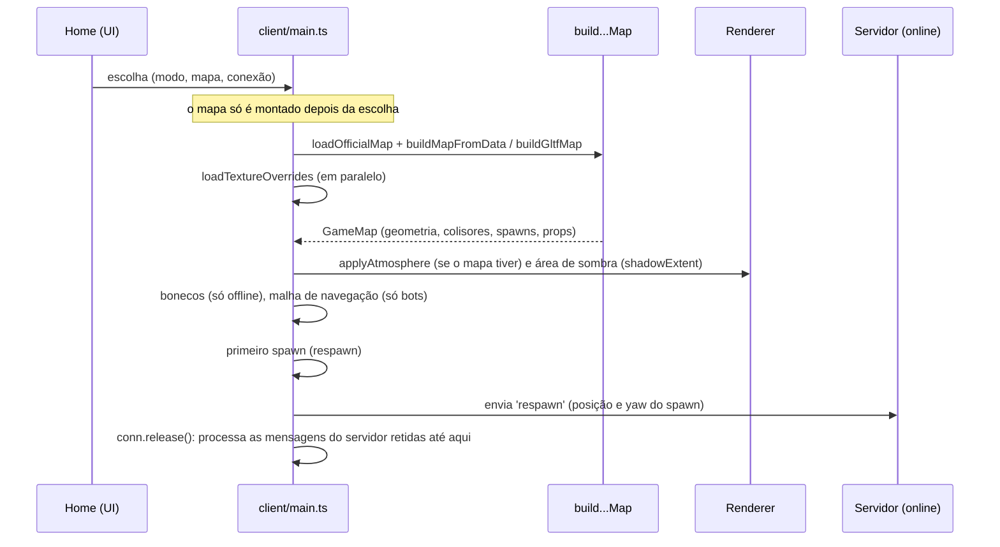

# Level Flow

Como um mapa é escolhido, montado e entra em jogo, e o que acontece com o mapa durante a partida. O fluxo de movimentação dos jogadores dentro de cada mapa está na seção "Fluxo esperado" de cada nota de mapa ([[Maps Index]]).

## Escolha do mapa

| Modo | Quem decide o mapa | Detalhe |
| --- | --- | --- |
| Treino offline ([[Training]]) | cartão de mapa escolhido na aba Jogar | valor salvo em `localStorage` (`oc.bots`, campo `map`); padrão `rua`; o clique só escolhe, o botão laranja começa |
| Contra bots ([[Versus Bots]]) | o mesmo cartão da aba Jogar | mesma preferência salva (zumbi: o Cemitério) |
| Online ([[Free For All]]) | **a sessão** | o cartão escolhido (ou Qualquer mapa) decide o mapa do `play`; o servidor guarda o id do mapa da sessão e o cliente usa `joined.session.map` |
| Criar sessão online | o mapa escolhido na aba Jogar ("+ Criar sessão com nome"; desabilitado com Qualquer mapa) | mensagem `create` com `map`; o servidor aceita só ids válidos (`isMapId`), senão usa `rua` |
| Prévia de mapa Blender | parâmetro de URL `?mapa=/maps/arquivo.glb` | **sobrepõe** qualquer escolha acima (ver abaixo) |

As salas online abrem sob demanda (`play {map, mode}`), cada uma presa à versão do mapa com que abriu; o cliente baixa os dados dessa versão antes de montar o mapa. Não há rotação de mapas, votação nem fim de partida: o README do projeto lista "fim de partida (limite de abates e tempo) e votação de mapa" como ainda não feitos. Ver [[Sessions]] e [[Matchmaking]].

## Montagem (carregamento)

1. A tela de carregamento aparece, a física e o renderizador são criados e a home é mostrada.
2. Depois da escolha, `client/main.ts` carrega os dados do mapa pelo id (`loadOfficialMap`: `shared/data/mapas/<id>.json`, no pacote do cliente) e os monta com `buildMapFromData` (`client/world/mapLoader.ts`). Com `?mapa=`, usa `buildGltfMap`.
3. As texturas reais de `public/textures/manifest.json` são carregadas em paralelo (ver [[Texture System]]).
4. Se o mapa define `atmosphere`, o céu, a névoa e as luzes são trocados (Jardim e Vila são noturnos). Se define `shadowExtent`, a câmera de sombra do sol é ampliada (profundidade 150 m). Ver [[Lighting]].
5. Bonecos de treino (`dummies`) só são criados no modo offline. No modo bots, a malha de navegação é gerada a partir dos colisores do mapa, excluindo a zona de mordida da Amora ampliada em 0,3 m (ver [[Navigation]]).
6. O jogador nasce num spawn (ver [[Spawn Design]]). Online, as mensagens do servidor ficam retidas (`conn.hold()`) até o jogo estar pronto.

Tempos de construção medidos (de `docs/MAPAS.md`, não reverificados): Rua ~50–90 ms, Jardim ~380–480 ms, Vila ~400–500 ms. Ver [[Loading Performance]].

## Durante a partida

- O mapa é **estático** em geometria e colisão; o que muda é o estado dos objetos vivos (piadas, coletáveis, carpas, rato), atualizado por `map.update(dt, frame)` a cada quadro.
- O estado compartilhado (coletáveis, carpas, rato, piadas) é sincronizado pelo servidor; quem entra numa sessão em andamento recebe o estado atual (`set(...)` em `MapFish`/`MapRats`). Ver [[Interactive Objects]] e [[Replication]].
- Morrer leva a um novo spawn no mesmo mapa ([[Flow - Death and Respawn]]). Não há troca de mapa sem voltar à home.

## Prévia por URL (`?mapa=`)

- Feita para criadores de mapa ("map makers' preview", comentário em `client/main.ts`).
- O `.glb` é carregado **por cima de qualquer escolha**, inclusive online. Com ela, os coletáveis do mapa da sessão ficam sem efeito (`pickupKind` devolve `undefined`).
- Ver [[Problem - Prévia glTF por URL sobrepõe o mapa da sessão]] e [[Map - Arena Teste (glTF)]].

## Código relacionado

- `client/main.ts` — trecho "Map: the session's (online) or the one picked on the home screen".
- `client/ui/home.ts` — `mapSel`, `newMapSel`, `pickedMap`, `BOTS_KEY`, `join`.
- `server/app.ts` — `createSession`, salas sob demanda (`sessionFor`).
- `shared/maps.ts` — `OFFICIAL_MAPS`, `DEFAULT_MAP`, `isMapId`; `client/net/maps.ts` — `fetchMapVersion`.
- Fluxos de UI relacionados: [[Flow - First Access]], [[Flow - Join Online Match]], [[Menus]].
