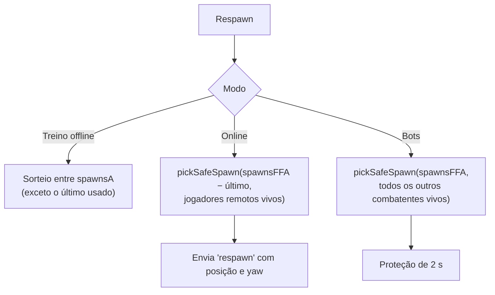

# Spawn Design

Onde e como os jogadores nascem em cada mapa. As regras de tempo de renascimento e o que acontece na morte ficam em [[Respawn]]; aqui fica o **lado espacial**: tipos de ponto, distribuição pelos mapas e escolha do ponto seguro.

## Tipos de ponto de nascimento

Cada mapa (`GameMap`) define três listas de `SpawnPoint` (posição dos pés + `yaw`):

| Lista | Intenção original | Uso real no código atual |
| --- | --- | --- |
| `spawnsA` | base do time A (laranja na Rua) | **modo treino offline**: o jogador nasce sempre em um ponto A |
| `spawnsB` | base do time B (azul na Rua) | **não é lido pelo jogo** (só existe como dado; o `buildGltfMap` o usa para montar fallbacks) |
| `spawnsFFA` | pontos neutros espalhados para o mata-mata livre (meta: 16–20) | **online** e **contra bots** |

> [!info]
> Os spawns de time (A/B) e as pinturas/cores de time da Rua (faixa laranja na van de mudança a oeste, garagem azul a leste) indicam que o design previa um modo por times. Não existe modo por times no código atual (ver [[Team Deathmatch]]). Inferência a partir dos comentários "team A (orange) west... team B (blue) east" em `blockoutMap.ts`.

## Distribuição por mapa

| Mapa | A | B | FFA | Onde ficam os FFA |
| --- | --- | --- | --- | --- |
| [[Map - Rua dos Vizinhos]] | 5 (ponta oeste e quintal oeste, olhando +X) | 3 (ponta leste, olhando −X) | 21 | térreo e andar de cima das 3 casas, vãos entre casas, faixa atrás das casas, pontas da rua, calçadas, quintais, casa na árvore (3,2 m), torre (7,2 m) |
| [[Map - Jardim do Dragão]] | 5 (oeste: pátio baixo do santuário e vale do bambu) | 5 (leste: margem sul do lago e rua das lanternas) | 28 | quartos da Casa e anel; pavilhão e deck do bonsai; casa de chá e andar de cima da ilha; casa dos servidores, sala de música, mercado, cozinha; dojo, Plataforma do Mestre, jardim zen, arsenal; casa do jardineiro e bambuzal; cripta, templo e terraço |
| [[Map - Vila Assombrada]] | 5 (Estrada Maldita, nordeste) | 5 (pátio sudoeste da praça) | 25 | mansão (térreo, andar de cima), porão e esgoto (−3,8 m), floresta, cabana, cemitério, estrada, celeiro, casas da vila, parque, praça, jardim e cantos |
| [[Map - Arena Teste (glTF)]] | 2 | 1 | 0 (usa A + B) | — |

Os FFA dos três mapas em código são gerados com `yaw = atan2(x, z)`, ou seja, cada ponto olha numa direção derivada da sua posição (não necessariamente para o centro). Os spawns ficam 0,2 m acima do piso.

## Escolha do ponto

### `pickSafeSpawn` (regras da "seção 6" do design)

Para cada ponto candidato, uma pontuação:

1. Sorteio base de 0 a 4 (para não ficar previsível).
2. −1000 se há um inimigo a menos de **2 m** (nunca nascer em cima de alguém).
3. −25 por inimigo a menos de **15 m**.
4. −20 por inimigo com **linha de visão** do olho dele até a cabeça do ponto (1,5 m acima dos pés), testada com raio contra o mundo (grupos `BULLET`/`WORLD`).
5. \+ distância ao inimigo mais próximo (limitada a 60 m): prefere longe de todos.

Os pontos são ordenados e o jogo **sorteia entre os três melhores**.

- Online, as ameaças são os jogadores remotos vivos (pés e olho a 1,65 m).
- Contra bots, a mesma função é usada para o jogador e para cada bot, contra todos os outros combatentes vivos. Quem nasce fica **2 s protegido** (invulnerável e ignorado pelos bots); atirar cancela a proteção (`SPAWN_PROTECTION` em `client/ai/bots.ts`).

## Autoridade

- **O cliente escolhe o spawn** e envia `respawn` com posição e yaw. O servidor só confere que o jogador está morto, que o tempo de renascimento (`NET.respawnDelay` = 5 s, com tolerância de 250 ms) passou e que os valores são vetores/números finitos; **não confere se a posição é um spawn do mapa** (o servidor não conhece a geometria). Ver [[Trust Boundaries]] e [[Anti Cheat]].

## Regras de design para novos mapas

- Ter **16 a 20** pontos FFA espalhados, cobrindo também andares superiores e áreas fechadas (`docs/MAPAS.md`).
- Em mapas glTF, usar empties `SPAWN_A_*`, `SPAWN_B_*`, `SPAWN_FFA_*`; o arquivo precisa de ao menos um `SPAWN_A_*` ou `SPAWN_FFA_*`. Sem FFA, o jogo usa A + B; sem B, usa A; sem A, usa FFA (`buildGltfMap`).
- A frente do spawn no Blender é +Y (vira −Z no jogo, `yaw` 0).

## Código relacionado

- `client/gameplay/spawnPicker.ts` — `pickSafeSpawn`.
- `client/main.ts` — `allSpawns`, `pickSpawn`, `respawn`.
- `client/ai/bots.ts` — `pickSpawn`, `protect`, `SPAWN_PROTECTION`.
- `server/session.ts` — tratamento da mensagem `respawn`.
- Construtores dos mapas: listas `spawnsA`, `spawnsB`, `spawnsFFA`.
- Relacionados: [[Respawn]], [[Flow - Death and Respawn]], [[Free For All]], [[Versus Bots]], [[Training]].
