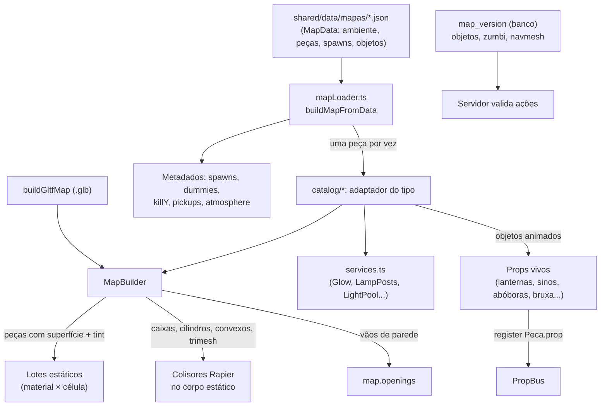

# World Structure

Como o "mundo" de uma partida é organizado: unidades, eixos, o contrato que todo mapa cumpre, como um mapa é descrito em dados e montado, e as camadas que compõem um mapa (geometria estática, colisão, objetos vivos, metadados para o jogo e para o servidor).

## Visão geral (nível 1)

- O mundo é **um mapa por partida**, montado inteiramente no cliente a partir do id do mapa (`rua`, `jardim`, `halloween`, `cemiterio`) ou de um arquivo `.glb`.
- Desde a PF-6 (fase 1), um mapa oficial é **um arquivo de dados**, não código: `shared/data/mapas/<id>.json`, no formato `MapData` (`shared/mapData.ts`). O cliente monta o mapa lendo esse arquivo com o carregador (`client/world/mapLoader.ts`), peça por peça, cada uma pelo seu adaptador no catálogo (`client/world/catalog/`). Ver [[ADR - Mapas como dados com catálogo de peças]].
- Na partida o servidor **não monta a geometria**: cada sala guarda a versão salva do mapa (`MapRuntime`, `server/maps.ts`) e lê dela as posições de `objetos` (coletáveis, bruxa, ratos, carpas) para validar ações, os dados de zumbi e a navmesh (ver [[Validation]] e [[Trust Boundaries]]). Quem monta o mapa no servidor é a thread de salvamento (`server/mapWorker.ts`), uma vez por versão salva, com o mesmo carregador do cliente: mede o orçamento de desenho, conta os colisores e gera a navmesh dos mapas zumbi.
- Todos os clientes da mesma sessão constroem a mesma geometria e os mesmos colisores porque a montagem é determinística: cada peça que sorteia guarda a própria semente (`Peca.semente`; ver [[Map Design Rules]] e [[ADR - Aleatoriedade com semente na construção dos mapas]]).

## Unidades e eixos

| Convenção | Valor | Fonte |
| --- | --- | --- |
| Unidade | 1 unidade = 1 metro (ângulos em radianos, cores `0xRRGGBB`) | `docs/MAPAS.md`, `shared/mapCatalog.ts` |
| Eixo vertical | +Y para cima | Three.js / glTF |
| Norte | −Z (comentário do layout do Jardim: "North is -Z") | `client/world/jardim/kit.ts` |
| Yaw 0 | olha para −Z (mesma convenção da câmera) | `DummySpot` em `gameMap.ts`, `yawOf` em `gltfMap.ts` |
| Origem | centro do mapa; o mapa se estende de −W a +W em X e −D a +D em Z | dados dos mapas (`shared/data/mapas/*.json`) |
| Jogador | cilindro de 0,35 m de raio, 1,8 m de altura (1,2 m agachado), olho a 1,65 m (1,05 m agachado) | `MOVE` em `shared/constants.ts` |
| Gravidade | 22 m/s² | `MOVE.gravity`, `createPhysics` |
| Inclinação máxima andável | 45° | `MOVE.maxSlopeDeg` |

## O contrato `GameMap`

Todo mapa montado é um objeto `GameMap` (interface em `client/world/gameMap.ts`; antes da PF-6 ficava em `blockoutMap.ts`), venha dos dados (`buildMapFromData`) ou de um `.glb` (`buildGltfMap`). É o que o resto do jogo sabe sobre o mundo:

| Campo | O que é | Usado por |
| --- | --- | --- |
| `spawnsA`, `spawnsB`, `spawnsFFA` | pontos de nascimento (posição + yaw) | [[Spawn Design]] |
| `dummies` | bonecos de treino (parados ou patrulhando em X/Z) | modo [[Training]] |
| `killY` | altura abaixo da qual o jogador morre ("void") | `LocalPlayer` |
| `openings` | todos os vãos (portas/janelas) abertos em paredes | previsto para checagens automáticas (ver [[Map Design Rules]]) |
| `props` | `PropBus`: piadas de cenário sincronizadas | [[Map Gags]], [[Interactive Objects]] |
| `update(dt, frame)` | animação por quadro e piadas de proximidade | loop do jogo |
| `dog` | a Amora (só na Rua) | perigo do mapa, malha dos bots |
| `pickups?` | coletáveis (cereja, biscoito) | [[Pickups]] |
| `critters?` | coisas pequenas atingíveis por tiro/faca sem colisor próprio (carpas, frutas, rato/armário/abóboras na faca) | [[Combat]], [[Melee]] |
| `fish?`, `rats?` | estado de carpas e ratos (morte/volta) | [[Interactive Objects]] |
| `potion?` | a poção da bruxa (posição e raio) | [[Buffs & Debuffs]] |
| `rewards?` | ganchos de recompensa do mapa (`ratDown`, `aimBonus`) | [[Buffs & Debuffs]] |
| `atmosphere?` | céu, névoa e luzes próprios | [[Lighting]] |
| `shadowExtent?` | meia-largura que a sombra do sol precisa cobrir em mapas grandes | [[Lighting]] |
| `stats` | peças, colisores, malhas, triângulos | painel F3, [[Performance Rendering]] |

O `MapFrame` passado a `update` traz os pés do jogador local, a posição do ouvinte (câmera), uma função `launch` (o hidrante arremessa o jogador) e o relógio do jogo (`time`: o da simulação offline, o do servidor online — é ele que sincroniza as carpas).

## O mapa como dados (`MapData`)

Formato em `shared/mapData.ts` (`MAP_FORMAT = 1`; um mapa de formato mais novo é recusado, um mais antigo será migrado). Os 4 mapas oficiais estão em `shared/data/mapas/{rua,jardim,halloween,cemiterio}.json`, com uma peça por linha (diferenças legíveis no git).

| Campo | O que é |
| --- | --- |
| `formato`, `nome`, `exclusivo?` | versão do formato, nome exibido e o modo a que o mapa pertence (ex.: `zumbi`) |
| `cartao` | emoji e cor do cartão do mapa |
| `ambiente` | `ceu` (`atmosfera?`: fundo, névoa, hemisfério, sol e luzes da arma; `cupula?`: `nuvens`, `lua` ou `oriental`), `celula` do lote, `sombra?` (meia-largura da sombra do sol), `killY`, `sons?` (pássaro, corvo, uivo, com o primeiro e o intervalo) |
| `pecas` | a lista de peças (`Peca`), montadas **em ordem** |
| `arquivos` | modelos `.glb` usados pelo mapa (`id` e `url`) |
| `spawns` | `a`, `b`, `ffa` (posição e yaw) |
| `bonecos` | bonecos de treino, com `patrulha` opcional |
| `objetos` | o que o servidor acompanha: `coletaveis`, `bruxa`, `ratos`, `peixes` (os ids são os da rede) |
| `zumbi?` | dados do modo zumbi do mapa (muro, surgimentos, caixão, chefes, brechas); só no Cemitério ([[Zombie]]) |
| `servicos?` | `luzes`: quantas luzes reais o pool do mapa tem |

Uma **peça** (`Peca`) tem `id` único no mapa, `tipo` (um tipo do catálogo), `p`/`yaw`/`escala` quando o tipo é livre, `params`, `semente` (estado do gerador sorteado de onde a peça começa, nos tipos que sorteiam), `prop` (o id do `PropBus` da piada, explícito: online, todos disparam a mesma) `coletavel` (o coletável que ela guarda) `pose` (o giro livre e o deslocamento que o gizmo do editor deu à peça inteira, P32: uma transformação rígida aplicada a tudo o que ela monta, inclusive colisores, salas e vãos; ver [[ADR - Mapas como dados com catálogo de peças]]), `pai` (opcional: o grupo da Hierarchy do editor de que ela faz parte) e `nome` (opcional: o nome que o editor mostra).

**Grupos** (PF-6 Revisions 01): uma peça do tipo `grupo` não monta nada; a pose dela é o referencial dos filhos (as peças com `pai` igual ao `id` dela), e grupos podem ficar dentro de grupos (até 16 níveis). A peça monta nas poses dos grupos, de fora para dentro, vezes a pose dela; no modo jogo o grupo é pulado. A ordem de `pecas` continua sendo a ordem de montagem (e a ordem dos filhos na Hierarchy). Mapa sem grupos monta exatamente como antes.

`validateMapData(raw)` é pura e devolve `{ ok, erros }`: confere formato, nome, cartão, ambiente, tipos e parâmetros das peças contra o catálogo, ids repetidos, ids do `PropBus` (o formato que o servidor aceita, sem repetir), limite por mapa (ex.: uma bruxa), ligações entre peças, os grupos (`pai` aponta para um `grupo` do mapa, sem ciclo, até 16 níveis), `objetos` e `arquivos`, spawns, bonecos e, num mapa exclusivo do zumbi, os dados de zumbi (`checkZombieMap`). `MAP_BUDGET` (400 chamadas de desenho, 750 mil triângulos) é o teto de custo de desenho ([[Performance Rendering]]).

### O catálogo de peças

`shared/mapCatalog.ts` descreve cada tipo de peça (~145 tipos): `id`, categoria (`primitivas`, `estrutura`, `construcoes`, `natureza`, `moveis`, `veiculos`, `objetos`, `luzes`, `ambiente`, `importado` e `organizacao`, a do `grupo`, que a paleta não lista), nome em pt e en, parâmetros com tipo, faixa e padrão, a **transformação** (`livre`: `p`/`yaw`/`escala`; `linear`: corre num eixo entre duas pontas dadas nos parâmetros, como muros, cercas e escadas; `fixa`: o layout inteiro em coordenadas do mundo, como um telhado sobre um retângulo ou um muro de jardim com portões), o limite por mapa, o prefixo do `PropBus`, se usa semente e se guarda coletável. Inclui a peça `sala` (a sala do som, com `fechamento` de 0 a 1; ver [[Spatial Audio]]).

No cliente, `client/world/catalog/` tem **um adaptador por tipo** (`CATALOG` em `index.ts`; um teste confere que casam um a um com o esquema), agrupados por arquivo: `primitives` (caixas, cilindros, paredes com vãos, escadas, telhados, salas, formas e brilhos), `street` (casa da Rua, árvores, postes, placas), `garden` (muros do Jardim e as peças orientais), `gardenPieces` (as peças próprias dos setores do Jardim: cerejeira, fonte do dragão, mercado, sinos, tambores), `haunted` (casas, barracas, retratos, árvores secas, lápides, cercas), `cemetery` (muro e pilares), `furniture`, `vehicles`, `objects` (piadas, bruxa, rato, carpas, cachorro, luzes, morcegos, névoa), `glb` (modelo do Blender) e `services`. Cada adaptador recebe `(ctx, peca)` e chama os construtores de sempre (`MapBuilder`, `furniture.ts`, `vehicles.ts`, `halloween.ts`, `oriental.ts`, `jardim/kit.ts` e as peças dos setores do jardim).

`services.ts` cria **sob demanda** os sistemas que várias peças compartilham e os finaliza uma vez no fim: brilho (`Glow`), postes (`LampPosts`), abóboras, espantalhos, lanternas de papel, cabeças dos postes da Rua, o pool de luzes reais (`LightPool`), `Puffs`, `Debris`, `WaterDrops` e a água do jardim.

### Montagem: `loadOfficialMap` e `buildMapFromData`

- `loadOfficialMap(id)` carrega o JSON oficial, que vai no pacote do cliente (import dinâmico por mapa): treino e bots continuam funcionando sem servidor.
- `buildMapFromData(data, { physics, scene, renderer, sfx, modo })` monta as peças em ordem (cada uma com o gerador na sua `semente`), fecha os sistemas compartilhados, desenha o céu (atmosfera e cúpula: nuvens na Rua, lua sobre a cúpula estrelada na Vila e no Cemitério, a noite oriental com lanternas no Jardim) e liga os sons ambientes do `ambiente.sons`.
- **Modo `jogo`**: o que se joga. A geometria estática é fundida **entre peças** em lotes por material e célula (`MapBuilder`).
- **Modo `editor`**: cada peça no seu próprio grupo da cena (sem lotes entre peças), com a lista de colisores dela (`BuiltMap.pieces`), para o editor de mapas selecionar e reconstruir uma peça sozinha (`MapBuild.remove` e `piece`; ver [[ADR - Editor de mapas no jogo]]). O editor junta depois, só para desenhar, o que não está selecionado em lotes `BatchedMesh` (P46, [[ADR - Lotes do editor com BatchedMesh]]).

## Camadas de um mapa

1. **Geometria estática** — cada peça usa uma **superfície da biblioteca** (`SURFACES` em `client/world/surfaces.ts`: `grama`, `asfalto`, `calcada`, `concreto`, `tijolo`, `reboco`, `madeira`, `piso`, `telhado`, `azulejo`, `metal`, `vidro`, `papel`, `pedra`, `lataria`, `folhagem`, `casca`, `feno`, `tecido`, `pintura`). A cor vem de um *tint* por vértice. O `MapBuilder` funde a geometria por material e por célula quadrada (40 m por padrão; o Jardim usa 45 m e a Vila 60 m). Detalhes visuais em [[Materials]], [[Texture System]], [[Procedural Textures]].
2. **Colisão** — colisores simples (caixa, cilindro, bola, casco convexo) ou malha de triângulos, todos num único corpo rígido fixo do Rapier. Cada colisor registra um **material físico** (`grass`, `concrete`, `wood`, `metal`, `glass`, `tile`, `paper`) que decide som de passos/impacto e penetração de bala (ver [[Cover & Combat Spaces]]). Um colisor pode ter `onShot`, chamado quando leva tiro (base das piadas de cenário).
3. **Grupos de colisão** — `WORLD` (tudo que é mapa) e `BLOCKER` (cercas de ferro e grades da Vila: param jogadores e projéteis, mas não balas). Constantes em `GROUP` (`shared/constants.ts`).
4. **Objetos vivos** — peças com estado e animação (lanternas, sinos, gongo, abóboras, bruxa, rato...). Os que precisam ser vistos por todos registram no `PropBus` o id gravado na peça (`Peca.prop`, ver [[Interactive Objects]]).
5. **Metadados** — spawns, bonecos, `killY`, coletáveis, atmosfera (no JSON do mapa).
6. **Versões no servidor** — desde a PF-6 (fase 2) o servidor guarda cada versão salva do mapa (`map_version`, imutável) e lê de lá `objetos`, `zumbi` e a navmesh; o cliente online baixa os dados da versão da sala (`GET /api/mapas/:id/versoes/:v`). Ver [[ADR - Sessões sob demanda por versão do mapa]].

## Dois caminhos de construção

| Caminho | Quando | Peças disponíveis |
| --- | --- | --- |
| **Dados + catálogo** (`mapLoader.ts`, `MapBuilder`) | os quatro mapas oficiais | os ~145 tipos de `shared/mapCatalog.ts`: primitivas (caixa, cilindro, parede com vãos empilháveis e moldura, escada com degraus visuais + rampa sólida, telhado de duas águas, sala do som), construções e kits temáticos (pavilhões, telhados curvos, muros de jardim com portões, pontes, bambuzais, cerejeira, fonte do dragão, barracas do mercado, sinos e tambores do Jardim; árvores secas, lápides, cercas de ferro, cercas vivas, casas da Vila; casa da Rua), móveis, veículos, piadas e objetos, luzes e o modelo `glb` |
| **Blender → glTF** (`gltfMap.ts`) | [[Map - Arena Teste (glTF)]] (mapa inteiro, `?mapa=`) e props dentro de um mapa de dados (peça `glb`, como a casinha da Amora) | convenções de nome `COL_`, `SPAWN_`, `DUMMY_`, `KILLVOLUME`, `GAG_`, `ROOM_`, `MAT_`, `NOCOL` (ver [[Asset Pipeline]] e [[Map - Arena Teste (glTF)]]) |

Os dois caminhos usam a mesma biblioteca de superfícies, os mesmos lotes e a mesma física (`docs/MAPAS.md`).

## Como os mapas oficiais viraram dados (PF-6, fase 1)

Até 2026-10-06 cada mapa era uma função em código (`buildBlockoutMap`, `buildDragonGardenMap`, `buildHauntedTownMap`, `buildCemeteryMap`). A conversão foi feita uma vez e conferida:

- `tools/snapshot-mapas.ts` gravou, **do código original e antes da conversão**, um golden de cada mapa (`shared/data/mapas/<id>.golden.json`): colisores, piadas do `PropBus`, vãos, salas, spawns, bonecos, `killY`, sombra, céu, lotes e objetos da cena, comparados sem depender da ordem (com `Math.random` fixo durante a montagem).
- `client/world/conversao/{rua,jardim,halloween,cemiterio}.ts` são os construtores antigos com cada chamada gravada como peça (`place()`, `recorder.ts`); os comentários de design dos construtores estão preservados ali. `tools/converter-mapas.ts` roda esses scripts sem tela (`tools/headless.ts`), escreve o JSON e confere contra o golden tanto a montagem gravada quanto uma montagem nova a partir do JSON escrito.
- Daqui em diante **o JSON é a fonte da verdade**; os scripts de conversão só documentam e reproduzem a conversão. O teste `client/tests/mapConversion.test.ts` confere os 4 mapas contra o golden (tolerância 1e-6) e o modo editor ([[Unit Tests]]).
- Os setores do Jardim (casa, anel, bonsai, lago, lanternas, guerreiros, bambu, santuário) foram convertidos chamada por chamada em peças individuais (`client/world/conversao/jardimSetores.ts`, decisão P31), como a Vila Assombrada: o Jardim tem 741 peças.

## Fora do mapa

- Tudo é cercado por um **muro perimetral** (4 m na Rua; 4,5 m no Jardim e na Vila). Na Vila há árvores secas sem colisão além do muro, só como silhueta.
- Cair abaixo de `killY` (−20 m; −10 no Cemitério) mata. Os mapas oficiais não têm buracos até essa altura; o nível mais baixo é o esgoto da Vila (piso a −4 m).

## Código relacionado

- `shared/mapData.ts` — `MapData`, `Peca`, `MAP_FORMAT`, `MAP_BUDGET`, `validateMapData`.
- `shared/mapCatalog.ts` — `MAP_CATALOG`, `TipoPeca`, `SUPERFICIES`, `checkPieceParams`.
- `shared/data/mapas/*.json` — os 4 mapas oficiais (e os `*.golden.json` da conversão).
- `client/world/mapLoader.ts` — `loadOfficialMap`, `buildMapFromData`, `startBuild`, `runPiece`, `atmosphereOf`.
- `client/world/catalog/` — adaptadores por tipo (`CATALOG`), `BuildCtx` (`types.ts`), `Services` (`services.ts`).
- `client/world/gameMap.ts` — interfaces `GameMap`, `SpawnPoint`, `DummySpot`, `MapFrame`, `MapCritters`, `MapFish`, `MapRats`, `MapPotion`, `MapRewards`, `MapPickup`, `MapSfx`.
- `client/world/budget.ts` — `measureBudget`, `measureMapBudget` (custo de desenho sem GPU).
- `client/world/mapBuilder.ts` — `MapBuilder`, `stairRun`, `stairSteps`, `worldUVs`, `boxProjectUVs`.
- `client/world/physics.ts` — `createPhysics`, `SurfaceMaterial`, `WORLD_GROUPS`.
- `client/world/surfaces.ts` — `SURFACES`, `surfaceMaterial`, `loadTextureOverrides`.
- `client/world/gltfMap.ts` — `addGltfToMap`, `buildGltfMap`.
- `client/world/props.ts` — `PropBus`.
- Implementação em detalhe: [[Client Architecture]], [[Modules]].
