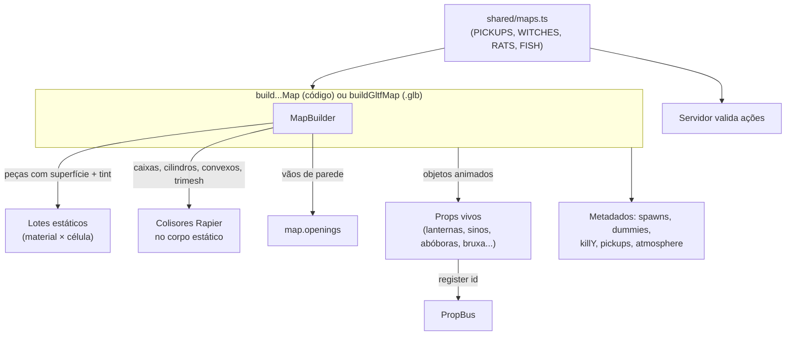

# World Structure

Como o "mundo" de uma partida é organizado: unidades, eixos, o contrato que todo mapa cumpre e as camadas que compõem um mapa (geometria estática, colisão, objetos vivos, metadados para o jogo e para o servidor).

## Visão geral (nível 1)

- O mundo é **um mapa por partida**, montado inteiramente no cliente a partir do id do mapa (`rua`, `jardim`, `halloween`) ou de um arquivo `.glb`.
- O servidor **não conhece a geometria**: ele só carrega o id do mapa na sessão e algumas tabelas de posições em `shared/maps.ts` (coletáveis, bruxa, ratos, carpas) para validar ações (ver [[Validation]] e [[Trust Boundaries]]).
- Todos os clientes da mesma sessão constroem a mesma geometria e os mesmos colisores porque a montagem é determinística (aleatoriedade com semente, ver [[Map Design Rules]]).

## Unidades e eixos

| Convenção | Valor | Fonte |
| --- | --- | --- |
| Unidade | 1 unidade = 1 metro | `docs/MAPAS.md`, todos os construtores |
| Eixo vertical | +Y para cima | Three.js / glTF |
| Norte | −Z (comentário do layout do Jardim: "North is -Z") | `client/world/jardim/kit.ts` |
| Yaw 0 | olha para −Z (mesma convenção da câmera) | `DummySpot` em `blockoutMap.ts`, `yawOf` em `gltfMap.ts` |
| Origem | centro do mapa; o mapa se estende de −W a +W em X e −D a +D em Z | construtores dos mapas |
| Jogador | cilindro de 0,35 m de raio, 1,8 m de altura (1,2 m agachado), olho a 1,65 m (1,05 m agachado) | `MOVE` em `shared/constants.ts` |
| Gravidade | 22 m/s² | `MOVE.gravity`, `createPhysics` |
| Inclinação máxima andável | 45° | `MOVE.maxSlopeDeg` |

## O contrato `GameMap`

Todo construtor de mapa devolve um objeto `GameMap` (interface em `client/world/blockoutMap.ts`). É o que o resto do jogo sabe sobre o mundo:

| Campo | O que é | Usado por |
| --- | --- | --- |
| `spawnsA`, `spawnsB`, `spawnsFFA` | pontos de nascimento (posição + yaw) | [[Spawn Design]] |
| `dummies` | bonecos de treino (parados ou patrulhando em X/Z) | modo [[Training]] |
| `killY` | altura abaixo da qual o jogador morre ("void") | `LocalPlayer` |
| `openings` | todos os vãos (portas/janelas) abertos em paredes | previsto para checagens automáticas (ver [[Map Design Rules]]) |
| `props` | `PropBus`: piadas de cenário sincronizadas | [[Map Gags]], [[Interactive Objects]] |
| `update(dt, frame)` | animação por quadro e piadas de proximidade | loop do jogo |
| `dog` | a Amora (só na Rua) | perigo do mapa, malha dos bots |
| `pickups?` | coletáveis (cereja, biscoito) | [[Pickups]] |
| `critters?` | coisas pequenas atingíveis por tiro/faca sem colisor próprio (carpas, frutas, rato/armário/abóboras na faca) | [[Combat]], [[Melee]] |
| `fish?`, `rats?` | estado de carpas e ratos (morte/volta) | [[Interactive Objects]] |
| `potion?` | a poção da bruxa (posição e raio) | [[Buffs & Debuffs]] |
| `rewards?` | ganchos de recompensa do mapa (`ratDown`, `aimBonus`) | [[Buffs & Debuffs]] |
| `atmosphere?` | céu, névoa e luzes próprios | [[Lighting]] |
| `shadowExtent?` | meia-largura que a sombra do sol precisa cobrir em mapas grandes | [[Lighting]] |
| `stats` | peças, colisores, malhas, triângulos | painel F3, [[Performance Rendering]] |

O `MapFrame` passado a `update` traz os pés do jogador local, a posição do ouvinte (câmera), uma função `launch` (o hidrante arremessa o jogador) e o relógio do jogo (`time`: o da simulação offline, o do servidor online — é ele que sincroniza as carpas).

## Camadas de um mapa

1. **Geometria estática** — cada peça usa uma **superfície da biblioteca** (`SURFACES` em `client/world/surfaces.ts`: `grama`, `asfalto`, `calcada`, `concreto`, `tijolo`, `reboco`, `madeira`, `piso`, `telhado`, `azulejo`, `metal`, `vidro`, `papel`, `pedra`, `lataria`, `folhagem`, `casca`, `feno`, `tecido`, `pintura`). A cor vem de um *tint* por vértice. O `MapBuilder` funde a geometria por material e por célula quadrada (40 m por padrão; o Jardim usa 45 m e a Vila 60 m). Detalhes visuais em [[Materials]], [[Texture System]], [[Procedural Textures]].
2. **Colisão** — colisores simples (caixa, cilindro, bola, casco convexo) ou malha de triângulos, todos num único corpo rígido fixo do Rapier. Cada colisor registra um **material físico** (`grass`, `concrete`, `wood`, `metal`, `glass`, `tile`, `paper`) que decide som de passos/impacto e penetração de bala (ver [[Cover & Combat Spaces]]). Um colisor pode ter `onShot`, chamado quando leva tiro (base das piadas de cenário).
3. **Grupos de colisão** — `WORLD` (tudo que é mapa) e `BLOCKER` (cercas de ferro e grades da Vila: param jogadores e projéteis, mas não balas). Constantes em `GROUP` (`shared/constants.ts`).
4. **Objetos vivos** — peças com estado e animação (lanternas, sinos, gongo, abóboras, bruxa, rato...). Os que precisam ser vistos por todos registram um id no `PropBus` (ver [[Interactive Objects]]).
5. **Metadados** — spawns, bonecos, `killY`, coletáveis, atmosfera.
6. **Tabelas compartilhadas** — `shared/maps.ts` guarda as posições que o servidor precisa conhecer.

## Dois caminhos de construção

| Caminho | Quando | Peças disponíveis |
| --- | --- | --- |
| **Código** (`MapBuilder`) | os três mapas jogáveis | primitivas `box`/`span`/`cylinder`, `wall` com vãos empilháveis e moldura, `stairs` (degraus visuais + rampa sólida), `gableRoof`; kits temáticos: `oriental.ts` + `jardim/kit.ts` (pavilhões, telhados curvos, muros de jardim com portões, pontes, bambuzais...), `halloween.ts` (árvores secas, lápides, cercas de ferro, cercas vivas...), `furniture.ts` (móveis montados com `Place`) e `vehicles.ts` |
| **Blender → glTF** (`gltfMap.ts`) | [[Map - Arena Teste (glTF)]] e props como a casinha da Amora | convenções de nome `COL_`, `SPAWN_`, `DUMMY_`, `KILLVOLUME`, `GAG_`, `MAT_`, `NOCOL` (ver [[Asset Pipeline]] e [[Map - Arena Teste (glTF)]]) |

Os dois caminhos usam a mesma biblioteca de superfícies, os mesmos lotes e a mesma física (`docs/MAPAS.md`).

## Fora do mapa

- Tudo é cercado por um **muro perimetral** (4 m na Rua; 4,5 m no Jardim e na Vila). Na Vila há árvores secas sem colisão além do muro, só como silhueta.
- Cair abaixo de `killY` (−20 m) mata. Os mapas feitos em código não têm buracos até essa altura; o nível mais baixo é o esgoto da Vila (piso a −4 m).

## Código relacionado

- `client/world/blockoutMap.ts` — interfaces `GameMap`, `SpawnPoint`, `DummySpot`, `MapFrame`, `MapCritters`, `MapFish`, `MapRats`, `MapPotion`, `MapRewards`, `MapPickup`.
- `client/world/mapBuilder.ts` — `MapBuilder`, `stairRun`, `stairSteps`, `worldUVs`, `boxProjectUVs`.
- `client/world/physics.ts` — `createPhysics`, `SurfaceMaterial`, `WORLD_GROUPS`.
- `client/world/surfaces.ts` — `SURFACES`, `surfaceMaterial`, `loadTextureOverrides`.
- `client/world/gltfMap.ts` — `addGltfToMap`, `buildGltfMap`.
- `client/world/props.ts` — `PropBus`.
- Implementação em detalhe: [[Client Architecture]], [[Modules]].
