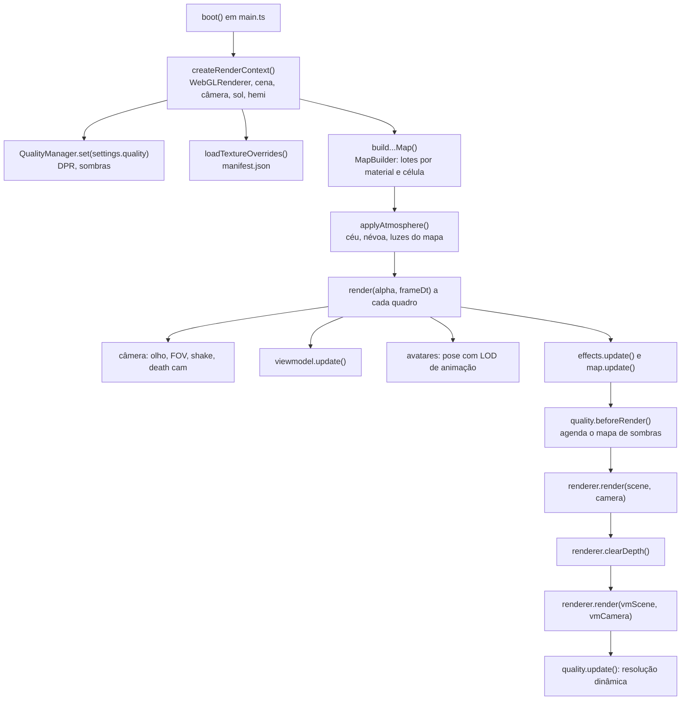

# Rendering Overview

## Nível 1: visão geral

O jogo desenha com **Three.js r186** (`three@^0.186.1`, `package.json`) em **WebGL**, sem pós-processamento. Cada quadro tem **duas passadas**: a cena do mundo com a câmera do jogador e, por cima, depois de limpar só o depth, a cena da arma em primeira pessoa (o *viewmodel*) com uma câmera própria. O visual é cartunesco: mapa, props e armas usam **toon shading** com uma rampa de 3 tons; os personagens usam material padrão com **flat shading** (facetado).

## Nível 2: como a imagem final é produzida

### Configuração do renderizador (`createRenderContext`)

| Item | Valor | Evidência |
| --- | --- | --- |
| Antialias | `antialias: true` (MSAA do contexto WebGL) | código confirmado |
| Preferência de GPU | `powerPreference: 'high-performance'` | código confirmado |
| Pixel ratio inicial | `min(devicePixelRatio, 1.5)`; depois controlado pelo [[Performance Rendering|QualityManager]] | código confirmado |
| Espaço de cor de saída | `SRGBColorSpace` | código confirmado |
| Tone mapping | não definido (padrão do Three.js, `NoToneMapping`) | busca por `toneMapping` sem resultados em `client/` |
| Sombras | `PCFShadowMap`, só o sol projeta | código confirmado |
| `autoClear` | `false` (limpeza manual para as duas passadas) | código confirmado |
| `renderer.info.autoReset` | `false`, zerado manualmente a cada quadro (o F3 soma as duas passadas) | código confirmado |

### Modelos de shading em uso

| O que | Material | Nota |
| --- | --- | --- |
| Superfícies do mapa, props, móveis, veículos | `MeshToonMaterial` com `toonGradient()` e cor por vértice | [[Materials]], [[ADR - Toon shading com rampa de 3 tons]] |
| Armas (1ª e 3ª pessoa), granada, mina | `MeshToonMaterial` (cor sólida ou cor por vértice após o merge) | [[Weapon Models]] |
| Personagens | `MeshStandardMaterial`, `flatShading`, roughness 0,85, metalness 0, atlas de paleta | [[Character Models]] |
| Coisas que brilham (janelas, velas, retículos, lanternas, céu) | `MeshBasicMaterial` (sem luz), às vezes aditivo | [[Visual Effects]] |
| Céu noturno do Jardim do Dragão | `ShaderMaterial` próprio | [[Shaders]] |

### Atmosfera por mapa

Cada mapa pode devolver um `atmosphere` (`GameMap.atmosphere`), aplicado por `applyAtmosphere()`: cor de fundo, névoa linear (`THREE.Fog`), luz hemisférica, sol (cor, intensidade, direção) e as luzes do viewmodel. Sem `atmosphere`, vale o dia ensolarado criado em `createRenderContext` (é o caso da [[Map - Rua dos Vizinhos]]). Detalhes e valores em [[Lighting]].

| Mapa | Atmosfera | Céu |
| --- | --- | --- |
| [[Map - Rua dos Vizinhos]] | padrão (dia) | cor sólida `0x6ec3ff` + nuvens instanciadas (`skyClouds`) |
| [[Map - Jardim do Dragão]] | `NIGHT` (`jardim/luzes.ts`) | cúpula com shader, 260 estrelas, 650 lanternas subindo |
| [[Map - Vila Assombrada]] | lua azulada, névoa roxa (`hauntedTown.ts`) | cúpula com degradê por vértice, 700 estrelas, lua com halo |
| [[Map - Arena Teste (glTF)]] | padrão (o carregador glTF não define atmosfera) | cor sólida |

## Nível 3: implementação

- `client/render/renderer.ts`: `RenderContext` (renderer, `scene`, `camera`, `vmScene`, `vmCamera`, `sun`, `hemi`, `vmHemi`, `vmSun`, `render()`), `applyAtmosphere()`, `patchBackFaceShadows()` (ver [[Shaders]]).
- `client/render/quality.ts`: presets e resolução dinâmica ([[Performance Rendering]]).
- `client/render/materials.ts`: rampa toon, cache de materiais toon, `mergeColoredParts`, `PALETTE`.
- `client/render/effects.ts`: decals, partículas, traçantes, explosões, luz do disparo ([[Decals]], [[Particles]], [[Visual Effects]]).
- `client/render/viewmodel.ts`, `viewmodelArms.ts`, `springs.ts`, `weaponModels.ts`: primeira pessoa ([[Camera]], [[Animation]], [[Weapon Models]]).
- `client/world/mapBuilder.ts` e `surfaces.ts`: geometria estática em lotes e biblioteca de superfícies ([[Texture System]], [[Environment Pieces]]).
- `client/main.ts`: ordem do quadro em `render(alpha, frameDt)`; o mundo é simulado em passo fixo e renderizado com interpolação (`alpha`). Ver [[Client Architecture]].

## Sistemas que mais pesam na GPU

- Mapa de sombras do sol (tamanho e frequência de atualização por preset).
- Número de lotes estáticos visíveis (células × materiais).
- Pixel ratio (resolução interna), ajustado pela qualidade automática.
- Partículas e névoas transparentes (`depthWrite: false`, sem frustum culling).
- Luzes pontuais reais (pool fixo de 6 a 10, mais a luz do disparo e a da explosão).

Detalhes em [[Performance Rendering]] e [[GPU]].

## Código relacionado

- `client/render/renderer.ts`
- `client/render/quality.ts`
- `client/main.ts` (função `render` dentro de `boot`)
- `client/world/blockoutMap.ts` (`GameMap.atmosphere`, `GameMap.shadowExtent`)

## Ver também

[[Camera]] · [[Lighting]] · [[Materials]] · [[Shaders]] · [[Texture System]] · [[Post Processing]] · [[Performance Rendering]] · [[Art Direction]] · [[Client Architecture]]
