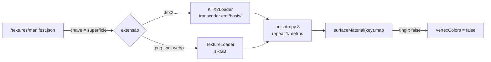

# Texture System

## Visão geral

Quase todas as texturas do jogo são **geradas em canvas no carregamento**. O sistema principal é a **biblioteca de superfícies**: cada superfície estática do mapa é uma chave (`tijolo`, `madeira`, `grama`...), com **um material**, **uma textura repetível** em metros e **um material de física** (som de passos e impactos, penetração de bala). Arquivos de verdade podem substituir qualquer textura pelo `public/textures/manifest.json`, sem mexer em código.

Personagens usam outro sistema: um **atlas de paleta** 256×256 (ver [[Material Palette]]).

## Biblioteca de superfícies (`SURFACES`)

20 chaves em `client/world/surfaces.ts`:

| Chave | Repete a cada (m) | Física | Pintor |
| --- | --- | --- | --- |
| `grama` | 2,5 | grass | `grama` |
| `asfalto` | 3 | concrete | `asfalto` |
| `calcada` | 2 | concrete | `calcada` |
| `concreto` | 2 | concrete | `concreto` |
| `tijolo` | 1,6 | concrete | `tijolo` |
| `reboco` | 1,8 | concrete | `reboco` |
| `madeira` | 1,2 | wood | `madeira` |
| `piso` | 1,8 | wood | `piso` |
| `telhado` | 1,2 | wood | `telhado` |
| `azulejo` | 1 | tile | `azulejo` |
| `metal` | 2 | metal | `metal` |
| `vidro` | 2 | glass | `vidro` |
| `papel` | 1,8 | paper | `papel` |
| `pedra` | 2,4 | concrete | `pedra` |
| `lataria` | 2 | metal | `lataria` |
| `folhagem` | 1,1 | grass | `folhagem` |
| `casca` | 0,9 | wood | `casca` |
| `feno` | 0,8 | grass | `feno` |
| `tecido` | 0,5 | wood | `tecido` |
| `pintura` | 1 | concrete | nenhum (cor lisa) |

O conteúdo visual de cada pintor está em [[Procedural Textures]]. A física de cada material está em [[Damage System]] (penetração) e [[SFX]] (sons).

> [!note] Divergências de documentação
> - `docs/MAPAS.md` lista 19 superfícies (falta `lataria`).
> - O comentário no topo de `mapBuilder.ts` fala em "13 surfaces" e o `_leia-me` do `manifest.json` lista 12 chaves: os dois ficaram para trás.

## Como a textura é aplicada

1. `surfaceMaterial(key)` cria (uma vez) o `MeshToonMaterial` da superfície, com `map` = clone da textura procedural, `RepeatWrapping` e `repeat = 1/metros`.
2. A geometria recebe **UVs em metros**, então a densidade de pixels é igual em qualquer parede:
   - **Mapas em código:** `worldUVs(geo)` escolhe, por vértice, o plano pela normal (X → (±z, y); Z → (±x, y); Y → (x, ±z)). Peças vizinhas continuam a mesma textura sem emenda: tábuas e fiadas de tijolo se alinham entre segmentos de parede. Ver [[ADR - UVs em coordenadas do mundo]].
   - **Mapas glTF:** `boxProjectUVs(geo)` faz projeção em caixa por triângulo (os dois eixos que a normal não encara), dispensando UV no Blender. A propriedade `uv_proprio = true` mantém as UVs do arquivo.
   - **Telhados de duas águas:** `gableRoof` monta UVs próprias (comprimento ao longo da cumeeira × comprimento da água).
   - **Veículos:** `lataria` é mapeada nos metros do próprio veículo, com `v` = altura (o degradê da pintura depende disso).
3. O tint por vértice multiplica a textura. Por isso as texturas procedurais são claras e quase cinza: uma única textura de tijolo serve para tijolo vermelho, amarelo ou branco. Ver [[ADR - Texturas procedurais claras tingidas por vértice]].

## Substituição por arquivos (`manifest.json`)

`loadTextureOverrides(renderer)` roda no boot, em paralelo com a construção do mapa:

| Campo | Significado |
| --- | --- |
| `arquivo` | nome do arquivo em `public/textures/` |
| `metros` | opcional, sobrescreve o tamanho da repetição |
| `tingir` | `false` = a textura já tem as cores finais; o material desliga `vertexColors` e ignora os tints |

- Chaves que começam com `_` são ignoradas (comentários); chaves que não são superfícies também.
- Falha de carga gera `console.warn('[texturas] ...')` e mantém a procedural.
- **Estado atual:** o `manifest.json` só tem a chave `_leia-me`. **Nenhuma textura real está em uso**; todas as superfícies estão com o placeholder procedural.
- O transcodificador Basis (`basis_transcoder.js` e `.wasm`) está em `public/basis/` e também é usado pelo carregador glTF.

## Outras texturas geradas em canvas

| Textura | Tamanho | Uso | Fonte |
| --- | --- | --- | --- |
| Furo de bala | 64² | [[Decals]] | `effects.ts` `holeTexture` |
| Clarão do disparo (estrela de 7 pontas) | 64² | viewmodel | `viewmodel.ts` `flashTexture` |
| Brilho radial | 64² | halos das lanternas | `jardim/luzes.ts` `glowTexture` |
| Lua e halo | 256² | céu da Vila | `halloween.ts` `nightSky` |
| Névoa rasteira | 128² | Vila | `halloween.ts` `GroundMist` |
| Placas, epitáfios, inscrições, letreiros | variável | mapas | `canvasTexture` + `fitText` |
| Atlas de paleta dos personagens | 256² (células 16×16) | personagens | `character/palette.ts` |

`fitText` (`canvasText.ts`) reduz a fonte em passos de 7% (até 8 px) até o texto caber na largura da placa.

## Filtros e memória

- Texturas da biblioteca: 512×512, `SRGBColorSpace`, `anisotropy 8`, mipmaps automáticos do Three.js.
- `canvasTexture` dos mapas temáticos: `anisotropy 4`.
- Atlas de paleta: `NearestFilter`, sem mipmaps (cada face amostra uma célula).
- `docs/MAPAS.md` estima ~16 MB para 12 texturas de 512×512 com mipmaps (medição do autor, não refeita aqui). A meta declarada é < 256 MB de texturas.
- Recomendação do doc para arte final: KTX2 (`toktx --t2 --encode etc1s --genmipmap`), "de 4 a 6 vezes menos memória de vídeo que PNG/JPG". Ver [[Asset Pipeline]].

## Código relacionado

- `client/world/surfaces.ts` (`SURFACES`, `surfaceMaterial`, `loadTextureOverrides`, `withRepeat`)
- `client/world/textures.ts` (`PAINTERS`, `paintTexture`)
- `client/world/mapBuilder.ts` (`worldUVs`, `boxProjectUVs`, `gableRoof`)
- `client/world/gltfMap.ts` (uso de `boxProjectUVs` e `uv_proprio`)
- `client/world/canvasText.ts` (`fitText`)
- `public/textures/manifest.json`

## Configurações relacionadas

- `public/textures/manifest.json` (ver [[Configurable Content]] e [[Configuration Reference]])
