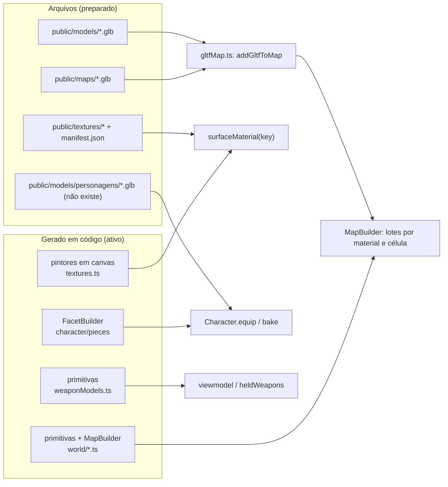

# Asset Pipeline

## Visão geral

Hoje **quase toda a arte é gerada em código**: mapas, props, armas, personagens e texturas. O projeto já tem, porém, três "portas de entrada" para arte de verdade, desenhadas para que trocar o placeholder não exija mudar código:

1. **Mapas e props em glTF** (Blender → `.glb`) com convenções de nome.
2. **Texturas de superfície** por arquivo, via `public/textures/manifest.json`.
3. **Peças de personagem em GLB**, apontando a `url` do item no registro.

## Formatos e carregadores

| Formato | Carregador | Onde |
| --- | --- | --- |
| `.glb` (glTF 2.0) | `GLTFLoader` com `MeshoptDecoder` e `KTX2Loader` | `gltfMap.ts` (mapas/props), `character.ts` (peças) |
| `.ktx2` (Basis) | `KTX2Loader`, transcoder em `public/basis/` | texturas do manifesto e embutidas no glb |
| `.png`, `.jpg`, `.webp` | `TextureLoader` (sRGB) | texturas do manifesto |
| Canvas 2D | `CanvasTexture` | todas as texturas procedurais |

## 1. Mapas e props do Blender

Referência completa: `docs/MAPAS.md`, seção 2. Resumo do que o código (`gltfMap.ts`) realmente lê:

| Nome no Blender | Vira |
| --- | --- |
| `COL_nome` / `COL_nome_BOX` / `COL_nome_CONVEX` | colisão invisível: malha de triângulos / caixa orientada / casco convexo |
| `SPAWN_A_*`, `SPAWN_B_*`, `SPAWN_FFA_*` | spawns (a rotação do Empty dá a direção) |
| `DUMMY_*` | boneco de treino; propriedades `eixo`, `amplitude`, `velocidade` fazem patrulha |
| `KILLVOLUME` | abaixo da altura dele, morre |
| `GAG_*` | gatilho de piada, ligado pelo código do mapa |
| `NOCOL` no nome ou `nocol = true` | visível sem colisão |
| material `MAT_<superfície>` (sufixo `.001` ignorado) | material compartilhado da biblioteca, cor base = tint, UV por projeção em caixa (salvo `uv_proprio = true`) |
| outro material | mantém a textura e as UVs do Blender, convertido para toon |
| propriedade `fisica` | material de física (`wood`, `metal`, `concrete`, `grass`, `glass`, `tile`, `paper`) |

- Sem nenhum `COL_` no arquivo, **toda** malha visível ganha colisão por triângulos (bom para blockout).
- Malhas com vários materiais são divididas por grupo para cada parte ir ao lote certo.
- **Mapa inteiro:** abrir o jogo com `?mapa=/maps/arquivo.glb` (exige um `SPAWN_A_*` ou `SPAWN_FFA_*`).
- **Prop num mapa de dados:** a peça `glb` (`client/world/catalog/glb.ts`) chama `addGltfToMap(gltf, builder, { position, yaw, scale })` com um arquivo listado em `arquivos` do JSON do mapa. Exemplo real: `casinha_cachorro.glb` em `shared/data/mapas/rua.json`.
- Escala: 1 unidade = 1 m; +Y Up na exportação; frente dos objetos = +Y do Blender.
- Otimização recomendada (doc): `bunx @gltf-transform/cli optimize ... --compress meshopt --texture-compress ktx2`.

### Exemplos gerados

`bun run exemplos:glb` roda `tools/gerar-props-exemplo.mjs`, que monta com `@gltf-transform/core` dois arquivos "no lugar de um export do Blender":

| Arquivo | Conteúdo | Tamanho |
| --- | --- | --- |
| `public/models/casinha_cachorro.glb` | casinha de cachorro com `MAT_madeira`, `MAT_telhado`, `COL_casinha_BOX`, `GAG_LATIDO` | ~10 KB |
| `public/maps/arena_teste.glb` | mapa: chão, muros, plataforma com rampas, caixotes, spawns, bonecos (um patrulha), `KILLVOLUME` | ~14 KB |

Ver [[Map - Arena Teste (glTF)]].

## 2. Texturas

Coloque o arquivo em `public/textures/` e registre a superfície no `manifest.json` (`arquivo`, `metros`, `tingir`). Regras do doc: repetível, potência de 2 (512² ou até 1024²), estilo pintado à mão, preferir KTX2 (`toktx --t2 --encode etc1s --genmipmap`). Hoje o manifesto está vazio (só `_leia-me`). Ver [[Texture System]] e [[Procedural Textures]].

## 3. Personagens

Referência completa: `docs/PERSONAGENS.md`. O registro (`client/character/registry.ts`) aceita `url` de GLB ou um gerador procedural; o GLB vence quando existe. Requisitos para um GLB compatível:

- esqueleto com os nomes canônicos (`root`, `hips`, `spine`, `chest`, `neck`, `head`, `shoulder_*`, `upperArm_*`, `forearm_*`, `hand_*`, `thigh_*`, `shin_*`, `foot_*`), em T-pose, um único armature;
- até 4 ossos por vértice;
- atributos `_TINT` (canal de cor da face), `_REGION` (região do corpo para esconder), `COLOR_0` (AO), opcionalmente `_MASK` (formato antigo);
- shape keys `gordo` e `magro` (e `punho_L`/`punho_R` nas mãos);
- UVs colapsadas em células do atlas de paleta; flat shading; orçamento por categoria (personagem completo até 4.500 triângulos).

**Estado atual:** nenhum item tem `url`; a pasta `public/models/personagens/` não existe. Todos os 306 itens do catálogo são procedurais. O editor tem "Exportar GLB", que baixa o personagem inteiro como ponto de partida no Blender. Ver [[Character Models]].

## 4. Armas

Só em código (`client/render/weaponModels.ts`), sem caminho de GLB próprio. O registro de personagem tem os itens `rifle` e `rifle_costas` com socket e grip, mas o modelo visível vem de `heldWeapons.ts`. Ver [[Weapon Models]].

## 5. Arte das figurinhas (pré-gerada)

As 65 figurinhas do [[Achievements|álbum]] são PNGs gerados a partir das cenas do estúdio (`client/dev/studio/`), não desenhados à mão:

- **Render:** um `WebGLRenderer` só, fundo transparente, sem tone mapping, com a luz do editor de personagem (`setupScene` de `customize.ts`) acompanhando cada câmera. Sem céu nem chão: só uma "ilha" pequena do piso do mapa quando a cena pede.
- **Recorte:** a partir do alfa da imagem (800 × 600 ou 256 × 256), fecha as frestas entre a figura e os efeitos (estrelas, confete, balões) e preenche os buracos internos, e desenha um contorno escuro `#1b1530` e uma borda creme `#fff8ec`. Depois reduz pela metade (400 × 300 e 128 × 128).
- **Mesmos pixels sempre:** SwiftShader (o bake recusa outra placa), `Math.random` com semente por figurinha, passo fixo nas animações e uma página nova por figurinha. Um bake sem mudança de código não regrava nada.
- **Peso:** de 30 a 126 KB por carta (média de ~55 KB) e de 7 a 19 KB por mini, 4,4 MB as 65 (limites de 150 e 30 KB por arquivo, conferidos no teste).

## Ferramentas de conferência

| Ferramenta | Como abrir | O que faz |
| --- | --- | --- |
| Laboratório de personagens | `/tools/lab-personagens.html` com `bun run dev` | fileira de visuais com triângulos e draw calls; `?hairs=1`, `?items=<categoria>`, `?sheet=<id>`, `?faces=<traço>`, `?lod=1\|2`, `?hitbox=1&probe=1` |
| Auditoria automática | `?audit=1` (ou `&category=`) no laboratório | gera cada peça nos dois corpos e nos 3 LODs e confere orçamento, geometria quebrada, partes fora do corpo, canais de cor, registro e se o LOD distante é mais leve (`client/dev/audit.ts`) |
| Preview de mapa | `?mapa=/maps/x.glb` | carrega um glb por cima da escolha de mapa |
| Overlay F3 | no jogo | draw calls, triângulos, tempo de build do mapa |

## Convenções de nome (assets)

- Superfícies e materiais em português minúsculo (`tijolo`, `MAT_tijolo`).
- Ids de piadas sincronizadas: minúsculos, sem acento, `/^[a-z]{1,16}(:\d{1,3})?$/`.
- Ids de itens do catálogo em camelCase português (`moletomCapuz`, `blackPower`).

Ver [[Naming Conventions]].

## Código relacionado

- `client/world/gltfMap.ts` (`gltfLoader`, `addGltfToMap`, `buildGltfMap`, `toToon`)
- `client/world/surfaces.ts` (`loadTextureOverrides`)
- `client/character/registry.ts` (`AssetRegistry`, `ItemDef.url`)
- `client/character/character.ts` (`loadGLB`)
- `tools/gerar-props-exemplo.mjs`, `tools/lab-personagens.html`, `client/dev/characterLab.ts`, `client/dev/audit.ts`

## Ver também

[[Art Direction]] · [[Texture System]] · [[Environment Pieces]] · [[Props Catalog]] · [[Build Pipeline]] · [[World Structure]]
