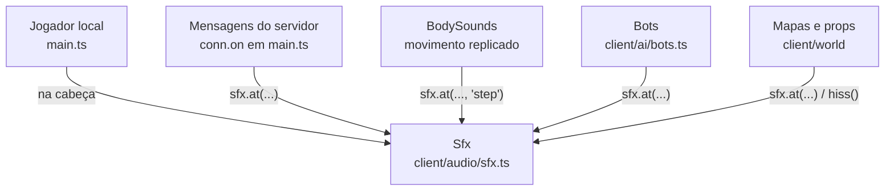

# Audio Events

Mapa de **qual evento do jogo toca qual som**, de onde ele vem e como é posicionado. Não existe um barramento de eventos de áudio formal (nem IDs de evento): o código de gameplay chama diretamente os métodos de `Sfx` no ponto onde o evento acontece. A lista de sons está em [[SFX]]; a propagação, em [[Spatial Audio]].

## Origem dos sons

## Jogador local (som "na cabeça")

| Evento | Som | Onde |
| --- | --- | --- |
| Clicar em JOGAR / fechar pausa com Esc | `unlock()` + `ui()` | `screens.onPlay`, handler de Esc |
| Disparo | `gunshot(1, voz)` (voz da arma em mãos, ou `silenciado`) | callback `shoot` da arma (`gunHooks`) |
| Troca de arma | `weaponSwitch()` | `holdSlot` |
| Gatilho vazio | `dryFire()` | callback `dryFire` da arma |
| Início da recarga | `reload(duração, vazio)` | callback `reloadStart` |
| Acerto (alvo, bot, jogador online) | `hitmarker(cabeça/virilha)` | resolução do tiro |
| Abate (offline/bots) | `killDing()` + `boing()` | `killFx` |
| Tiro na virilha | `bird()` | `groinFx` |
| Passo / aterrissagem / deslize | `footstep`, `land`, `slide` | eventos de `player.fixedStep` |
| Dano recebido | `hurt()` | dano local, bots, mensagem `damage` |
| Própria morte | `sadTrombone()` | morte local ou mensagem `kill` |
| Começo de dança (humilhação) | `danceMusic(3,2 s)` | `taunt.start` — ver [[Music]] |
| Fim da dança | `airHorn()` + `applause()` | `humiliationFx` |
| Faca | `meleeSwing(forma)` / `knifeHit()` | `startMelee`, `resolveMelee` |
| Granada: pino, bips do pavio, arremesso | `pinPull`, `fuseBeep`, `grenadeThrow` | `thrower.update` |
| Mina plantada | `minePlant()` | `plantMine` |
| Coletáveis | `cherry`, `cherryEnd`, `scoobySnack`, `humanity`, `potionGulp` | funções de bônus |
| Nível de arma/conta | `levelUp()` | mensagem de progressão |

## Sons posicionados vindos da rede

Mensagens do servidor (ver [[Remote Calls]] e [[Replication]]) que geram som no cliente:

| Mensagem | Som | Tipo espacial | Posição |
| --- | --- | --- | --- |
| `shot` | `gunshot(1, voz)` da arma na mão dele (`RemotePlayer.gun`); silenciado: voz `silenciado` e sem traçante | `gun` (silenciado: `step`) | boca da arma do avatar remoto |
| `swing` | `meleeSwing(forma)` da faca dele | `step` (frango e sabre: `normal`) | avatar remoto (+1,3 m) |
| `grenade` (granada) | `grenadeThrow()` | `step` | lançador (+1,4 m) |
| `grenade` (mina) | `minePlant()` | `normal` | posição da mina |
| `boom` | `explosion()` (via `explosionFx`) | `boom` | centro da explosão |
| `damage` (alvo = eu) | `hurt()` | na cabeça | — |
| `kill` (vítima = eu) | `sadTrombone()` | na cabeça | — |
| `pickup` de outro jogador | `cherry()` / `scoobySnack()` | `normal` | posição do coletável |
| `prop` | som do prop (sino, gongo, tambor, buzina...) | conforme o prop | posição do prop |

**Passos, aterrissagens, deslizes e recargas de outros jogadores não trafegam como eventos**: são deduzidos localmente do estado replicado por `BodySounds` (ver [[Spatial Audio]]). O mesmo vale para os bots (`playBody` é usado para ambos).

Quiques de granadas (próprias e remotas) tocam a partir da simulação local de `GrenadeProjectiles` (`grenadeBounce` ou `quack` se for "granada de pato").

## Bots (modo Versus Bots)

`client/ai/bots.ts` toca `gunshot` com a voz da arma do bot (`gun`, boca da arma), `impact` de cada ponto atingido (`normal`) e `knifeHit` (`normal`). Ver [[Versus Bots]].

## Mapas e props

Cada mapa recebe o `Sfx` na construção (interfaces `MapSfx`/`SpatialSfx`) e toca os sons dos seus props quando são baleados ou ativados. Props interativos são **sincronizados online** via mensagem `prop` (o `PropBus` do mapa chama `onLocal` → envia `{t:'prop', id}`; ao receber, `map.props.remote(id, ...)` reproduz o efeito e o som). Ver [[Map Gags]] e [[Interactive Objects]].

## Feedback não sonoro relacionado

Junto com o som, alguns eventos disparam vibração: `navigator.vibrate` em celulares (acerto 12 ms, abate 40 ms) e `gamepad.rumble` no controle (acerto, abate, dano). Ver [[HUD]] e [[Input & Controls]].

## Código relacionado

- `client/main.ts` — praticamente todos os gatilhos de som do jogador e da rede (`conn.on('shot' | 'swing' | 'grenade' | 'boom' | 'damage' | 'kill' | 'prop' ...)`).
- `client/ai/bots.ts` — sons dos bots.
- `client/world/props.ts` — `PropBus` (sincronização de props).
- `client/world/*.ts` — sons de mapa.
- `shared/protocol.ts` — formato das mensagens.
