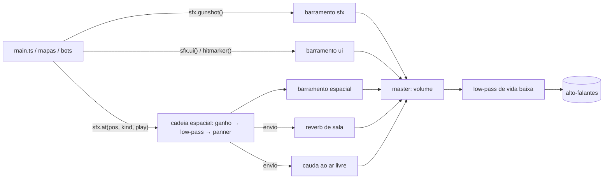

# Audio Overview

## Visão geral (nível 1)

Todo o áudio do Offensive Combat é **sintetizado em tempo real com a Web Audio API**. Não existe nenhum arquivo de som no projeto (`.mp3`, `.ogg`, `.wav`) nem elemento `<audio>`: cada som é uma função que monta osciladores, ruído filtrado e envelopes de ganho no momento em que é tocado. A decisão está registrada em [[ADR - Áudio procedural em Web Audio]].

O sistema tem duas camadas:

| Camada | Arquivo | Responsabilidade |
| --- | --- | --- |
| Motor de som | `client/audio/sfx.ts` (classe `Sfx`) | Contexto Web Audio, barramentos de mixagem, catálogo de sons procedurais, posicionamento 3D, eco e limite de vozes. |
| Matemática espacial | `client/audio/spatial.ts` | Funções puras (sem Web Audio nem física) para atenuação por distância, oclusão por paredes, "quanto um lugar é fechado" (eco) e passos de outros jogadores. Testadas em `client/tests/spatial.test.ts`. |

## Como funciona (nível 2)

- **Sons do próprio jogador** (tiro, recarga, passos, dano) tocam "na cabeça", direto no barramento `sfx`, recebendo apenas o eco do lugar onde o jogador está.
- **Sons do mundo** (outros jogadores, bots, granadas, props do mapa, ambiente) passam por `sfx.at(posição, tipo, play)`, que cria uma cadeia própria com panner 3D, filtro de oclusão e envios de eco. Detalhes em [[Spatial Audio]].
- **Sons de interface** (clique de menu, hitmarker, "ding" de abate) vão para o barramento `ui`.
- O **volume geral** e o **modo espacial** (fone 3D / caixa estéreo / automático) vêm de [[Settings]].
- Com **vida baixa**, um filtro passa-baixa no master abafa tudo (efeito de "audição abafada"), proporcional a quanto a vida está abaixo de `HEALTH.lowThreshold` (30). Morto, o filtro é desligado.

## Implementação (nível 3)

- **Desbloqueio:** navegadores só permitem áudio após um gesto do usuário. `Sfx.unlock()` cria o `AudioContext` no clique do botão JOGAR (`screens.onPlay` em `client/main.ts`). Antes disso, todas as funções de som retornam sem fazer nada (`ready` falso).
- **Ruído compartilhado:** um único `AudioBuffer` de 1 s de ruído branco é reutilizado por todos os sons de ruído (`noiseBurst`), com início aleatório para variar.
- **Variação:** tiros variam ±5% de altura; passos variam a frequência do filtro; nada soa idêntico duas vezes.
- **Limite de vozes:** no máximo 36 sons espaciais simultâneos (`MAX_VOICES`), cada um contado por 1,2 s. Quando lotado, um som de prioridade menor (passos primeiro, ambiente antes de tudo) é descartado. Ver [[Spatial Audio]].
- **Mapas** recebem a instância `Sfx` (ou a interface `SpatialSfx`) na construção e tocam seus próprios sons de props e ambiente. Ver [[Ambient Audio]] e [[Audio Events]].

## Notas desta área

- [[SFX]] — catálogo de efeitos sonoros por família.
- [[Music]] — o que existe de "música" (jingles procedurais e a música da dança).
- [[Voice]] — não há voz/voice chat; existem "resmungos" cartunescos.
- [[Ambient Audio]] — pássaros, corvos, uivos, hidrante.
- [[Audio Events]] — que evento de jogo dispara que som, e de onde vem (local, rede, bots, mapa).
- [[Spatial Audio]] — posicionamento 3D, oclusão por material, eco, modos fone/caixa.

## Dependências

- [[Damage System]] / [[Health System]] — dano dispara `hurt()`, vida baixa abafa o master.
- [[Movement]] — passos, aterrissagem e deslize geram sons conforme o material do chão.
- [[Materials]] / [[Texture System]] — o material físico de cada superfície (`SurfaceMaterial`) decide o timbre de passos, impactos e o quanto uma parede abafa.
- [[Replication]] — eventos de rede (`shot`, `swing`, `grenade`, `boom`, `prop`) tocam sons posicionados no cliente.
- [[Settings]] — volume e modo espacial.

## Código relacionado

- `client/audio/sfx.ts` — classe `Sfx`, `SpatialLoop`, `impulse()` (resposta de impulso sintética).
- `client/audio/spatial.ts` — `SPATIAL_KINDS`, `voiceParams`, `distanceGain`, `OCCLUSION_WEIGHT`, `Enclosure`, `BodySounds`, `skySpot`.
- `client/main.ts` — criação do `Sfx`, `setWorld` (raycasts Rapier), `setListener` por quadro, `setMuffled`.
- `client/core/settings.ts` — `volume`, `spatialAudio`, `spatialMode()`.
- `client/tests/spatial.test.ts` — testes da matemática espacial.

## Configurações relacionadas

- `Settings.volume` (padrão 0,7) e `Settings.spatialAudio` (`auto` | `hrtf` | `stereo`, padrão `auto`).
- `HEALTH.lowThreshold` em `shared/constants.ts` (30) — limiar do abafamento.
