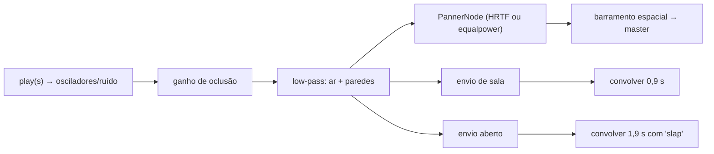

# Spatial Audio

Som 3D: todo som que acontece no mundo (outros jogadores, bots, granadas, props do mapa, ambiente) vem **do lugar onde acontece**, fica **abafado e mais baixo atrás de paredes** e ganha **eco** conforme o ambiente. Os sons do próprio jogador continuam "na cabeça". A decisão técnica está em [[ADR - Som espacial com oclusão por raycast]].

## Como o jogador percebe

- Tiros se ouvem de longe (até 220 m); passos só a poucos cômodos (até 34 m).
- Atrás de uma parede o som é abafado e mais baixo, mas **nunca some**: "você ainda ouve a briga no cômodo ao lado".
- Papel, vidro e madeira abafam menos que concreto (paredes de papel do Jardim do Dragão quase não abafam).
- Dentro de cômodos há eco curto de sala; ao ar livre, tiros e explosões ganham uma cauda longa.
- **Andar agachado não faz barulho de passos** (regra igual para o jogador local e para os outros).
- Configurações → Som: *Automático* (3D no PC, estéreo no celular), *Fone (3D)* (HRTF) ou *Caixa de som (estéreo)*. Ver [[Settings]].

## Tipos de som espacial (`SPATIAL_KINDS`)

Cada chamada `sfx.at(posição, tipo, play)` escolhe um "tipo", que define como o som se propaga (modelo de distância inverso do Web Audio: `ref / (ref + rolloff·(d − ref))`):

| Tipo | Uso | ref (m) | rolloff | máx. (m) | eco de sala | cauda aberta | prioridade |
| --- | --- | --- | --- | --- | --- | --- | --- |
| `gun` | tiros | 6 | 0,9 | 220 | 0,45 | 0,32 | 3 |
| `boom` | explosões | 9 | 0,7 | 260 | 0,5 | 0,45 | 3 |
| `step` | passos, aterrissagem, deslize, facada/arremesso de outros | 2,5 | 1,3 | 34 | 0,3 | 0 | 1 |
| `normal` | recargas, facas, impactos, quiques, props comuns | 2,5 | 1,2 | 70 | 0,35 | 0 | 2 |
| `loud` | props altos: gongo, rugido do dragão, caminhão de sorvete, sinos, buzina | 6 | 1 | 140 | 0,4 | 0,2 | 2 |
| `ambient` | pássaros, corvos, uivos no céu | 18 | 1 | 400 | 0 | 0 | 0 |

Sons além da distância máxima nem são criados.

## Pipeline de um som posicionado

1. **Admissão** (`admit`): no máximo 36 vozes espaciais vivas (cada uma conta 1,2 s). Lotado, uma voz de prioridade menor é substituída; se não houver, o som novo é descartado. Passos (1) e ambiente (0) caem primeiro.
2. **Oclusão** (`voiceParams(d, oclusão)`):
   - O "ar" abafa sons distantes: corte = `max(2500, 20000·e^(−d/70))` Hz.
   - Com paredes (oclusão > 0,01, limitada a 2): ganho = `max(0,2; 1 − 0,42·oclusão)` e corte = `min(ar, max(450, 1700/oclusão))` Hz.
3. **Oclusão por material** (`OCCLUSION_WEIGHT`): concreto, azulejo, metal e grama = 1 (parede sólida); madeira 0,7; vidro 0,35; papel 0,25.
4. **Medição da oclusão** (em `main.ts`): um raio Rapier vai do ouvido até o som e outro volta do som até o ouvido. Se os dois batem no mesmo colisor, é **uma** parede; se batem em colisores diferentes, somam-se os pesos (duas paredes ou parede grossa). Só colisores do mundo (`WORLD_ONLY`), excluindo sensores.
5. **Eco** (`Enclosure`): mede "quão fechado" é um ponto, de 0 (campo aberto) a 1 (sala pequena), lançando um raio para cima (teto pesa 60%) e seis raios horizontais (paredes pesam 40%; mais perto = mais fechado). Resultado em **cache por célula de 2 m** (limpo ao passar de 4000 entradas). Envio de sala = `room·fechamento·√distanceGain·0,7`; envio aberto = `open·(1−fechamento)·√distanceGain`. Antes dos raios valem as **salas marcadas** (`RoomVolumes`: peças `sala` e caixas `ROOM_` dos `.glb`; vale a mais fechada que contém o ponto). Uma sala girada (peça com pose no editor, `ROOM_` girado) guarda a caixa no seu referencial e testa o ponto lá (`RoomVolume.local`), sem virar a caixa alinhada em volta dela ([[ADR - Mapas como dados com catálogo de peças]]).
6. **Respostas de impulso** são sintéticas (`impulse()` em `sfx.ts`): ruído que decai e escurece; a cauda aberta tem um "slap" (eco precoce de parede distante).

## Ouvinte e sons do próprio jogador

- `setListener(pos, frente, cima, dt)` é chamado a cada quadro com a câmera (`client/main.ts`). Firefox usa os setters antigos (`setPosition`/`setOrientation`).
- A cada 0,2 s: atualiza o eco dos sons do próprio jogador (o barramento `sfx` envia `0,22·fechamento` para a sala e `0,1·(1−fechamento)` para a cauda aberta) e reavalia oclusão/eco dos sons contínuos (`SpatialLoop.refresh`, ex.: hidrante).

## Passos e ações de outros (`BodySounds`)

Os outros jogadores não enviam eventos de passo pela rede: o cliente **deduz** os sons a partir do movimento replicado (`Walker`: pés, vivo, no chão, correndo, agachado, deslizando, recarregando), com as mesmas regras do jogador local:

- passo a cada 2,0 m andando ou 2,6 m correndo, se velocidade > 1 m/s, no chão e sem deslizar; **agachado não soa**; correndo soa mais alto (1,3 vs 0,8);
- aterrissagem após > 0,35 s no ar (forte se > 0,9 s);
- início de deslize e início de recarga geram um som cada;
- deslocamento > 4 m num passo é tratado como teleporte (respawn) e não gera passo.

O material do chão vem de um raio para baixo (`groundAt`). Ver [[Replication]] e [[Movement]].

## Modos de espacialização

| Modo | `panningModel` | Quando |
| --- | --- | --- |
| `hrtf` | `HRTF` | Fone; padrão "auto" no computador. |
| `stereo` | `equalpower` | Caixa de som; padrão "auto" em celulares (mais leve e geralmente tocado no alto-falante). |

`spatialMode(settings)` em `client/core/settings.ts` resolve o "auto" com `IS_MOBILE` ([[Input & Controls]]). Trocar o modo atualiza também os sons em loop já tocando.

## Testes

`client/tests/spatial.test.ts` (Bun) cobre: parede abafa sem silenciar e papel quase não abafa; sons distantes são mais baixos e escuros; tiro carrega mais que passo; lugar com teto e paredes é fechado e campo aberto não; cache por célula; passos andando/correndo/agachado; aterrissagem, deslize e recarga geram um som cada; respawn não é passo. Ver [[Unit Tests]].

## Código relacionado

- `client/audio/spatial.ts` — `SPATIAL_KINDS`, `distanceGain`, `OCCLUSION_WEIGHT`, `voiceParams`, `Enclosure`, `BodySounds`, `skySpot`, interface `SpatialSfx`.
- `client/audio/sfx.ts` — `at`, `loopAt`, `chain`, `tune`, `admit`, `setListener`, `setWorld`, `setSpatialMode`, `SpatialLoop`.
- `client/main.ts` — `soundCast`, `occluder`, `sfx.setWorld(...)`, `playBody`, `groundAt`.
- `client/world/physics.ts` — tipo `SurfaceMaterial`.

## Riscos e limitações

- Cada som posicionado com oclusão faz até 2 raycasts no momento em que toca; sons em loop refazem a cada 0,2 s. Ver [[CPU]].
- O cache de `Enclosure` assume mapa estático ("o mapa não se move"); `setWorld` deve ser chamado de novo num mapa novo.
- Portas/objetos móveis não são considerados (só colisores do mundo).
