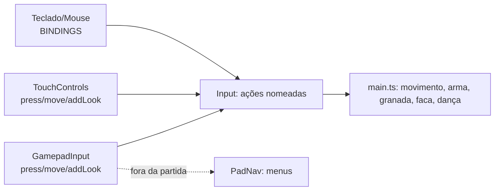

# Input & Controls

O jogo aceita **teclado + mouse**, **toque** (celular/tablet) e **controle** (PS4, PS5, Xbox 360/One via Gamepad API). Todos alimentam o mesmo conjunto de **ações nomeadas** em `client/core/input.ts`; o código de gameplay só pergunta `input.down('fire')`, `input.consume('reload')` etc., sem saber qual dispositivo foi usado.

## Ações

| Ação | Padrão (teclado) | Controle (layout CoD) | Toque |
| --- | --- | --- | --- |
| Andar (frente/trás/esq./dir.) | W / S / A / D | analógico esquerdo | analógico flutuante à esquerda |
| Olhar | mouse | analógico direito | arrastar na tela |
| Pular | Espaço | ✕ / A | botão |
| Agachar (correndo: deslizar) | **C** | ◯ / B (toque alterna) | botão (alterna) |
| Correr | Shift esquerdo | L3 (alterna; para com o analógico) | analógico até a borda |
| Atirar | botão esquerdo | R2 / RT | botão grande (+ segundo à esquerda) |
| Mirar | botão direito | L2 / LT | botão (tocar alterna ou segurar, configurável) |
| Recarregar | R | □ / X | botão |
| Faca | F | R1 / RB ou R3 | botão |
| Granada (segurar = cozinhar) | G | L1 / LB | botão |
| Primária / secundária | 1 / 2 | — | — |
| Trocar de arma (a outra) | roda do mouse (para baixo; alternativa: para cima) | direcional ← / → | botão de troca (acima do pular) |
| Oprimir / interagir | E | △ / Y | tocar no prompt |
| Placar (segurar) | Tab | Share/View ou touchpad | botão (alterna) |
| Chat | Enter, alternativa T | — | botão |
| Pausa | Esc (fixo) | Options / Menu | botão |
| Depuração | F3 (fixo) | — | — |
| Hitboxes/colisores | F4 (fixo) | — | — |
| Painel de ajuste | F6 (fixo) | — | — |

Mecânicas: [[Movement]], [[Combat]], [[Weapons]] (troca de arma), [[Grenades]], [[Melee]], [[Humiliation]], [[Aim Assist]]. As ações de troca são `weapon1`, `weapon2` e `swapWeapon`.

## Teclas remapeáveis

Decisão em [[ADR - Teclas remapeáveis com primária e alternativa]]. Regras (`client/core/keybinds.ts`, testadas em `client/tests/keybinds.test.ts`):

- Cada ação tem **dois espaços**: primária e alternativa (qualquer um pode ficar vazio).
- No menu, clicar numa tecla da tabela espera a próxima tecla, botão do mouse (inclusive laterais) ou passo da roda; Esc cancela; "×" esvazia o espaço; "Restaurar padrão" volta tudo.
- Uma tecla só pode estar num lugar: atribuí-la a uma ação a tira da outra, e o menu avisa ("{tecla} estava em "{ação}", que ficou sem tecla primária/alternativa.").
- **Proibidas:** Ctrl (Ctrl+W fecha a aba e não pode ser interceptado fora da tela cheia) e as teclas fixas F3/F4/F6. Por isso agachar fica no **C**.
- **Roda do mouse** só vale para ações de um toque (pular, atirar, recarregar, faca, granada, primária, secundária, trocar de arma, oprimir) — não para ações de segurar nem para o chat (`WHEEL_ACTIONS`).
- Nomes das teclas: usa o mapa de layout do navegador (Chrome/Edge: AZERTY, Dvorak…); no Firefox, o caractere aprendido quando o jogador apertou a tecla (`keyLabels`); senão, QWERTY. Nomes em pt-BR/en.
- Ao carregar, as teclas salvas são mescladas ação por ação com os padrões (ações novas ganham o padrão; inválidas, proibidas ou repetidas são descartadas).
- Os prompts do HUD mostram a tecla atual (`screens.keyName('taunt')`).

## Mouse e pointer lock

- Jogar no computador usa **pointer lock** (com `unadjustedMovement`, sem aceleração do SO, quando suportado). Sensibilidade estilo Source: graus por contagem = `sensibilidade × 0,022`.
- Durante o jogo, o uso padrão do navegador das teclas em uso é bloqueado (Espaço rolar, Tab foco, botões laterais voltarem página); menu de contexto sempre bloqueado.
- Presses são guardados até serem consumidos, para não perder um toque num quadro sem tick de simulação (comum a 144 Hz+).
- Esc e retomada do mouse têm regras especiais do navegador: ver [[Problem - Esc e Pointer Lock no navegador]].

## Controle (Gamepad)

- Detecta família pelo id (Xbox por nome/vendor 045e; Sony 054c/DualShock/DualSense; o resto é tratado como Xbox) e mostra os glifos certos (✕◯□△/L1… ou A B X Y/LB…) no HUD e na tabela de controles.
- Zona morta radial (movimento 0,16; olhar 0,12), gatilhos acima de 0,35; olhar com curva de resposta (expoente 1,8), 220°/s a sensibilidade 1, e **impulso de 1,6×** ao segurar no limite para virar.
- Vibra em acertos, abates e dano (Chrome/Edge; Safari ignora).
- Jogar no controle **não prende o mouse**; um clique no jogo devolve o controle ao mouse. O "dispositivo atual" (`mouse` | `touch` | `pad`) muda com o último usado.
- Fora da partida, navega os menus (`PadNav`, ver [[Menus]]); no canvas do Arsenal da tela inicial, o analógico direito move o canvas ([[Inventory UI]]).

## Toque

Ver [[Touch Controls]].

## Detecção de dispositivo

`client/core/device.ts` decide uma vez no início se é celular/tablet (`IS_MOBILE`): toque como entrada principal sem ponteiro fino, ou user agent de celular/tablet, ou iPadOS. `?mobile=1` / `?mobile=0` força. Também detecta iOS, suporte a tela cheia, PWA instalado (`STANDALONE`) e Keyboard Lock (`CAN_KEEP_ESCAPE`).

## Código relacionado

- `client/core/input.ts` — `Input`, `BINDINGS`, `applyKeybinds`.
- `client/core/keybinds.ts` — `Action`, `DEFAULT_KEYBINDS`, `FIXED_KEYS`, `REBINDABLE`, `assign`, `clearSlot`, `mergeKeybinds`, `toBindings`, `keyLabel`, `WHEEL_ACTIONS`.
- `client/core/gamepad.ts` — `GamepadInput`, `gamepad`, `GLYPHS`.
- `client/core/device.ts` — `IS_MOBILE`, `IS_IOS`, `CAN_FULLSCREEN`, `CAN_KEEP_ESCAPE`, `enterFullscreen`, `keepEscape`.
- `client/ui/menu.ts` — tabela de controles e captura de teclas.
- `client/tests/keybinds.test.ts` — testes de atribuição. Ver [[Unit Tests]].
