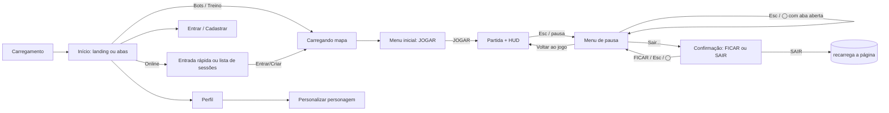

# UI Overview

## Visão geral (nível 1)

A interface do Offensive Combat é **HTML/CSS puro sobre o canvas do Three.js**, sem framework (nada de React/Vue). As telas existem como elementos fixos em `index.html` e são mostradas/escondidas trocando a classe `hidden`; cada módulo em `client/ui/` guarda referências diretas aos elementos e atualiza seu texto/estilo. Algumas telas são montadas dinamicamente com `innerHTML` (formulários de conta, perfil, editor de personagem, lista de sessões, painel de arsenal).

Visual: estilo "sticker" (painéis com contorno grosso e sombra dura deslocada), fontes Google **Lilita One** (títulos, números) e **Nunito** (texto), paleta definida em variáveis CSS (`--ink` #1b1530, `--paper` #fff8ec, `--good` verde, `--warn` amarelo, `--bad` vermelho, cores de time laranja/azul). No HUD em partida, texto branco direto sobre o jogo com sombra suave, sem painéis. Ver [[UI Assets]] e [[Art Direction]].

## Camadas e telas

| Elemento (`index.html`) | Módulo | Nota |
| --- | --- | --- |
| `#game` | canvas do renderizador | [[Rendering Overview]] |
| `#loading` | `Screens` (`client/ui/menu.ts`) | [[Menus]] — carregamento com dicas |
| `#home` (`#home-in`: abas `#tab-play`, `#tab-maps`, `#tab-arsenal`, `#tab-album`, `#tab-profile`, `#tab-settings` e, para a equipe, `#tab-management`; `#home-out`: landing com `#home-auth`) | `showHome` (`client/ui/home.ts`), `maps.ts`, `management.ts`, `arsenalCanvas.ts`, `album.ts`, `auth.ts`, `profile.ts`, `customize.ts` | [[Menus]], [[Matchmaking UI]], [[Flow - First Access]], [[Moderation]], [[Achievements]] |
| `#menu` (trilho `.pm-rail`, painel `#pm-panel`, janela de saída `#pm-confirm`, configurações `#menu-settings`) | `Screens` (`client/ui/menu.ts`), regras em `client/ui/pauseMenu.ts` | [[Menus]] (cartão de início e pausa), [[Settings]], [[Input & Controls]] |
| `#hud` | `Hud` (`client/ui/hud.ts`) | [[HUD]] |
| `#scoreboard` (dentro do HUD) | `Scoreboard` | [[Scoreboard]] |
| `#chat` (dentro do HUD) | `Chat` | [[Chat]] |
| `#killfeed`, `#banner`, `#popups`, `#net-status` | `Hud` | [[Notifications]] |
| `#scope` | `client/main.ts` | [[HUD]] (luneta) |
| `#touch` (criado em código) | `TouchControls` | [[Touch Controls]] |
| `#touch-edit-bar`, `#rotate` | `Screens` | [[Touch Controls]] |
| Sprite 3D sobre corpos | `CorpseTimer` | [[HUD]], [[Humiliation]] |
| Painel F6 (criado em código) | `TuningPanel` (`client/ui/tuning.ts`) | ferramenta de dev, ver [[Input & Controls]] |
| `#editor` (criado em código, no lugar da partida) | `runEditor` (`client/editor/editor.ts`): toolbar, painéis encaixáveis (Hierarquia, Cena, Inspetor, Projeto) e barra de status, CSS próprio (`client/editor/style.ts`) e textos próprios (`client/editor/strings.ts`) | [[Map Editor UI]] |

## Fluxo geral de telas

A saída do menu ("Sair da sessão", "Sair da partida", "Sair da corrida", "Sair do treino", conforme o modo) pede **confirmação** e só então fecha a conexão e **recarrega a página inteira** (`location.reload()` em `client/main.ts`): não existe retorno ao início sem recarregar. No menu, Esc e ◯ voltam um nível (janela → aba → jogo; ver [[Menus]]).

## Princípios observados no código

- **Um único conjunto de ações para todos os dispositivos:** teclado/mouse, toque e controle alimentam as mesmas ações nomeadas (`Input`), e a UI mostra os glifos do dispositivo em uso (tecla, "Toque", ✕/A...). Ver [[Input & Controls]].
- **Atualização barata:** o HUD guarda o último valor mostrado e só toca no DOM quando muda; números (vida, munição, placar) são atualizados a 15 Hz (`hudTimer = 1/15` em `main.ts`).
- **Textos sempre por `t(chave)`:** todo texto visível vem de `client/ui/strings.ts` em **pt-BR** e **en**. O idioma é escolhido pelo `navigator.language` (começa com "pt" → pt-BR, senão en). Não há seletor de idioma na interface (existe `setLang`, mas nada o chama). O editor de personagem tem seus próprios rótulos bilíngues em `customize.ts`.
- **Segurança de texto:** nomes de jogadores e mensagens de chat são escritos com `textContent` ou escapados (`esc`) antes de `innerHTML`.
- **Navegação por controle:** fora da partida, `PadNav` (`client/ui/padNav.ts`) move o foco para o controle visível mais próximo na direção do D-pad/analógico; ✕/A aciona, ◯/B volta (botões cujo texto começa com "voltar", "cancelar", "fechar"...), L1/R1 trocam abas, analógico direito rola (no canvas do Arsenal da tela inicial, move o canvas).
- **Celular:** classe `mobile` no `<html>` (`client/core/device.ts`) troca layouts via CSS (`.desktop-only`, `.mobile-only`); a partida pede o celular deitado (aviso "Gire o celular para jogar").

## Notas desta área

[[HUD]] · [[Menus]] · [[Map Editor UI]] · [[Matchmaking UI]] · [[Inventory UI]] · [[Scoreboard]] · [[Notifications]] · [[Input & Controls]] · [[Chat]] · [[Settings]] · [[Touch Controls]]

Fluxos: [[Flow - First Access]] · [[Flow - Join Online Match]] · [[Flow - Death and Respawn]]

## Código relacionado

- `index.html` — estrutura de todas as telas.
- `client/styles.css` — estilos (~2500 linhas; seções HUD, Screens, Home, Scoreboard, Account, Character editor, Phones, Controllers).
- `client/ui/*.ts` — módulos de UI.
- `client/main.ts` — orquestra telas, HUD e input durante a partida.
- `client/ui/strings.ts` — i18n.
