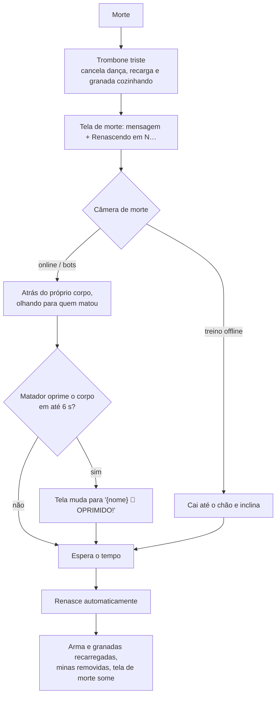

# Flow - Death and Respawn

O que o jogador vê e ouve entre morrer e voltar a jogar. As regras de jogo estão em [[Respawn]], [[Health System]] e [[Humiliation]]; escolha de ponto de nascimento em [[Spawn Design]].

## Fluxo

## Passo a passo

1. **Momento da morte**
   - Som `sadTrombone()` na cabeça ([[SFX]]); o abafamento de vida baixa é desligado.
   - A dança em curso é cancelada (com a música), a granada cozinhando cai no chão, e a segunda granada do "Dose Dupla" é descartada.
   - O painel de bônus esvazia (efeitos "até morrer", como humanidade e granadas de pato, acabam). Ver [[Buffs & Debuffs]].
2. **Tela de morte** (`#death`): cartão central com a mensagem e "Renascendo em {s}…" atualizado a cada tick.
   - Morto por alguém: "{nome} te eliminou com {arma}".
   - Morte sem atacante: frase engraçada aleatória por causa — queda ("A calçada mandou lembranças."), saída do mapa ("Você saiu do mapa. O mapa não sentiu sua falta."), explosão própria, mordida da cachorra Amora (`DEATH_MESSAGES` em `strings.ts`).
   - Se o matador começa a humilhar o corpo, a mensagem vira "{nome} 💃 OPRIMIDO!".
   - O kill feed registra a morte para todos ([[Notifications]]).
3. **Câmera de morte** (`render` em `client/main.ts`):
   - **Online e contra bots:** a câmera desliza para 3 m atrás e 2,2 m acima do próprio corpo, **olhando para o matador** enquanto ele estiver vivo — o comentário do código diz que é "para ver a humilhação". Ver [[Camera]].
   - **Treino offline:** a câmera cai até o chão sob o ponto da morte em 0,6 s e inclina.
   - Não há killcam/replay do ponto de vista do matador nem modo espectador livre.
4. **Corpo humilhável:** sobre o corpo aparece o contador 3D ([[HUD]]: anel + segundos + [E]) durante a janela de 6 s (`HUMILIATION.window`).
5. **Respawn automático** (não há botão "renascer"):

| Modo | Atraso | Origem |
| --- | --- | --- |
| Treino offline | 3 s | `RESPAWN_DELAY` em `client/entities/localPlayer.ts` |
| Contra bots | 5 s | `player.respawnDelay = 5` em `main.ts` |
| Online | 5,3 s | `NET.respawnDelay` (5 s, "longo o bastante para ver a própria humilhação") + 0,3 s |

   Ver [[ADR - Atraso de respawn de 5 s online]].
6. **Volta ao jogo:** novo ponto de nascimento (online: ponto seguro longe/fora da vista de inimigos; bots: o gerenciador escolhe; offline: aleatório diferente do último), minas próprias removidas, pente e granadas cheios, tela de morte escondida. Contra bots, **2 s de proteção** (o jogador pisca; acaba ao atirar). Online o cliente envia `{t:'respawn', p, yaw}` ao servidor ([[Remote Calls]]).

## Código relacionado

- `client/main.ts` — `ev.died`, `conn.on('kill')`, callbacks dos bots (`deathMessage`, `tauntStarted`), `stepInner` (timer e `respawn()`), câmera de morte em `render`.
- `client/ui/hud.ts` — `showDeath`, `setDeathTimer`.
- `client/ui/corpseTimer.ts` — contador sobre o corpo.
- `client/entities/localPlayer.ts` — `respawnDelay`, `canRespawn`, `respawnIn`.
- `client/ui/strings.ts` — `killedByWith`, `respawnIn`, `DEATH_MESSAGES`.
- `shared/protocol.ts` — `NET.respawnDelay`; `shared/constants.ts` — `HUMILIATION`.
