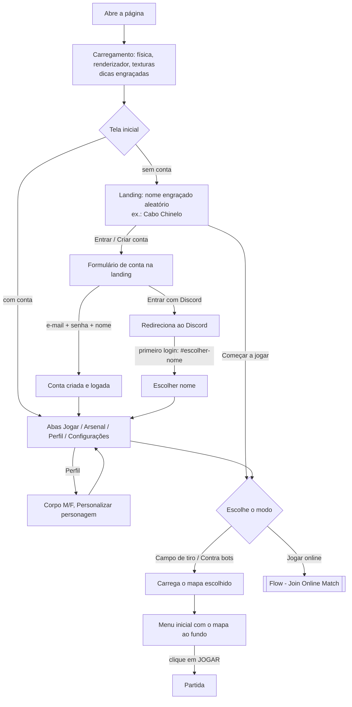

# Flow - First Access

O que acontece da primeira abertura da página até o primeiro tiro. Não há tutorial, nem onboarding guiado, nem tela de termos: o jogador cai direto na tela inicial e pode jogar sem conta (treino e bots).

## Fluxo

## Passo a passo

1. **Carregamento** (`Screens`, `client/ui/menu.ts`): logo, barra e dicas rotativas. Antes de montar qualquer tela, o boot lê as configurações salvas e aplica o **idioma** (o salvo no aparelho; sem escolha, o do navegador: pt → pt-BR, es, de, en, qualquer outro → inglês), com `<html lang>` e o título da página. Depois inicializa o Rapier, o renderizador e a qualidade gráfica (avisa se a GPU é por software). Ver [[Loading Performance]] e [[ADR - Seletor de idioma por aparelho]].
2. **Tela inicial** (`showHome`, `client/ui/home.ts`): consulta a conta (`/api/me`) e se o login por Discord está disponível (`/api/auth/provedores`). Sem conta mostra a **landing** (apresentação do jogo, mapas, modos, formulário de conta e jogo rápido contra bots), com o **botão de idioma** ao lado de ENTRAR para trocar o idioma antes do cadastro (recarrega a página); com conta, as **abas** Jogar, Mapas, Arsenal, Perfil e Configurações (e Gerenciamento para admin e moderador). Ver [[Menus]]. Apaga chaves antigas do `localStorage` (`oc.name`, `oc.sex`, `oc.profile`). Sem servidor, mostra o aviso "Servidor fora do ar…" mas treino e bots continuam disponíveis.
3. **Conta (opcional para offline):**
   - *Criar conta:* e-mail, senha (com dica de regras), nome no jogo; o corpo enviado é o atual (padrão masculino). O nome vira `Nome#1234`.
   - *Entrar:* e-mail e senha; "Esqueci a senha" envia e-mail no idioma da tela (campo `idioma` de `POST /api/auth/recuperar`); o link volta com `#redefinir=<token>` e abre o formulário de nova senha.
   - *Discord:* botão só aparece se o servidor tiver o provedor; no primeiro login volta com `#escolher-nome`; erros voltam com `#erro=<código>`, traduzido em mensagem.
   - Detalhes de backend em [[Authentication]].
4. **Personagem (opcional):** Perfil → escolha de corpo e **PERSONALIZAR PERSONAGEM** (editor 3D). Sem conta, joga-se com a aparência padrão. Ver [[Character Customization]].
5. **Modo:** *Campo de tiro* ([[Training]]), *Contra bots* ([[Versus Bots]]) ou *Online* (exige conta — [[Flow - Join Online Match]]). O Arsenal (secundária e melhorias opcionais) e as configurações já podem ser ajustados nas abas antes de escolher.
6. **Mapa:** a tela de carregamento volta enquanto o mapa é construído ([[Maps Index]]).
7. **Menu inicial:** um quadro do mapa é renderizado atrás do cartão; o jogador pode ajustar [[Settings]], teclas ([[Input & Controls]]) e o [[Inventory UI]] (Arsenal: secundária e melhorias) antes de jogar.
8. **JOGAR:** o clique **libera o áudio** (`sfx.unlock()`, exigência do navegador — ver [[Audio Overview]]), toca o bip de UI, pede o **pointer lock** e, se configurado, **tela cheia** (celular: paisagem; computador com Keyboard Lock: o jogo fica com o Esc). Nascimento: ver [[Respawn]].

## Pontos de atrito conhecidos

- O áudio só começa no clique de JOGAR (a tela inicial é muda).
- "Sair para o início" recarrega a página e refaz todo o carregamento.
- No iPhone não há tela cheia pelo navegador; o menu orienta a "Adicionar à Tela de Início".
- ~~Idioma é automático pelo navegador; não há como trocar.~~ Resolvido na PF-30: seletor nas Configurações (subaba Vídeo) e na landing; quatro idiomas (pt-BR, en, es, de).

## Código relacionado

- `client/main.ts` — `boot()`.
- `client/ui/home.ts`, `client/ui/auth.ts`, `client/ui/profile.ts`, `client/ui/customize.ts`, `client/ui/menu.ts`.
