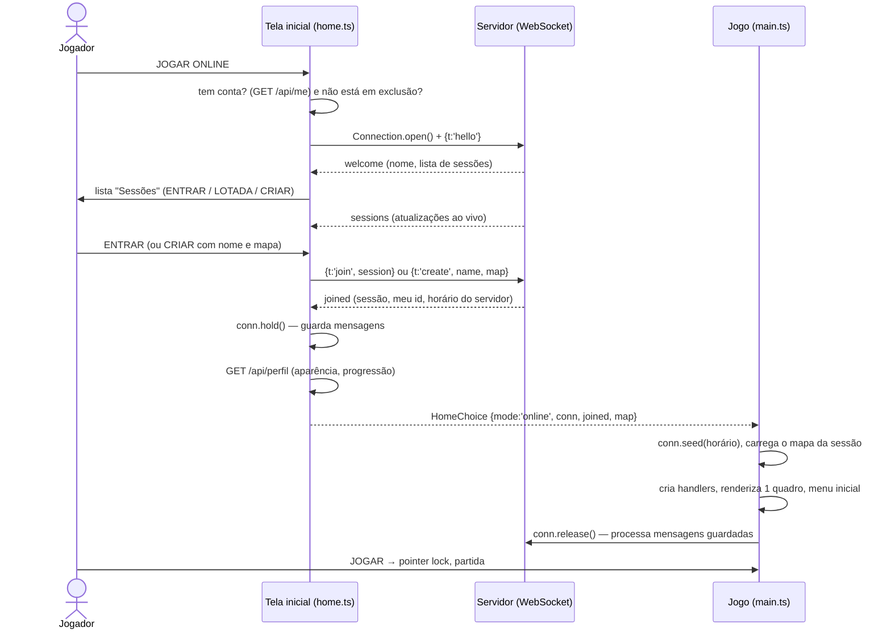

# Flow - Join Online Match

Da tela inicial até estar jogando numa sessão online. A UI do navegador de sessões está em [[Matchmaking UI]]; o lado do servidor em [[Matchmaking]], [[Sessions]] e [[Client Server Model]].

## Sequência

## Passo a passo

1. **JOGAR ONLINE** na tela inicial. Sem conta: abre "Entrar" com "Entre na sua conta para jogar online.". Conta marcada para exclusão: bloqueado com instrução para cancelar no Perfil.
2. **Conexão:** "Conectando ao servidor…" → abre o WebSocket, envia `hello`, espera `welcome`. A tela troca para a lista de sessões e mostra "Conectado como {nome}.".
3. **Escolha:** cada sessão mostra nome, mapa, jogadores/máximo (máx. 10). Sessão cheia: botão **LOTADA** desabilitado. Ou cria uma nova (nome até 24 caracteres + mapa).
4. **Entrada:** "Entrando…" → `join`/`create` → `joined`. A conexão passa a **segurar** as mensagens que chegam (`hold`) enquanto o mapa é construído, para que nada se perca antes de existirem os handlers.
5. **Carregamento do mapa da sessão** (não o do seletor da tela inicial). O relógio local é sincronizado com o do servidor (`seed`).
6. **Menu inicial** com subtítulo "Sessão: {nome} · mata-mata livre"; a conexão libera as mensagens guardadas (`release`). O mundo online **já está rodando** mesmo antes de clicar JOGAR.
7. **JOGAR:** captura do mouse, partida. Chat habilitado ([[Chat]]), placar com Tab ([[Scoreboard]]), avisos de entrada/saída no feed ([[Notifications]]).

## Falhas e saídas

| Situação | O que o jogador vê |
| --- | --- |
| Servidor fora do ar | "Servidor fora do ar. Rode "bun run dev:online" (ou jogue o treino offline)." |
| Erro ao entrar/criar | Mensagem do erro no status da tela inicial; continua na lista. |
| Conexão perdida durante a lista | Motivo do fechamento no status. |
| Conexão perdida em jogo | `#net-status`: "Sem conexão com o servidor". |
| Sessão revogada (4001) | "Sua sessão foi encerrada (saída da conta, troca de senha, exclusão ou suspensão)." |
| Mesma conta em outro lugar (4002) | "Sua conta entrou no jogo em outro lugar." |
| Voltar na lista | Fecha a conexão e volta à tela inicial. |
| Sair para o início (pausa) | Fecha a conexão e recarrega a página. |

> [!info]
> Não há reconexão automática nem retorno à mesma sessão após queda: inferido pela ausência de lógica de reconexão em `client/main.ts` (o `onClose` só mostra o status). Ver [[Error Handling]].

## Código relacionado

- `client/ui/home.ts` — handler de `#home-online`, `join`, `renderList`, `closeReason`.
- `client/net/connection.ts` — `Connection.open`, `next`, `hold`, `release`, `seed`.
- `client/net/api.ts` — `fetchMe`, `fetchProfile`.
- `client/main.ts` — `boot()` (ramo online), `conn.onClose`.
- `shared/protocol.ts` — mensagens e `NET`, `CLOSE`.
