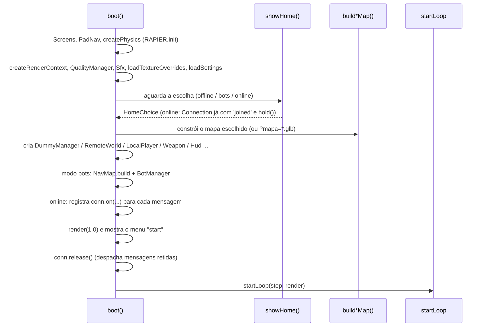

# Client Architecture

## Responsabilidade

O cliente é o jogo inteiro rodando no navegador: monta o mapa, simula o jogador local com física Rapier, renderiza com Three.js, toca sons procedurais, desenha a UI em DOM e, conforme o modo, conversa com o servidor (online), simula bots (contra bots) ou bonecos de treino (offline).

## Ponto de entrada

1. `index.html` contém todo o DOM estático do HUD, menus e home, e carrega `client/main.ts` como módulo.
2. `client/main.ts` define `async function boot()` e a chama no fim do arquivo: `boot().catch(...)` escreve "Erro ao iniciar: ..." no elemento `#loading-tip` (ver [[Error Handling]]).
3. Não há roteador nem múltiplas páginas no jogo. `tools/lab-personagens.html` é uma segunda página só de desenvolvimento (carrega `client/dev/characterLab.ts`).

## Fases do `boot()` (código confirmado)

Detalhes:

- **Carregamento**: `createPhysics()` (`client/world/physics.ts`) inicializa o WASM do Rapier e cria um `World` com gravidade −22 e `timestep` 1/60. `createRenderContext` cria renderer, cena, câmera, sol e a cena separada do viewmodel.
- **Home**: `showHome()` (`client/ui/home.ts`) resolve com um `HomeChoice` que é uma união discriminada por `mode`: `'offline'` (treino), `'bots'` (`count`, `skill`) ou `'online'` (`conn`, `joined`). Ver [[Menus]] e [[Flow - Join Online Match]].
- **Mapa**: escolhido por `choice.map` (`rua` → `buildBlockoutMap`, `jardim` → `buildDragonGardenMap`, `halloween` → `buildHauntedTownMap`, `cemiterio` → `buildCemeteryMap`, só no modo zumbi) ou por `?mapa=/maps/x.glb` (`buildGltfMap`). Todos devolvem a interface `GameMap` (`client/world/blockoutMap.ts`): spawns, bonecos, `killY`, `props` (um `PropBus`), `update()`, `dog`, coletáveis, peixes, ratos, poção, recompensas e atmosfera. Ver [[World Structure]].
- **Criação de sistemas**: tudo é instanciado como `const` local dentro de `boot()` (ex.: `dummies`, `net`, `effects`, `viewmodel`, `progress`, `mines`, `player`, `avatar`, `melee`, `thrower`, `grenades`, `taunt`, `hud`, `scoreboard`, `input`, `chat`, `bots`).
- **Retenção de mensagens**: a home chama `conn.hold()` logo depois do `'joined'`; o `boot()` só chama `conn.release()` quando todos os handlers existem, para não perder abates/corpos enviados durante a montagem do mapa (`client/net/connection.ts`).

## Laço principal

`startLoop(step, render)` (`client/core/loop.ts`): acumulador com passo fixo `SIM.dt = 1/60`, no máximo `SIM.maxStepsPerFrame = 5` passos por quadro (zera o acumulador se atingir, "spiral-of-death guard"), `frameDt` limitado a 0,25 s, e `render(alpha, frameDt)` com `alpha = acc / dt` para interpolar. Ver [[ADR - Simulação em passo fixo com render interpolado]].

### `step(dt)` — simulação

- Offline e contra bots, a simulação **pausa** quando o ponteiro não está travado (menu aberto); online continua (`if (!input.locked && !net) return`).
- Ordem aproximada em `stepInner` (confirmada em `client/main.ts`): `simTime += dt` → `net.update` → coletáveis → morte/respawn → input do jogador (tiro, faca, opressão, granada, minas) → movimento e eventos do `LocalPlayer` (dano de queda, cão, morte) → `weapon.update` → `grenades.fixedUpdate` (explosões) → `bots.fixedUpdate` → pose das hitboxes do jogador (modo bots) → `dummies.fixedUpdate` → `physics.world.step()` → envio do estado ao servidor a `NET.stateRate` (20 Hz) com flags `FLAG.*`.

### `render(alpha, frameDt)` — apresentação

Interpola posições, atualiza câmera/viewmodel, `dummies.render`, `bots.render`, `net.render`, `map.update(frameDt, mapFrame)` (props animados e gags de proximidade), HUD (`hud.update`, vida, munição), qualidade dinâmica (`quality.update`, só jogando) e depuração (F3/F4/F6). Ver [[Rendering Overview]] e [[HUD]].

## Subsistemas (por pasta)

| Pasta | Papel | Notas centrais |
| --- | --- | --- |
| `client/core/` | Laço, input (teclado/mouse/toque/controle), keybinds, settings, detecção de dispositivo | [[Input & Controls]], [[Settings]] |
| `client/render/` | Renderer, qualidade, efeitos em pool, viewmodel, modelos de arma, materiais toon | [[Rendering Overview]] |
| `client/world/` | Física, `MapBuilder`, mapas feitos em código, glTF, superfícies/texturas, gags (`PropBus`), NPCs de cenário | [[World Structure]], [[Map Gags]] |
| `client/entities/` | Jogador local, avatar 3ª pessoa, rig de hitboxes, bonecos de treino | [[Health System]], [[Damage System]] |
| `client/character/` | Sistema modular de personagens (corpo, peças, atlas, animador) | [[Character Models]], [[Animation]] |
| `client/weapons/` | Lógica de arma de fogo, hitscan, faca, granadas, minas | [[Weapons]], [[Grenades]], [[Melee]] |
| `client/gameplay/` | Alvos, corpos, opressão, escolha de spawn, progressão, assistência de mira | [[Humiliation]], [[Spawn Design]] |
| `client/zombies/` | Modo zumbi no cliente: `client.ts` (eventos da partida, HUD, `E` no caixão, nas barricadas e para reanimar, setas das brechas, caído), `view.ts` (zumbis interpolados com hitboxes, telegrafias, inclusive a de surgimento), `coffin.ts` (o Caixão Misterioso, fixo, com a placa de arma danificada), `barricades.ts` (as tábuas nas brechas: estágios de dano, colisor para jogadores, sons), `looks.ts` (visuais dos zumbis e adereços dos chefes), `local.ts` (jogo solo: o motor `shared/zombieMatch.ts` no navegador), `link.ts` (interface `ZombieLink`, a mesma para a partida online e a solo; sem DOM), `ambience.ts` (névoa e página do caixão) | [[Zombie]] |
| `client/ai/` | Bots, gerenciador do mata-mata contra bots, navmesh | [[AI Overview]] |
| `client/net/` | API HTTP, conexão WebSocket, jogadores remotos | [[Networking Overview]] |
| `client/audio/` | Sons procedurais e matemática de som espacial | [[Audio Overview]] |
| `client/ui/` | Home, menus, HUD, chat, placar, editor de personagem, toque, strings | [[UI Overview]] |
| `client/dev/` | Laboratório de personagens e auditoria do catálogo (só dev) | [[Testing Overview]] |

Detalhe por módulo em [[Modules]].

## Como os três modos se encaixam

- `targets()` devolve `net.targets()` online ou `[...dummies.list, ...bots.bots]` offline; `humiliables()` faz o mesmo para corpos. O código de tiro, faca e granada só conhece `Target`/`Humiliable` (`client/gameplay/targets.ts`).
- **Online**: o resultado do acerto é enviado (`hit`, `stab`, `boom`) e o servidor responde com `damage`/`kill`. Ver [[Remote Calls]].
- **Contra bots**: o resultado vai para `bots.hit(...)`, que aplica dano, prêmios, corpos e respawns localmente. Ver [[Versus Bots]].
- **Treino**: o resultado vai direto para o `Dummy`. Ver [[Training]].

## Estado mantido

Todo o estado da partida no cliente vive em variáveis `let` do `boot()` (estatísticas, buffs, poção, humanidade, timers de granada etc.) e nos objetos criados ali. Sair para o início faz `location.reload()`. Ver [[State Management]].

## Eventos emitidos e recebidos

- Recebe mensagens do servidor por `conn.on('<tipo>', ...)` (≈ 25 handlers em `client/main.ts`).
- Envia `ClientMsg` com `conn.send(...)`.
- Liga callbacks de objetos (`input.onLockChange`, `gamepad.onStart`, `touch.onPause`, `chat.onSend`, `map.props.onLocal`, `conn.onClose`). Ver [[Events & Messaging]].

## Hooks de desenvolvimento

Em `import.meta.env.DEV`, `window.__oc` expõe jogador, arma, rede, física, mapa, bots, navmesh etc., além de `trace`, `stats` e `perf` (para testes de fumaça e console). No modo bots, `window.__ocNavDebug` guarda a malha de depuração.

## Riscos

- `boot()` é uma closure de ~1.800 linhas: difícil de testar isoladamente, sem fronteiras explícitas entre sistemas. Ver [[ADR - Bootstrap do cliente numa única closure]] e [[Technical Debt]].
- Não há "desmontagem": trocar de modo/mapa exige recarregar a página.

## Código relacionado

- `client/main.ts` (`boot`, `step`, `stepInner`, `render`)
- `client/core/loop.ts` (`startLoop`)
- `client/ui/home.ts` (`showHome`, `HomeChoice`, `closeReason`)
- `client/net/connection.ts` (`Connection.hold/release`)
- `client/world/blockoutMap.ts` (`GameMap`)
- `client/gameplay/targets.ts` (`Target`, `Humiliable`, `HitboxRegistry`)
