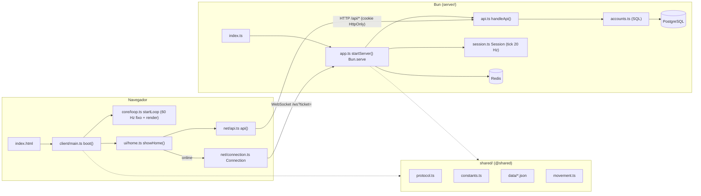

# Code Architecture Overview

> Índice da área **09 - Code Architecture**. Para a visão de alto nível do jogo inteiro, veja [[Architecture Overview]] (00 - Index).

## Resumo (nível 1)

Offensive Combat é um monorepo TypeScript com **três pacotes lógicos** (não há workspaces formais; é um único `package.json`):

| Pacote | Roda em | Ponto de entrada | Papel |
| --- | --- | --- | --- |
| `client/` | Navegador (Vite em dev, `dist/` em produção) | `index.html` → `client/main.ts` → `boot()` | Jogo completo: renderização Three.js, física Rapier, input, UI DOM, áudio Web Audio, bots offline e cliente de rede |
| `server/` | Bun (`Bun.serve`) | `server/index.ts` → `startServer()` em `server/app.ts` | API HTTP de contas, arquivos estáticos e WebSocket com lobby + sessões de mata-mata livre (autoridade de vida, dano, abates, pontos) |
| `shared/` | Ambos (importado pelo alias `@shared/*`) | — (biblioteca) | Protocolo, constantes de gameplay, dados de armas (JSON), movimento, progressão, mapas, aparência, catálogo |

Ferramentas auxiliares ficam em `tools/` (CLI `offensive`, console de moderação, gerador de `.glb` de exemplo, `dev-online`). Infraestrutura em `deploy/`, `Dockerfile` e `docker-compose.yml` (ver [[Infrastructure Overview]]).

## Princípios observados no código (nível 2)

- **Regras de jogo em `shared/`, usadas pelos dois lados.** O servidor recalcula dano com `computeDamage` e as mesmas tabelas de pontos (`SCORE`) que o cliente usa offline. Ver [[Shared Systems]] e [[ADR - Código compartilhado entre cliente e servidor]].
- **Cliente orquestrado por uma única função `boot()`** que cria todos os sistemas e guarda o estado da partida em variáveis locais (closure). Não há injeção de dependências nem um "GameManager" formal. Ver [[Client Architecture]] e [[ADR - Bootstrap do cliente numa única closure]].
- **Simulação em passo fixo de 1/60 s** com acumulador e render interpolado (`client/core/loop.ts`, `SIM` em `shared/constants.ts`). Ver [[ADR - Simulação em passo fixo com render interpolado]].
- **Servidor autoritativo só para o que importa**: contas, vida, dano, abates, pontos, progresso, respawn e corpos. O **movimento é confiado ao cliente**, e os acertos são conferidos contra as posições do servidor com folga de latência (`server/session.ts`). Ver [[Client Server Model]] e [[Anti Cheat]].
- **Um processo, uma porta**: `Bun.serve` atende API, estáticos e WebSocket. Cada sessão é um tópico do pub/sub do Bun. Ver [[Server Architecture]] e [[ADR - Bun como runtime único]].
- **Três modos no mesmo código de combate**: treino offline (bonecos), contra bots (offline, `BotManager`) e online (`RemoteWorld`). O combate trabalha sobre as interfaces `Target`/`Humiliable` (`client/gameplay/targets.ts`); só o passo "aplicar o resultado" muda entre os modos.
- **Sem framework de UI**: a interface é DOM direto (`index.html` + `client/ui/*`), com strings centralizadas em `client/ui/strings.ts` (pt-BR e en).

## Notas desta área

| Nota | Conteúdo |
| --- | --- |
| [[Client Architecture]] | `boot()`, fases de inicialização, laço de simulação/render, subsistemas do cliente |
| [[Server Architecture]] | `startServer()`, lobby, `Session`, API, persistência de progresso, jobs |
| [[Shared Systems]] | O que mora em `shared/` e quem consome |
| [[Modules]] | Mapa de módulos por pasta, com responsabilidade e dependências |
| [[Services]] | O que faz papel de "serviço" (não existe camada formal) |
| [[Controllers]] | O que faz papel de "controller" (não existe formalmente) |
| [[Events & Messaging]] | Callbacks, `PropBus`, `Connection.on`, pub/sub do Bun, canais Redis |
| [[State Management]] | Onde cada estado vive (closure, `Session`, `localStorage`, banco) |
| [[Configuration]] | Variáveis de ambiente, constantes, JSON de dados, settings, parâmetros de URL |
| [[Error Handling]] | `HttpError`, `ApiError`, códigos de fechamento, falhas silenciosas |
| [[Utilities]] | Helpers puros e reutilizáveis |

## Ferramentas de build e linguagem

- TypeScript 7 (`tsc` nativo), `strict`, `noUnusedLocals/Parameters`. Dois projetos: `tsconfig.json` (client + shared, DOM) e `server/tsconfig.json` (server + shared + tools + `client/tests`, tipos do Bun). `bun run typecheck` roda os dois.
- Alias `@shared/*` definido em `tsconfig.json`, `server/tsconfig.json` e `vite.config.ts`.
- Vite 8 empacota o cliente (`vite build` → `dist/`); `bun build` empacota o servidor (`build/server.js`) e o console de moderação (`build/admin.js`). Ver [[Build Pipeline]].

## Riscos arquiteturais

- `client/main.ts` tem ~1.890 linhas e concentra toda a orquestração (ver [[Technical Debt]]).
- Regras de pontuação/abate duplicadas entre `server/session.ts` e `client/ai/bots.ts` (o comentário de `bots.ts` diz "with the same rules as the server", mas é outra implementação).
- Movimento confiado ao cliente; sem compensação de lag nem simulação no servidor (README, seção "Ainda não feito").

## Código relacionado

- `index.html`, `client/main.ts`, `client/core/loop.ts`
- `server/index.ts`, `server/app.ts`, `server/session.ts`, `server/api.ts`
- `shared/protocol.ts`, `shared/constants.ts`
- `package.json` (scripts), `tsconfig.json`, `server/tsconfig.json`, `vite.config.ts`, `bunfig.toml`

Ver também: [[File Structure Reference]], [[Naming Conventions]], [[Systems Map]], [[Dependencies Map]].
