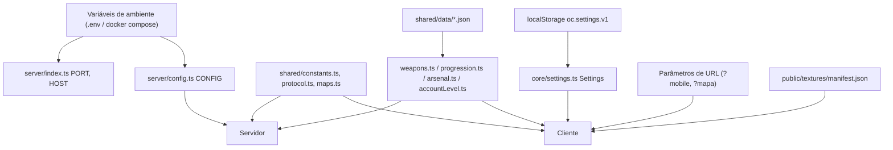

# Configuration

Como o software é configurado, por **camada**. Os valores em si (tabelas completas) ficam em [[Configuration Reference]] e [[Constants Reference]]; os dados de jogo em [[Configuration Data]]. Esta nota explica **de onde cada tipo de configuração vem e quem lê**.

## 1. Variáveis de ambiente (servidor)

Lidas uma vez na importação de `server/config.ts` (objeto `CONFIG`) e em `server/index.ts`. Os padrões batem com `docker compose up -d banco redis` na máquina local, então `bun run dev:online` funciona sem `.env`.

| Variável | Padrão | Lida em | Finalidade |
| --- | --- | --- | --- |
| `PORT` | `8787` (`NET.port`) | `server/index.ts` | Porta do `Bun.serve` |
| `HOST` | `0.0.0.0` | `server/index.ts` | Interface; `127.0.0.1` atrás do nginx |
| `NODE_ENV` | — | `server/config.ts` (`CONFIG.production`), `server/email.ts` (`test` silencia o console) | Modo |
| `DATABASE_URL` | `postgres://oc:oc@localhost:5442/oc` | `server/config.ts` | PostgreSQL |
| `REDIS_URL` | `redis://localhost:6392` | `server/config.ts` | Redis |
| `ORIGENS_PERMITIDAS` | vazio | `server/config.ts` → `originAllowed` | Origens extras aceitas na API e no WebSocket (lista separada por vírgula) |
| `DISCORD_CLIENT_ID`, `DISCORD_CLIENT_SECRET` | vazio | `server/config.ts` | OAuth Discord (sem eles o botão some) |
| `DISCORD_RETORNOS` | vazio | `server/config.ts` | URLs de retorno registradas, uma por endereço de acesso |
| `SMTP_USUARIO`, `SMTP_SENHA_APP`, `SMTP_REMETENTE` | vazio | `server/config.ts` → `server/email.ts` | E-mail; sem eles o link sai no log |
| `ADMIN_BOOTSTRAP_EMAIL`, `ADMIN_BOOTSTRAP_PASSWORD` | `admin@cadu.com`, `admin` | `server/config.ts` → `server/bootstrapAdmin.ts` | Admin inicial, criado ao subir enquanto nenhuma conta é admin ([[Moderation]]) |
| `DATABASE_URL_TESTE`, `REDIS_URL_TESTE` | `.../oc_teste`, `redis://localhost:6392/1` | `server/tests/env.ts` | Banco e Redis dos testes (usados na CI) |
| `PG_SENHA`, `PG_PORTA`, `REDIS_PORTA`, `PORTA` | `oc`, `5442`, `6392`, `8080` | `docker-compose.yml` (e `PORTA` em `tools/offensive.ts`) | Senha do Postgres e portas publicadas |

> [!warning]
> Segredos (`DISCORD_CLIENT_SECRET`, `SMTP_SENHA_APP`, `PG_SENHA`, `ADMIN_BOOTSTRAP_PASSWORD`) vêm de um `.env` ao lado do `docker-compose.yml` (que está no `.gitignore`). O Vault só registra os nomes. Ver [[Sensitive Data]] e [[Environments]].

## 2. Constantes compartilhadas (código)

Regras de jogo e de rede são **constantes TypeScript `as const`** em `shared/`, compiladas nos dois lados: `NET` (`shared/protocol.ts`), `MOVE`, `HEALTH`, `SCORE`, `HUMILIATION`, `SIM`, `GROUP`, `CHERRY`, `BISCUIT`, `POTION`, `RAT`, `KOI` (`shared/constants.ts`), posições de coletáveis/NPCs (`shared/maps.ts`). Mudar uma delas exige rebuild de cliente e servidor. Ver [[Shared Systems]].

## 3. Dados em JSON (data-driven)

`shared/data/weapons/*.json` (rifle, pistola, submetralhadora, faca, granada), `shared/data/progression.json` (melhorias de cada arma por nível; aplicadas por `shared/arsenal.ts`) e `shared/data/nivel_conta.json` (curva da conta). As chaves estão em português (`dano`, `cadencia`, `pente`, `recarga`, `quantidade`, `recargaSegundos`, `pavio`...) e alguns arquivos têm um campo `_doc` com a explicação. São importados como módulos (não há carregamento em tempo de execução). Ver [[Configuration Data]] e [[Weapons]].

## 4. Constantes locais de módulo

Muitos ajustes de comportamento são constantes no próprio arquivo (não expostas): `MAX_MSGS_PER_SEC = 150` e `FLUSH_EVERY_MS = 60000` (`server/app.ts`), `LAG_SLACK = 4` e `PICKUP_SLACK = 1.5` (`server/session.ts`), `LIMITS` de login (`server/auth/password.ts`), `TICKET_TTL_SECONDS = 30` (`server/api.ts`), `TTL_DAYS = 30` da sessão (`server/auth/sessions.ts`), `BOT_SKILLS` (`client/ai/bot.ts`), `RESPAWN = 5` e `SPAWN_PROTECTION = 2` (`client/ai/bots.ts`), parâmetros do Recast (`client/ai/navmesh.ts`). Ver [[Constants Reference]].

## 5. Preferências do jogador (cliente)

`Settings` em `localStorage['oc.settings.v1']`, carregado no `boot()` e aplicado por `screens.bindSettings` a cada mudança (salva, reaplica keybinds, volume, modo espacial, qualidade, layout de toque). Detalhes em [[Settings]] e [[State Management]]. Teclas fixas não remapeáveis: `F3` (depuração), `F4` (hitboxes/navmesh), `F6` (painel de ajuste) — `FIXED_KEYS` em `client/core/keybinds.ts`.

## 6. Parâmetros de URL (cliente)

| Parâmetro | Lido em | Efeito |
| --- | --- | --- |
| `?mobile=1` / `?mobile=0` | `client/core/device.ts` | Força modo celular ou PC |
| `?mapa=/maps/arquivo.glb` | `client/main.ts` | Carrega um mapa glTF por cima da escolha da home |
| `?view=`, `?bake=`, `?anim=`, `?yaw=`, `?audit=1`, `?category=`, `?items=` | `client/dev/characterLab.ts`, `client/dev/audit.ts` | Laboratório de personagens (só dev) |

## 7. Arquivos de conteúdo trocáveis

`public/textures/manifest.json`: mapeia superfície → arquivo de textura (`arquivo`, `metros`, `tingir`) para substituir as texturas procedurais; hoje só tem a chave `_leia-me`. Ver [[Texture System]].

## 8. Configuração de build e ferramentas

| Arquivo | O que configura |
| --- | --- |
| `package.json` | Scripts (`dev`, `dev:online`, `server`, `build`, `start`, `typecheck`, `test`, `admin`, `exemplos:glb`, `offensive`), `bin.offensive`, versão do Bun (`packageManager: bun@1.4.2`) |
| `vite.config.ts` | Alias `@shared`, porta 5173, `host: true`, proxy de `/api` e `/ws` para `:8787` com `xfwd`, alvo `es2022` |
| `tsconfig.json` / `server/tsconfig.json` | Opções estritas, alias `@shared/*`, inclusões de cada projeto |
| `bunfig.toml` | `[run] bun = true`; `[test]` raiz `.`, preload `server/tests/preload.ts`, timeout 20 s |
| `Dockerfile` / `docker-compose.yml` / `deploy/nginx/*.conf` | Imagens `server` e `web`, serviços `jogo`, `web`, `banco`, `redis` |

Ver [[Build Pipeline]] e [[Infrastructure Overview]].

## 9. Ajuste ao vivo (dev)

`F6` abre o painel de ajuste (`client/ui/tuning.ts`): sliders para `VM_FEEL` (primeira pessoa) e `ANIM` (terceira pessoa), alterados em tempo real, com botão para copiar o JSON e colar de volta no código. Não persiste.

## Feature flags

Não há sistema de feature flags. O mais próximo são as checagens de modo (`online`, `botMode`), `import.meta.env.DEV` e as variáveis opcionais de Discord/SMTP (que escondem/ativam recursos). Ver [[Feature Flags]].

## Código relacionado

- `server/config.ts`, `server/index.ts`, `server/tests/env.ts`
- `shared/constants.ts`, `shared/protocol.ts`, `shared/maps.ts`, `shared/data/**`
- `client/core/settings.ts`, `client/core/keybinds.ts`, `client/core/device.ts`, `client/ui/tuning.ts`
- `vite.config.ts`, `tsconfig.json`, `server/tsconfig.json`, `bunfig.toml`, `docker-compose.yml`, `Dockerfile`
