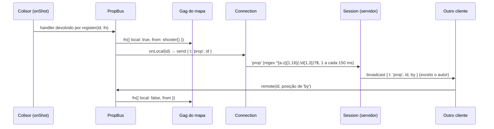

# Events & Messaging

O projeto **não tem um barramento de eventos genérico** (nada de `EventEmitter` próprio, nem `CustomEvent` de jogo). A comunicação usa sete mecanismos simples, cada um com um uso claro.

## 1. Callbacks atribuídos como propriedade (um ouvinte)

Objetos expõem propriedades `onX` com uma função padrão vazia; o `boot()` (ou o dono) atribui a implementação. Só existe **um** ouvinte por propriedade.

| Propriedade | Dono | Quem atribui | Para quê |
| --- | --- | --- | --- |
| `Connection.onClose(code)` | `client/net/connection.ts` | `ui/home.ts` (lobby) e `main.ts` (partida) | Mostrar o motivo: `CLOSE.revoked`, `CLOSE.replaced` ou conexão perdida |
| `Input.onLockChange(locked)` | `client/core/input.ts` | `main.ts` | Abrir/fechar o menu de pausa |
| `gamepad.onDeviceChange`, `gamepad.onStart` | `client/core/gamepad.ts` | `main.ts` | Trocar ícones de botões; Start retoma do menu |
| `touch.onPause`, `touch.onChat` | `client/ui/touch.ts` | `main.ts` | Pausar e abrir o chat no celular |
| `chat.onSend(text)` | `client/ui/chat.ts` | `main.ts` | Enviar `{ t: 'chat' }` |
| `PropBus.onLocal(id)`, `PropBus.shooter()` | `client/world/props.ts` | `main.ts` | Reportar gag local ao servidor; posição do olho do atirador |
| `Bot.onShoot(spread)` | `client/ai/bot.ts` | `BotManager` | Resolver o tiro do bot com os serviços do mundo |
| `map.rewards.ratDown`, `map.rewards.aimBonus` | `MapRewards` (`client/world/blockoutMap.ts`) | `main.ts` | O mapa avisa; o jogo decide o efeito (online, via servidor) |

Exceção com vários ouvintes: `Progress.onChange(f)` (`client/gameplay/progress.ts`) guarda um `Set` de ouvintes e os chama quando o progresso das armas muda (mensagem `progresso` do servidor).

## 2. Hooks injetados no construtor (vários métodos)

Interfaces de callbacks passadas na criação:

- `WeaponHooks` (`shoot`, `dryFire`, `reloadStart`, `reloadEnd`) em `Weapon` (`client/weapons/weapon.ts`).
- `BotHooks` (`damagePlayer`, `kill`, `tauntStarted`, `humiliation`) em `BotManager` (`client/ai/bots.ts`), implementados em `main.ts` para HUD/sons.
- `BotWorld` (`fire`, `stab`, `tauntStarted`, `tauntFinished`, `combatants`, `corpses`) que o `BotManager` oferece a cada `Bot`.
- `CorpseHooks` (`now`, `claim`, `release`, `finish`) em `Corpse` (`client/gameplay/corpse.ts`): online o servidor arbitra pelos hooks; contra bots tudo é local.
- `onDown(id)` em `GiantRat` e callbacks de som (`sfx`) passados aos NPCs de cenário (`client/world/halloween.ts`).
- No servidor, `Session` recebe `onChange` (lista do lobby mudou) e `publish(topic, data)` (`server/session.ts`).

## 3. Eventos como valor de retorno

Sistemas de lógica pura devolvem o que aconteceu no passo; o `main.ts` aplica os efeitos:

| Chamada | Retorno |
| --- | --- |
| `LocalPlayer.fixedStep(...)` | `PlayerEvents` (`jumped`, `landed`, `fallHeight`, `damaged`, `footstep`, `died`, `selfDamage`) |
| `GrenadeThrower.update(...)` | `ThrowerEvent` (`pin`, `throw`, `inHand`, `mine`) ou `null` |
| `Melee.update(dt)` | `'impact'` ou `null` |
| `GrenadeProjectiles.fixedUpdate(dt)` | lista de explosões `{ position, id }` |
| `Mines.triggered(feet)` | minas disparadas |
| `BodySounds.update(id, walker, dt)` | `BodySound[]` (passo, aterrissagem, deslize, recarga) |

## 4. `PropBus` — gags sincronizados

`client/world/props.ts`. Cada gag do cenário se registra com um id (`'hidrante:1'`, `'fantasma'`, `'bruxa'`, `'espantalho:N'`...):

Offline, `onLocal` continua sendo a função vazia padrão, então o gag só roda localmente. Ver [[Map Gags]] e [[Interactive Objects]].

## 5. `Connection` — despacho de mensagens do servidor

`client/net/connection.ts`:

- `on(type, fn)` guarda **vários** handlers por tipo (`Map<string, fn[]>`); `dispatch` chama todos.
- `next(type)` devolve uma `Promise` com a próxima mensagem do tipo (rejeita com `'error'`), usada pela home (`welcome`, `joined`).
- `hold()`/`release()` retêm mensagens entre o `'joined'` e o fim da montagem do mapa.
- `pong` alimenta a sincronização de relógio (`serverNow()`) e o RTT suavizado.
- As mensagens são JSON com união discriminada por `t` (`ClientMsg`/`ServerMsg` em `shared/protocol.ts`). Catálogo completo em [[Remote Calls]].

## 6. Pub/sub do Bun — difusão por sessão (servidor)

- Cada `Session` tem o tópico `sessao:<id>`; o jogador assina em `join` e cancela em `leave` (`server/session.ts`).
- `broadcast(msg, except?)` serializa **uma vez**; se há um autor, usa `ws.publish` do socket dele (o Bun não entrega ao próprio publicador), senão `server.publish` (todos).
- Mensagens só para um jogador usam `conn.send(...)` (ex.: `progresso`, `chatRefused`, `pong`, `joined`).
- O lobby não usa tópico: `sessionsChanged()` agrupa mudanças por 100 ms e manda `sessions` a cada conexão sem sessão (`server/app.ts`).

Ver [[Replication]] e [[ADR - Bun como runtime único]].

## 7. Redis pub/sub — eventos entre processos

`server/redis.ts` define dois canais; `startServer` assina com uma segunda conexão (`sub`):

| Canal | Publicado por | Efeito no servidor de jogo |
| --- | --- | --- |
| `oc:revogacao` (`REVOCATION_CHANNEL`) | `auth/sessions.ts` (`revokeSession`, `revokeAll`), `api.ts` (`DELETE /api/conta`) | Fecha a conexão da conta com `CLOSE.revoked` (4001) |
| `oc:silencio` (`MUTE_CHANNEL`) | `moderacao.ts` (`mute`, `unmute`, chamados por `tools/admin.ts`) | Recarrega `chatMutedUntil` da conexão viva |

Isso permite que o console de moderação (outro processo) afete uma partida em andamento. Ver [[Moderation]].

## Eventos do navegador usados diretamente

`keydown` (Esc), `fullscreenchange`, `visibilitychange` (pausa no celular), `pointerdown/up` no aviso de opressão, `click` no canvas para retomar o mouse (todos em `client/main.ts`).

## Riscos

- Callbacks de um ouvinte só: atribuir de novo sobrescreve silenciosamente (ex.: `conn.onClose` é trocado da home para o jogo).
- `Connection.on` nunca remove handlers; `next()` também deixa o handler registrado depois de resolver (inferência pelo código: não há `off`).

## Código relacionado

- `client/net/connection.ts`, `client/world/props.ts`, `client/main.ts`
- `server/session.ts` (`broadcast`), `server/app.ts` (`sub.on('message')`, `sessionsChanged`), `server/redis.ts`

Ver também: [[Networking Overview]], [[Audio Events]], [[State Management]].
