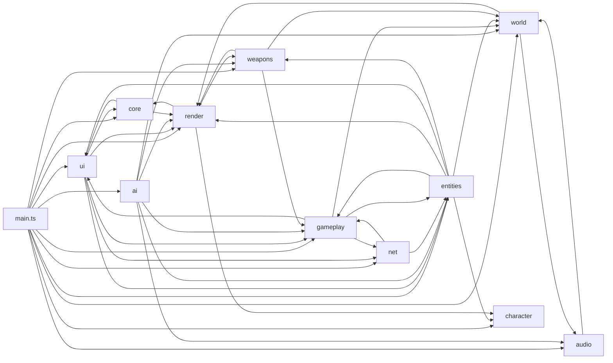
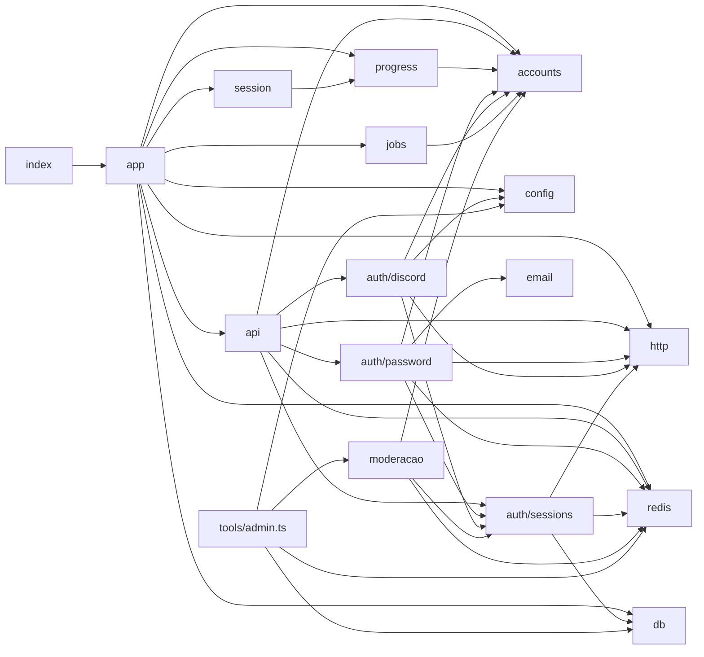

# Modules

> Mapa dos módulos por responsabilidade. A árvore completa de arquivos, com uma linha por arquivo, está em [[File Structure Reference]]. O projeto usa **módulos ES** (um arquivo = um módulo); não há pacotes internos nem workspaces.

## Dependências entre pastas do cliente

Levantado a partir dos `import` de cada pasta (`from '../<pasta>/...'` e `from '@shared/...'`). Várias setas são só de **tipos** (`import type`).

> [!info]
> Há importações mútuas entre pastas (ex.: `gameplay ↔ entities`, `gameplay ↔ net`, `core ↔ ui`, `audio ↔ world`). Na maior parte são `import type` (por exemplo, `core/settings.ts` importa o tipo `Quality` de `render/quality.ts`). Não há uma regra de camadas imposta por ferramenta.

`client/character/` é a única pasta do cliente que não importa nenhuma outra pasta do cliente (só `@shared/appearance`, `catalog`, `palette`, `protocol`): é o subsistema mais isolado.

## Módulos principais do cliente

| Módulo | Exporta | Responsabilidade | Depende de |
| --- | --- | --- | --- |
| `main.ts` | — (`boot()` local) | Orquestra tudo: cria sistemas, liga eventos, `step`/`render` | todas as pastas |
| `core/loop.ts` | `startLoop` | Passo fixo + render interpolado | `@shared/constants` (`SIM`) |
| `core/input.ts` | `Input`, `applyKeybinds` | Ações nomeadas, pointer lock, entrada de toque/controle (`press`, `move`, `addLook`) | `core/keybinds` |
| `core/keybinds.ts` | `assign`, `mergeKeybinds`, `keyLabel`... | Regras puras de teclas remapeáveis | `ui/strings` (tipo `Lang`) |
| `core/gamepad.ts` | `gamepad` (`GamepadInput`) | Gamepad API, layout padrão, vibração | `core/input`, `core/settings` (tipos) |
| `core/settings.ts` | `loadSettings`, `saveSettings`, `spatialMode` | Preferências em `localStorage` | `core/device`, `core/keybinds` |
| `world/physics.ts` | `createPhysics`, `Physics`, `SurfaceInfo` | `World` Rapier, corpo estático, mapa `handle → superfície` | Rapier, `GROUP` |
| `world/mapBuilder.ts` | `MapBuilder` | Constrói geometria estática + colisores (código e glTF) | `world/surfaces`, `render` |
| `world/props.ts` | `PropBus` | Gags sincronizados (ver [[Events & Messaging]]) | — |
| `world/mapLoader.ts`, `world/catalog/*` | `buildMapFromData` → `GameMap` | Um carregador para todos os mapas de dados (`shared/data/mapas/*.json`); um adaptador por tipo de peça | `MapBuilder`, `PropBus`, NPCs |
| `entities/localPlayer.ts` | `LocalPlayer` | Corpo cinemático + `stepMovement` + regras de vida/queda | `@shared/movement` |
| `entities/rig.ts` | `CharacterRig` | 15 hitboxes + bloqueador que seguem o personagem | `entities/hitboxes` |
| `entities/dummy.ts` | `Dummy`, `DummyManager` | Bonecos de treino | `rig`, `avatar` |
| `weapons/weapon.ts` | `Weapon` | Lógica pura da arma (cadência, pente, dispersão, recuo) com hooks | `@shared/weapons` |
| `weapons/hitscan.ts` | `traceShot`, `applySpread` | Raio contra mapa + hitboxes, penetração | `world/physics` |
| `weapons/grenades.ts` | `GrenadeThrower`, `GrenadeProjectiles` | Máquina de estados da mão + projéteis dinâmicos | `@shared/weapons` |
| `gameplay/targets.ts` | `Target`, `Humiliable`, `HitboxRegistry` | Contratos do combate | — |
| `ai/bots.ts` | `BotManager` | Mata-mata contra bots (regras locais) | `ai/bot`, `ai/navmesh` |
| `net/connection.ts` | `Connection` | WebSocket, despacho por tipo, relógio, ping | `net/api` |
| `net/remote.ts` | `RemoteWorld`, `RemotePlayer` | Jogadores remotos interpolados e corpos online | `entities`, `gameplay` |
| `ui/hud.ts` | `Hud` | HUD em DOM por referência direta | `core/device`, `core/gamepad` |
| `ui/menu.ts` | `Screens` | Carregamento, cartão de início e menu de pausa (trilho, abas, painel, janela de saída, Esc por nível), configurações em subabas | `core/*`, `ui/pauseMenu`, `ui/arsenal` |
| `ui/pauseMenu.ts` | `pauseContext`, `backStep`, `standingsOrder`, `ladderLeader`, `moreUpgradesText`, `KEY_GROUPS`, `previewMapName` | Regras puras do menu de pausa (sem DOM, testadas) | `@shared/*`, `ui/strings` |
| `ui/strings.ts` | `t`, `pick`, `getLang`, `DEATH_MESSAGES` | Todas as strings (pt-BR e en) | — |

## Módulos do servidor

Ver a tabela em [[Server Architecture]]. Resumo das dependências:

`session.ts` não toca banco nem Redis: recebe `now`, `onChange` e `publish` pelo construtor e conversa com o progresso só via `server/progress.ts` (memória). A gravação é responsabilidade do `app.ts`.

## Padrões de módulo observados

- **Classes com estado** para sistemas de vida longa (`Session`, `BotManager`, `Bot`, `Weapon`, `Hud`, `Connection`, `PropBus`, `MapBuilder`).
- **Funções construtoras** para mapas (`buildMapFromData` para os mapas de dados, `buildGltfMap` para um `.glb`) que devolvem um objeto `GameMap` com closures (`update`, `props`); cada peça é montada por um adaptador `(ctx, peca)` do catálogo (`client/world/catalog/`).
- **Funções puras testáveis** isoladas de DOM/física onde houve teste: `core/keybinds.ts`, `audio/spatial.ts`, `gameplay/aimAssist.ts` (testados em `client/tests/`).
- **Tabelas de dados** em vez de herança: `BOT_SKILLS`, `SURFACES`, `CATALOG`, `PROGRESSION`.

## Código relacionado

- `client/**`, `server/**`, `shared/**` (imports levantados com busca por `from '../`)

Ver também: [[Code Architecture Overview]], [[Dependencies Map]], [[Utilities]].
