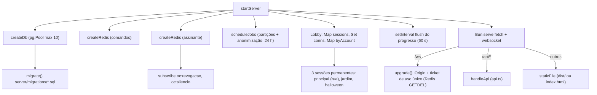

# Server Architecture

## Responsabilidade

Um único processo Bun que:

1. serve a **API de contas** em `/api/*` (JSON, cookie de sessão HttpOnly);
2. serve os **arquivos estáticos** do build (`dist/`) quando existe;
3. atende o **WebSocket** em `/ws` com o lobby e as **sessões de mata-mata livre**, sendo a autoridade sobre vida, dano, abates, pontos, respawn, corpos, coletáveis e progresso;
4. grava o progresso no PostgreSQL e usa o Redis para limites, tickets e canais de revogação.

## Ponto de entrada

- `server/index.ts`: lê `PORT` (padrão `NET.port` = 8787) e `HOST` (padrão `0.0.0.0`), chama `startServer()`, e em `SIGTERM`/`SIGINT` chama `game.close()` com um limite de 3 s antes de `process.exit(0)`. Se `startServer` falhar, imprime a dica "O banco e o Redis estão rodando?" e sai com código 1.
- `server/app.ts` → `startServer(opts)`: função que monta tudo e devolve `{ port, deps, close() }`. Os testes sobem seu próprio servidor numa porta livre com `jobs: false` (`server/tests/helpers.ts`).

## Composição (`startServer`)

O estado do lobby (`sessions`, `conns`, `byAccount`, `nextId`) vive como variáveis locais da closure de `startServer` — o mesmo padrão de closure do cliente (ver [[ADR - Bootstrap do cliente numa única closure]]).

## Camadas e módulos

| Módulo | Papel | Tipo (informal) |
| --- | --- | --- |
| `app.ts` | Composição, lobby, handshake WS, roteamento das mensagens de lobby, flush do progresso, assinatura Redis | composição / "servidor" |
| `session.ts` | Classe `Session`: uma sala com mapa e modo de jogo, tick a `NET.tickRate` (20 Hz) por `setInterval`, validação de cada mensagem do cliente, regras de dano/abate/coletáveis comuns a todos os modos | regra de jogo autoritativa |
| `modes.ts` | O que muda entre modos (`SessionMode`, `createMode`): `DeathmatchMode` (Arsenal da conta, travado ao entrar) e `GunGameMode` (escada, rodadas). Ver [[ADR - Modos de jogo com regras declaradas e ganchos no servidor]] | regra de modo autoritativa |
| `progress.ts` | `LiveAccount` em memória, XP de arma e de conta, a escolha do Arsenal (`equip`) e o loadout que sai dela (`loadoutOf`), `delta` desde a última gravação | domínio |
| `api.ts` | Tabela de rotas `'MÉTODO /caminho' → handler`, checagem de Origin em métodos que mudam estado | API |
| `auth/sessions.ts` | Sessões do navegador (cookie `oc_sessao`, SHA-256 no banco, renovação deslizante) | auth |
| `auth/password.ts` | Cadastro, login (rate limit + bloqueio), recuperação por e-mail | auth |
| `auth/discord.ts` | OAuth 2 com PKCE via `arctic` | auth |
| `accounts.ts` | **Todas** as consultas SQL sobre jogadores (perfil, progresso, auditoria, sanções, anonimização) | acesso a dados (equivalente a repositório, sem esse nome) |
| `db.ts` | Pool `pg`, `migrate()`, `transaction()` | infraestrutura |
| `redis.ts` | Cliente `ioredis`, nomes de canais, contador de janela fixa `hit()` | infraestrutura |
| `http.ts` | Helpers HTTP (JSON, cookies, IP, Origin, tokens) e `HttpError` | utilitário |
| `email.ts` | SMTP (Gmail) via `nodemailer`, ou `outbox` + console sem configuração | integração |
| `jobs.ts` | Manutenção diária | job |
| `moderacao.ts` | Banir, silenciar, papéis (usado por `tools/admin.ts`) | ferramenta de staff |
| `config.ts` | `CONFIG` a partir do ambiente | configuração |

Ver [[Services]] para a discussão de que nenhum desses módulos é um "Service" formal.

## Fluxo de uma conexão de jogo

1. Cliente faz `POST /api/ws-ticket` (exige sessão) → servidor grava `ws:ticket:<sha256(ticket)>` no Redis por 30 s.
2. Cliente abre `/ws?ticket=...`. `upgrade()` exige cabeçalho `Upgrade`, Origin permitido, e faz `GETDEL` atômico do ticket; carrega conta, banimento, perfil e silêncio do chat; cria o `Peer`.
3. `open`: cria o `Conn`; se a conta já tinha conexão, fecha a antiga com `CLOSE.replaced` (4002).
4. `message`: token bucket de 150 msg/s; `JSON.parse` (descarta inválido); `hello`/`list`/`create`/`join`/`leave`/`ping` tratados no lobby; o resto vai para `conn.session.handle()`.
5. `close`: sai da sessão (grava o progresso) e limpa o mapa por conta.

Detalhes de protocolo em [[Remote Calls]] e [[Sessions]].

## Sessão (`Session`)

- Estado: `players` (Map de `SPlayer` com vida, kills, score, granadas vivas, dança, buffs), `corpses`, `pickups`, `fish`, `rats`, e o tópico `sessao:<id>`.
- `tick()` (20 Hz): fim do bônus da cereja, regeneração de vida, tempo vivo/XP, limpeza de corpos, `broadcast('snap')` e, a cada 1 s, `broadcast('scores')`.
- `broadcast()` serializa uma vez e publica no tópico; quando a ação veio de um jogador, usa `ws.publish` desse jogador para não ecoar para ele.
- Validações: posição (`vec`), regiões de acerto, cadência (`hitTimes`), distância servidor × relatada (`LAG_SLACK = 4 m` + 10%), alcance da faca, alcance físico da granada, janela da opressão, distância a coletáveis (`PICKUP_SLACK = 1,5 m`). Ver [[Validation]] e [[Anti Cheat]].
- Sessões não permanentes vazias são descartadas no `sessionsChanged()` (coalescido em 100 ms).

## Persistência de progresso

- Cada conexão carrega um `LiveAccount` (`server/progress.ts`) com o perfil e um `delta` (abates, mortes, XP etc.).
- `flush()` grava o delta com `flushProgress` a cada `FLUSH_EVERY_MS = 60 s` e ao sair da sessão; se falhar, `mergeDelta` devolve o delta para tentar no próximo ciclo. Ver [[Save System]] e [[Player Data]].

## Revogação e moderação (Redis pub/sub)

O servidor assina `oc:revogacao` (fecha a conexão da conta com `CLOSE.revoked` = 4001) e `oc:silencio` (recarrega `chatMutedUntil` da conta na conexão viva). Publicadores: `api.ts` (pedido de exclusão de conta), `auth/sessions.ts` (`revokeSession` no logout; `revokeAll` na troca de senha e no banimento), `moderacao.ts` (`mute`/`unmute` em `oc:silencio`; `ban` via `revokeAll`). Ver [[Events & Messaging]] e [[Moderation]].

## Encerramento

`close()`: para o timer de flush e os jobs, grava o progresso de todos (`leaveSession`), fecha sockets com 1001, `dispose()` das sessões, `server.stop()`, desconecta Redis e encerra o pool.

## Riscos

- Movimento confiado ao cliente; sem rewind de hitboxes (comentário no topo de `session.ts`).
- Todo o lobby e as sessões vivem em memória de um único processo: reiniciar derruba as partidas (o progresso é gravado antes). Não há suporte a múltiplas instâncias para as sessões (o Redis só cobre revogação/mute). Ver [[Problem - Estado das partidas só em memória de um processo]] e [[ADR - Um único Bun.serve para API, arquivos e WebSocket]].
- Tick por `setInterval` por sessão (sem compensação de drift).

## Código relacionado

- `server/index.ts`, `server/app.ts` (`startServer`, `upgrade`, `staticFile`, `flush`)
- `server/session.ts` (`Session.handle`, `tick`, `damage`, `kill`, `onHit`, `onBoom`...)
- `server/api.ts` (`routes`, `handleApi`)
- `server/progress.ts`, `server/accounts.ts`, `server/db.ts`, `server/redis.ts`, `server/jobs.ts`

Ver também: [[Backend Overview]], [[APIs]], [[Authentication]], [[Match Services]], [[Database]], [[Cache]].
