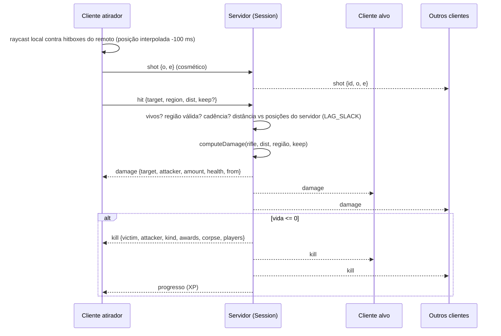

# Client Server Model

## Resumo

Modelo **cliente-servidor com servidor autoritativo sobre as regras**, mas **sem simulação física no servidor**. O cliente roda a física completa (Rapier, 60 Hz) do jogador local e a detecção de acertos; o servidor (Bun, sem Rapier) recebe relatórios, faz *sanity checks* com as mesmas regras de `shared/` (dados das armas, níveis de granada, tabela de pontos) e decide o resultado.

> Comentário de `server/session.ts`: *"The server owns health, damage, kills, score, respawns and corpses; clients report their movement and what their shots hit, and every report is sanity-checked here."* e *"Movement is trusted; hits are validated against server positions with a lag tolerance."*

## Tabela de autoridade

| Dado / ação | Autoridade | Como |
|---|---|---|
| Identidade (id, nome `Nome#1234`, sexo, aparência) | **Servidor** | Vem da conta ligada ao ticket; o `hello` não carrega nome (testado em `game.test.ts`: "o nome vem da conta, não da mensagem") |
| Posição, yaw, pitch, flags de animação | **Cliente** (confiado) | `state` só é checado quanto a números finitos; pitch é limitado a ±1,6 rad |
| Posição de respawn | **Cliente** (confiado) | Servidor só confere o atraso de 5 s (−250 ms de folga) |
| Detecção de acerto (raycast, região, distância, penetração) | **Cliente informa** | `hit` / `stab` / `boom`; servidor valida e calcula o dano |
| Dano, vida, regeneração, morte | **Servidor** | `Session.damage()`, `kill()`, `tick()` |
| Pontos, prêmios (*awards*), placar | **Servidor** | `SCORE` de `shared/constants.ts` |
| Progresso (XP de armas e conta, estatísticas) | **Servidor** | `server/progress.ts`; o cliente só recebe `progresso` |
| Loadout equipado | **Servidor** (filtra) | Só níveis desbloqueados (`equip()`, `sanitizeLoadout`) |
| Corpos e humilhação (dança) | **Servidor** | `taunt` / `tauntEnd` validados por janela, raio e duração |
| Itens do mapa (biscoito, cereja), carpas, ratos, poção da bruxa | **Servidor** | Estado e cooldown no servidor; cliente só pede ([[ADR - Itens do mapa com autoridade do servidor]]) |
| Efeito da poção | **Servidor sorteia** | `Math.random()` em `onPotion` |
| Granadas (trajetória, quique) | **Cliente** | Servidor só registra lançamento e valida a explosão |
| Tiros (traçante/som para outros) | **Cliente** (cosmético) | Retransmitido com limite de cadência |
| Gags do mapa (`prop`, ex.: `hidrante:1`) | **Cliente** (cosmético) | Retransmitido com regex e 150 ms de intervalo |
| Chat | **Servidor** | Sanitiza, limita taxa e aplica silêncio |
| Dano próprio (queda, vazio, cachorro) | **Cliente informa** | `selfDamage`, limitado a `LETHAL_DAMAGE`; só afeta quem envia |

## Fluxo de um tiro que acerta

## Consequências do modelo

- **Sem predição/reconciliação**: o jogador local se move só pela simulação local; o servidor nunca corrige posição. A vida local é sobrescrita pelo `h` de cada `snap` enquanto vivo (`client/main.ts`).
- **"Favor the shooter" implícito**: o atirador acerta onde vê o alvo (100 ms no passado + latência); o servidor aceita se a distância informada bater com a sua visão dentro de `LAG_SLACK = 4 m + 10 %`. Ver [[Synchronization]].
- **Superfície de trapaça**: posição, região do acerto, `behind` da facada e posição de explosão de granada com pavio são confiados em maior ou menor grau. Ver [[Anti Cheat]] e [[Problem - Lacunas de validação de gameplay online]].

## Decisões relacionadas

- [[ADR - Movimento confiado ao cliente]]
- [[ADR - Acertos informados pelo cliente com tolerância de lag]]
- [[ADR - Itens do mapa com autoridade do servidor]]

## Código relacionado

- `server/session.ts` — `handle()`, `onHit()`, `onStab()`, `onBoom()`, `damage()`, `kill()`, `tick()`.
- `shared/weapons.ts` — `computeDamage`, `explosionDamage`, `clampExplosionDamage`, `HIT_REGIONS`, `LETHAL_DAMAGE`.
- `shared/progression.ts` — `rifleData`, `knifeData`, `sanitizeLoadout`.
- `client/main.ts` — envio de `state`, `hit`, `stab`, `grenade`, `boom`; handlers de `snap`, `damage`, `kill`.
- Regras de gameplay: [[Combat]], [[Damage System]], [[Health System]], [[Respawn]], [[Scoring]], [[Humiliation]], [[Grenades]].
