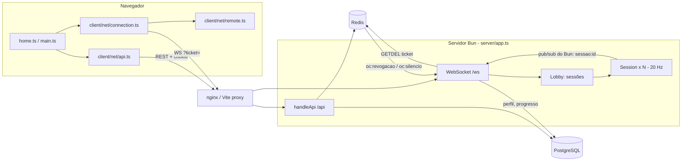

# Networking Overview

## Visão geral (nível 1)

O Offensive Combat tem **um único processo servidor** (Bun) que atende, na mesma porta (`8787` por padrão, `NET.port`):

- a **API REST de contas** em `/api/*` (JSON sobre HTTP, sessão em cookie HttpOnly) — ver [[APIs]] e [[Authentication]];
- o **WebSocket do jogo** em `/ws` (`NET.path`), com mensagens **JSON** (`ClientMsg` / `ServerMsg` em `shared/protocol.ts`);
- os arquivos estáticos do build (`dist/`) quando não há nginx na frente.

O jogo online é um **mata-mata livre (FFA) de até 10 jogadores por sessão** ([[Free For All]]). O servidor é autoritativo sobre vida, dano, abates, pontos, respawn, corpos, itens do mapa e progresso; o cliente envia sua posição e **informa o que seus tiros acertaram**, e o servidor confere cada informação (ver [[Client Server Model]] e [[Anti Cheat]]).

Os modos [[Training]] e [[Versus Bots]] são **totalmente offline**: não abrem WebSocket.

## Números principais

| Item | Valor | Origem |
|---|---|---|
| Tick do servidor (simulação de regras + snapshot) | **20 Hz** (`NET.tickRate`) | `shared/protocol.ts`, `server/session.ts` |
| Envio de estado pelo cliente | **20 Hz** (`NET.stateRate`), só enquanto vivo | `client/main.ts` |
| Atraso de interpolação dos remotos | **100 ms** (`NET.interpDelayMs`) | `client/net/remote.ts` |
| Placar (`scores`) | 1 Hz | `server/session.ts` |
| Ping do cliente | a cada 1 s | `client/net/connection.ts` |
| Jogadores por sessão | 10 (`NET.maxPlayers`) | `shared/protocol.ts` |
| Tamanho máximo de mensagem WS | 16 KiB (`maxPayloadLength`) | `server/app.ts` |
| Limite de mensagens por conexão | 150 msg/s (token bucket) | `server/app.ts` |
| Ticket do WebSocket | uso único, 30 s | `server/api.ts` |
| Gravação de progresso | a cada 60 s + ao sair | `server/app.ts` |

## Topologia

- **Desenvolvimento**: o Vite (porta 5173) faz proxy de `/api` e `/ws` para `localhost:8787` (`vite.config.ts`, com `xfwd: true`), mantendo **uma única origem** — necessário para o cookie de sessão e para a checagem de `Origin`. Ver [[Local Development]].
- **Produção**: nginx serve os estáticos e faz proxy de `/ws` (timeout 1 h, sem buffer, máx. 6 conexões por IP) e `/api/` para o servidor (`deploy/nginx/*.conf`). Ver [[Hosting]].

## Fluxo de uma conexão online

1. `POST /api/ws-ticket` (com cookie de sessão) → `{ ticket }` (ver [[Sessions]]).
2. `new WebSocket(wss://host/ws?ticket=...)`; o servidor valida origem e ticket **antes** do upgrade.
3. Cliente envia `hello` → recebe `welcome` (id, nome `Nome#1234`, lista de sessões) e `progresso`.
4. `list` / `create` / `join` no lobby ([[Matchmaking]]).
5. `joined` com o estado completo da sala; a partir daí `state` a 20 Hz e eventos ([[Remote Calls]], [[Replication]]).
6. Fechamento: perda de conexão, `4001` (revogada) ou `4002` (substituída).

## Notas desta área

- [[Client Server Model]] — quem é autoridade sobre o quê.
- [[Remote Calls]] — catálogo completo de mensagens e endpoints usados pelo jogo.
- [[Replication]] — snapshots, broadcasts e estado inicial.
- [[Synchronization]] — relógio, interpolação, ordem de mensagens.
- [[Matchmaking]] — lobby (não existe fila).
- [[Sessions]] — ciclo de vida da conexão e da sala.
- [[Anti Cheat]] — validações de gameplay no servidor e lacunas.

## O que ainda não existe

Confirmado em `server/session.ts` (comentário de cabeçalho) e `README.md` ("Ainda não feito"):

- simulação de movimento no servidor, predição e reconciliação ([[ADR - Movimento confiado ao cliente]]);
- compensação de lag com rewind de hitboxes ([[ADR - Acertos informados pelo cliente com tolerância de lag]]);
- *interest culling* (todos recebem todos);
- mensagens binárias (hoje JSON; `shared/protocol.ts` diz que o formato foi pensado para trocar por binário depois);
- fim de partida, votação de mapa, bots online;
- reconexão automática no cliente (não encontrada em `client/`).

## Código relacionado

- `shared/protocol.ts` — `NET`, `FLAG`, `ClientMsg`, `ServerMsg`, `CLOSE`, `sanitizeName`, `sanitizeChat`.
- `server/app.ts` — `Bun.serve`, handshake, lobby, token bucket, revogação, flush de progresso.
- `server/session.ts` — classe `Session` (uma sala FFA).
- `client/net/connection.ts` — `Connection` (ticket, ping, relógio, hold/release).
- `client/net/remote.ts` — `RemotePlayer`, `RemoteWorld` (interpolação).
- `client/net/api.ts` — `api()`, `fetchMe()`, `fetchProfile()`.
- Ver também [[Server Architecture]], [[Client Architecture]], [[Network Performance]], [[Security Overview]].
