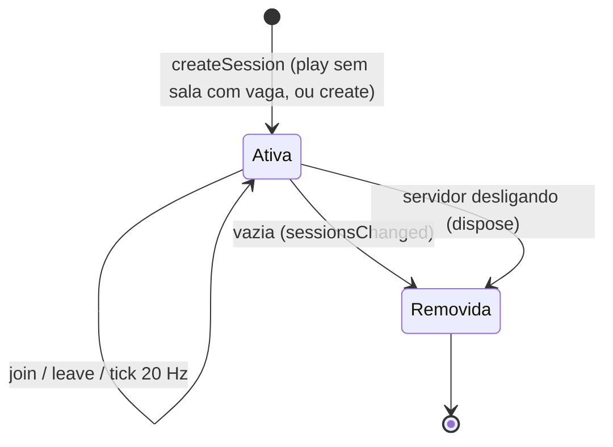

# Sessions

No código, "sessão" tem **três sentidos** — não confundir:

| Termo | O que é | Onde | Nota |
|---|---|---|---|
| Sessão de login | Cookie `oc_sessao` (30 dias, renovado) + linha na tabela `session` | `server/auth/sessions.ts` | [[Authentication]] |
| Conexão de jogo (`Conn`) | Um WebSocket aberto com ticket, ligado a uma conta | `server/app.ts` | esta nota |
| Sessão de jogo / sala (`Session`) | Uma partida de um modo, numa versão de um mapa, com até 10 jogadores | `server/session.ts` | esta nota |

Ver também a "participação" persistida (`session_participation`) em [[Player Data]].

## Conexão de jogo

### Abertura

1. Cliente pede `POST /api/ws-ticket` (exige sessão de login válida, sem banimento, conta não `pending_deletion`).
2. Abre `ws(s)://<mesmo host>/ws?ticket=<ticket>` (`Connection.open()`).
3. `upgrade()` em `server/app.ts`: header `Upgrade`, **Origin**, ticket (GETDEL no Redis), conta `active` e sem banimento ativo.
4. Carrega o **perfil de jogo** (`loadGameProfile`: tag, sexo, aparência, XP, armas) e o silêncio do chat (`chatMutedUntil`) e cria um `LiveAccount` em memória ([[Player Data]]).
5. Em `open`: cria o `Conn` (id numérico incremental, válido só neste processo) e aplica **uma conexão por conta**: se a conta já tinha conexão, a antiga é fechada com `4002` (`replaced`).

### Estado mantido por conexão (`Peer` / `Conn`)

- `account: LiveAccount` — perfil, delta de progresso, participação aberta, silêncio.
- `bucket`, `bucketAt` — token bucket de 150 msg/s.
- `session` — sala atual ou `null` (lobby).
- `name` — preenchido só após `hello` (`Nome#1234`).

### Encerramento

| Causa | Código | Mecanismo |
|---|---|---|
| Logout (`POST /api/auth/sair`) | 4001 | `revokeSession` publica o id da conta em `oc:revogacao` |
| Redefinição de senha, banimento | 4001 | `revokeAll` publica em `oc:revogacao` |
| Pedido de exclusão de conta | 4001 | `DELETE /api/conta` publica em `oc:revogacao` |
| Mesma conta conectou de novo | 4002 | `byAccount` em `server/app.ts` |
| Servidor desligando (SIGTERM/SIGINT) | 1001 | `GameServer.close()` |
| Rede / navegador fechado | — | evento `close` |

O servidor assina os canais Redis `oc:revogacao`, `oc:silencio` e `oc:perfil` numa **segunda conexão Redis** (uma conexão em modo subscribe não executa outros comandos). Silêncio não fecha a conexão: recarrega `chatMutedUntil` na conexão viva. `oc:perfil` (`PROFILE_CHANNEL`, publicado quando a equipe muda nome, corpo, aparência ou progresso de uma conta pelo Gerenciamento) recarrega o perfil: o progresso novo (somado ao que a partida ainda não gravou) chega na hora com uma mensagem `progresso`; nome e aparência valem a partir da próxima sala. Ver [[Moderation]].

Ao fechar: sai da sala (grava o progresso com `close = true`), remove do conjunto de conexões e do mapa `byAccount` (só se ainda for a conexão registrada).

## Sala (`Session`)

### Ciclo de vida

- Cada sala tem seu próprio `setInterval` de 50 ms (`tick`) e um tópico pub/sub `sessao:<id>`.
- Cada sala tem um **modo de jogo** (`mata-mata`, `corrida-armada` ou `zumbi`, `SessionInfo.mode`), fixo desde a criação: a `Session` recebe o id e cria o seu `SessionMode` (`server/modes.ts`), que decide o loadout de quem entra, campos extras do jogador, se há dano agora (`combatOpen`), o que um abate faz (`onKill`) e o que roda no tick. Ver [[ADR - Modos de jogo com regras declaradas e ganchos no servidor]].
- **Sob demanda** (PF-6): não há sala fixa. `play {map, mode}` entra numa sala da versão atual do mapa com vaga ou abre uma; toda sala fecha quando esvazia. Ver [[Matchmaking]] e [[ADR - Sessões sob demanda por versão do mapa]].
- Cada sala joga **uma versão salva de um mapa** (`Session.mapa`, um `MapRuntime` de `server/maps.ts`: os dados da versão, o nome, `exclusivo` e a navmesh), até o fim. `SessionInfo` traz `map`, `versao` e `mapaNome`; o cliente baixa os dados dessa versão (`GET /api/mapas/:id/versoes/:v`) antes de montar o mapa.
- Um mapa feito para um modo (`exclusivo` nos dados) só é jogado nele, e o modo **zumbi** só em mapas feitos para ele (`modeAllowsMap`): `play` fora disso é recusado com `error`; `create` cai no primeiro mapa oficial do modo.
- Uma sala **zumbi** carrega a navmesh **da versão** do mapa ao ser criada (`server/navmesh.ts`, uma vez por processo e versão; a primeira do processo espera o WebAssembly do Recast) e roda a partida da horda no tick da sala (`ZombieMode`, com o `zumbi` dos dados da versão); quem entra recebe o estado da partida no `joined` (`zumbi`). Ver [[Zombie]].

### Estado mantido por sala

- `players: Map<id, SPlayer>` — por jogador: estado de rede, vivo, vida, `lastDamageAt`, `deadAt`, kills/deaths/score/humiliations, ping, histórico de acertos (`hitTimes`), últimos tempos de facada/tiro/prop, tokens de chat, granadas vivas, dança, bônus (cereja, humanidade do rato, poção), loadout (armas e melhorias: do modo — o Arsenal da conta ao entrar, ou o degrau da corrida armada), o loadout anterior e quando mudou (`loadoutBefore`/`loadoutAt`: tiros em voo da arma tirada pelo modo contam por 1 s), arma em mãos (`held`/`heldBefore`/`heldAt`, da `FLAG.secondary`) e `body` (`bodyStats` da aparência: altura, vida máxima).
- `corpses` — corpos com janela de humilhação (`NET.corpseWindow` = 6 s), dono da dança (`claimedBy`); removidos 2 s após a janela se ninguém estiver dançando.
- `pickups`, `fish`, `rats` — estado dos itens/criaturas do mapa (de `objetos` nos dados da versão: `coletaveis`, `peixes`, `ratos`; a bruxa em `objetos.bruxa`), com `ready` em tempo do servidor.

### Entrada e saída

- **Nome único na sala**: se o nome já estiver na sala, recebe sufixo ` (2)`, ` (3)`... (cortando o nome em `NET.nameMax − 4` caracteres). Como o nome agora é a tag `Nome#1234`, única no banco (índice em `lower(display_name), discriminator`), isso praticamente não ocorre.
  > [!warning]
  > Inferência: o sufixo parece herança da época de nomes livres (antes das contas); precisa ser confirmado.
- Entra **morto**, com `deadAt` no passado para poder nascer na hora.
- O loadout é o do modo (`mode.joinLoadout`). No mata-mata é o Arsenal da conta **naquele momento** e fica travado até sair: `loadout` dentro da sala é recusado e subir de nível não muda as armas ([[ADR - Equipamento travado no mata-mata]]). A escolha é enviada no saguão, antes do `join`.
- Ao sair: libera corpos que estava humilhando, avisa `playerLeft`.
- Em `join` o servidor abre uma linha em `session_participation` (assíncrono, com `map_id`) e incrementa `matches_played`; na primeira entrada da conta na sala, soma uma jogada ao mapa (`map.play_count`). Ver [[Save System]].

### Tick (20 Hz)

0. `mode.tick` (corrida armada: começa a rodada nova quando o intervalo acaba, ver [[Gun Game]]).
1. Fim da cereja → vida volta ao máximo do corpo.
2. Regeneração: `HEALTH.regenPerSecond` (25/s) após `HEALTH.regenDelay` (4 s) sem dano.
3. Tempo de jogo e XP por minuto vivo (`addTime`).
4. Limpeza de corpos.
5. `snap` (se há jogadores) e, a cada 1 s, `scores`.

## Desligamento do servidor

`server/index.ts` trata SIGTERM/SIGINT: chama `close()` (grava o progresso de todos que estão em sala, fecha sockets com 1001, encerra salas, servidor, Redis e pool do banco) com **limite de 3 s** antes de `process.exit(0)`. Ver [[Troubleshooting]].

## Limitações conhecidas

- **Perfil carregado no handshake**: a troca de nome ou aparência pelo próprio jogador (`PATCH /api/perfil`) durante a conexão só vale ao reconectar. Só as mudanças da equipe pelo Gerenciamento recarregam o perfil na conexão viva (`oc:perfil`).
- **"Uma conexão por conta" é por processo**: o mapa `byAccount` é local. Com mais de uma instância, a mesma conta poderia jogar em duas (hoje o deploy tem uma instância). Ver [[Problem - Estado das partidas só em memória de um processo]].
- Sem reconexão: cair da rede perde o lugar na sala; o progresso até ali é gravado.

## Código relacionado

- `server/app.ts` — `Peer`, `upgrade()`, `open/message/close`, `byAccount`, `leaveSession()`, `flush()`, revogação.
- `server/session.ts` — `Session`, `SPlayer`, `join()`, `leave()`, `tick()`, `dispose()`.
- `server/progress.ts` — `LiveAccount`.
- `server/redis.ts` — `REVOCATION_CHANNEL`, `MUTE_CHANNEL`, `PROFILE_CHANNEL`.
- `server/maps.ts` — `MapRuntime`, `MapStore` (cache das versões por `mapa@versão`).
- `client/net/connection.ts`, `client/ui/home.ts` (`closeReason`).
- Ver também [[Server Architecture]], [[State Management]], [[Flow - Join Online Match]].
