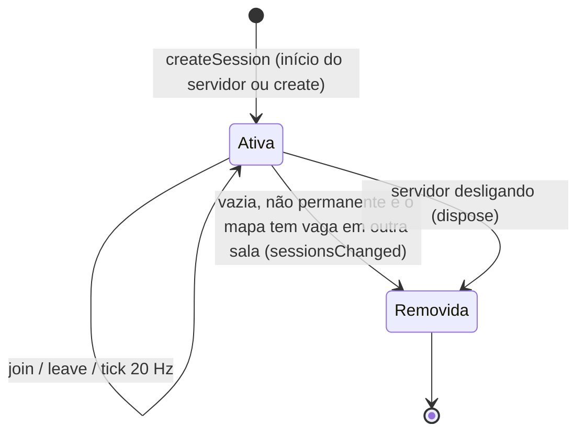

# Sessions

No código, "sessão" tem **três sentidos** — não confundir:

| Termo | O que é | Onde | Nota |
|---|---|---|---|
| Sessão de login | Cookie `oc_sessao` (30 dias, renovado) + linha na tabela `session` | `server/auth/sessions.ts` | [[Authentication]] |
| Conexão de jogo (`Conn`) | Um WebSocket aberto com ticket, ligado a uma conta | `server/app.ts` | esta nota |
| Sessão de jogo / sala (`Session`) | Uma partida FFA com até 10 jogadores | `server/session.ts` | esta nota |

Ver também a "participação" persistida (`session_participation`) em [[Player Data]].

## Conexão de jogo

### Abertura

1. Cliente pede `POST /api/ws-ticket` (exige sessão de login válida, sem banimento, conta não `pending_deletion`).
2. Abre `ws(s)://<mesmo host>/ws?ticket=<ticket>` (`Connection.open()`).
3. `upgrade()` em `server/app.ts`: header `Upgrade`, **Origin**, ticket (GETDEL no Redis), conta `active` e sem banimento ativo.
4. Carrega o **perfil de jogo** (`loadGameProfile`: tag, sexo, aparência, XP, armas) e o silêncio do chat (`chatMutedUntil`) e cria um `LiveAccount` em memória ([[Player Data]]).
5. Em `open`: cria o `Conn` (id numérico incremental, válido só neste processo) e aplica **uma conexão por conta**: se a conta já tinha conexão, a antiga é fechada com `4002` (`replaced`).

### Estado mantido por conexão (`Peer` / `Conn`)

- `account: LiveAccount` — perfil, delta de progresso, participação aberta, silêncio.
- `bucket`, `bucketAt` — token bucket de 150 msg/s.
- `session` — sala atual ou `null` (lobby).
- `name` — preenchido só após `hello` (`Nome#1234`).

### Encerramento

| Causa | Código | Mecanismo |
|---|---|---|
| Logout (`POST /api/auth/sair`) | 4001 | `revokeSession` publica o id da conta em `oc:revogacao` |
| Redefinição de senha, banimento | 4001 | `revokeAll` publica em `oc:revogacao` |
| Pedido de exclusão de conta | 4001 | `DELETE /api/conta` publica em `oc:revogacao` |
| Mesma conta conectou de novo | 4002 | `byAccount` em `server/app.ts` |
| Servidor desligando (SIGTERM/SIGINT) | 1001 | `GameServer.close()` |
| Rede / navegador fechado | — | evento `close` |

O servidor assina os canais Redis `oc:revogacao` e `oc:silencio` numa **segunda conexão Redis** (uma conexão em modo subscribe não executa outros comandos). Silêncio não fecha a conexão: recarrega `chatMutedUntil` na conexão viva. Ver [[Moderation]].

Ao fechar: sai da sala (grava o progresso com `close = true`), remove do conjunto de conexões e do mapa `byAccount` (só se ainda for a conexão registrada).

## Sala (`Session`)

### Ciclo de vida

- Cada sala tem seu próprio `setInterval` de 50 ms (`tick`) e um tópico pub/sub `sessao:<id>`.
- Salas permanentes (uma por mapa) nunca são removidas, e todo mapa sempre tem uma sala com vaga (o servidor abre `<Mapa> 2` quando as do mapa lotam). Ver [[Matchmaking]].

### Estado mantido por sala

- `players: Map<id, SPlayer>` — por jogador: estado de rede, vivo, vida, `lastDamageAt`, `deadAt`, kills/deaths/score/humiliations, ping, histórico de acertos (`hitTimes`), últimos tempos de facada/tiro/prop, tokens de chat, granadas vivas, dança, bônus (cereja, humanidade do rato, poção), loadout e `body` (`bodyStats` da aparência: altura, vida máxima).
- `corpses` — corpos com janela de humilhação (`NET.corpseWindow` = 6 s), dono da dança (`claimedBy`); removidos 2 s após a janela se ninguém estiver dançando.
- `pickups`, `fish`, `rats` — estado dos itens/criaturas do mapa (de `PICKUPS`, `FISH`, `RATS` em `shared/maps.ts`), com `ready` em tempo do servidor.

### Entrada e saída

- **Nome único na sala**: se o nome já estiver na sala, recebe sufixo ` (2)`, ` (3)`... (cortando o nome em `NET.nameMax − 4` caracteres). Como o nome agora é a tag `Nome#1234`, única no banco (índice em `lower(display_name), discriminator`), isso praticamente não ocorre.
  > [!warning]
  > Inferência: o sufixo parece herança da época de nomes livres (antes das contas); precisa ser confirmado.
- Entra **morto**, com `deadAt` no passado para poder nascer na hora.
- Ao sair: libera corpos que estava humilhando, avisa `playerLeft`.
- Em `join` o servidor abre uma linha em `session_participation` (assíncrono) e incrementa `matches_played`. Ver [[Save System]].

### Tick (20 Hz)

1. Fim da cereja → vida volta ao máximo do corpo.
2. Regeneração: `HEALTH.regenPerSecond` (25/s) após `HEALTH.regenDelay` (4 s) sem dano.
3. Tempo de jogo e XP por minuto vivo (`addTime`).
4. Limpeza de corpos.
5. `snap` (se há jogadores) e, a cada 1 s, `scores`.

## Desligamento do servidor

`server/index.ts` trata SIGTERM/SIGINT: chama `close()` (grava o progresso de todos que estão em sala, fecha sockets com 1001, encerra salas, servidor, Redis e pool do banco) com **limite de 3 s** antes de `process.exit(0)`. Ver [[Troubleshooting]].

## Limitações conhecidas

- **Perfil carregado só no handshake**: troca de nome ou aparência via API durante a conexão só vale ao reconectar (o `LiveAccount` não é recarregado; inferência a partir de `upgrade()` ser o único ponto que chama `loadGameProfile`).
- **"Uma conexão por conta" é por processo**: o mapa `byAccount` é local. Com mais de uma instância, a mesma conta poderia jogar em duas (hoje o deploy tem uma instância). Ver [[Problem - Estado das partidas só em memória de um processo]].
- Sem reconexão: cair da rede perde o lugar na sala; o progresso até ali é gravado.

## Código relacionado

- `server/app.ts` — `Peer`, `upgrade()`, `open/message/close`, `byAccount`, `leaveSession()`, `flush()`, revogação.
- `server/session.ts` — `Session`, `SPlayer`, `join()`, `leave()`, `tick()`, `dispose()`.
- `server/progress.ts` — `LiveAccount`.
- `server/redis.ts` — `REVOCATION_CHANNEL`, `MUTE_CHANNEL`.
- `client/net/connection.ts`, `client/ui/home.ts` (`closeReason`).
- Ver também [[Server Architecture]], [[State Management]], [[Flow - Join Online Match]].
