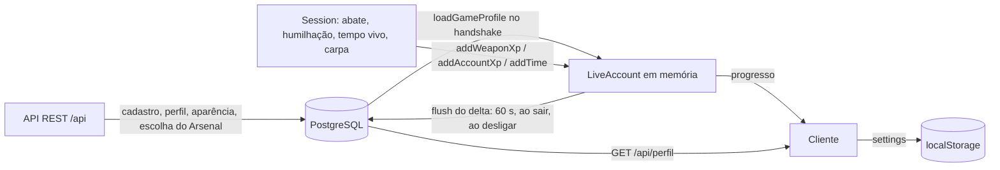

# Data Architecture

## Visão geral

Os dados do jogo vivem em **quatro lugares**:

| Onde | O quê | Durabilidade |
|---|---|---|
| **PostgreSQL 18** (`banco`) | Contas, credenciais, sessões de login, perfil, estatísticas, progresso de armas, participações, sanções, papéis, auditoria | Persistente (volume Docker `oc-pg`) |
| **Redis 8** (`redis`) | Tickets do WebSocket, links de redefinição de senha, contadores de limite de taxa, bloqueios de login, canais pub/sub de revogação e silêncio | **Efêmero** (sem RDB/AOF: `--save '' --appendonly no`) |
| **Memória do servidor** | Salas, jogadores, corpos, itens do mapa, `LiveAccount` (perfil + delta de progresso) | Some ao reiniciar |
| **Navegador** (`localStorage`) | Configurações do jogador (`oc.settings.v1`) e preferências de bots (`oc.bots`) | Por navegador/dispositivo |

Dados de **configuração de jogo** (armas, progressão, nível da conta, mapas) são arquivos versionados no repositório (`shared/data/*.json`, `shared/*.ts`), embutidos no build do cliente e do servidor. Ver [[Configuration Data]].

## Classificação (README §7)

| Categoria | Exemplos | Onde | Nota |
|---|---|---|---|
| Estado temporário | buffers de interpolação, efeitos, física local | cliente (memória) | [[Synchronization]] |
| Estado da partida | vida, posição, kills da sala, corpos, itens | servidor (`Session`) | [[Sessions]] |
| Estado do jogador (vivo) | `LiveAccount`: perfil carregado + delta não gravado | servidor (memória) | [[Player Data]] |
| Estado persistente | conta, perfil (com a escolha do Arsenal em `player_profile.loadout`), stats, XP das armas, participações | PostgreSQL | [[Database]] |
| Configuração | `shared/data/*.json`, constantes, variáveis de ambiente | repositório / ambiente | [[Configuration Data]] |
| Cache / efêmero | tickets, limites, tokens de redefinição | Redis | [[Cache]] |
| Preferências locais | sensibilidade, FOV, teclas, qualidade | `localStorage` | [[Save System]] |
| Dados externos | id do usuário Discord (OAuth) | `auth_identity` | [[External Services]] |

## Fluxo dos dados do jogador

## Princípios observados no código

- **Separação identidade × perfil × estatísticas** em tabelas diferentes: a conta quase não muda, as estatísticas mudam o tempo todo (comentário em `001_contas.sql`). Ver [[Database]].
- **Somar, não sobrescrever**: o progresso é gravado como **delta** acumulado (`xp = xp + $2`), o que torna a gravação tolerante a falhas e reenvio ([[ADR - Progresso gravado em lotes por delta]]).
- **Sanções como histórico, nunca uma flag** (comentário em `001_contas.sql`).
- **Segredos nunca em claro**: senhas em Argon2id; tokens de sessão, tickets e links de redefinição guardados só como SHA-256 ([[Sensitive Data]]).
- **Validação na leitura e na escrita** de dados livres (aparência JSON passa por `sanitizeAppearance` sempre).
- **Redis só para o que pode sumir** ([[ADR - Redis efêmero sem persistência]]).

## Recuperação após falha

| Falha | Efeito |
|---|---|
| Gravação de progresso falha | delta volta para a memória (`mergeDelta`) e é tentado no próximo ciclo (60 s) |
| Processo do servidor morre sem SIGTERM | perde o progresso não gravado (até ~60 s por jogador) e todas as salas — inferência a partir do intervalo de flush |
| Desligamento normal (SIGTERM) | grava o progresso de todos antes de sair (limite de 3 s) |
| Redis reinicia | tickets, links de redefinição e contadores somem; jogadores pedem de novo |
| Banco perdido | restaurar backup `pg_dump` (procedimento em `docs/DEPLOY.md`) — ver [[Infrastructure Overview]] |

## Notas desta área

[[Player Data]] · [[Save System]] · [[Database]] · [[Cache]] · [[Configuration Data]] · [[Data Migrations]]

## Código relacionado

- `server/db.ts`, `server/redis.ts`, `server/accounts.ts`, `server/progress.ts`, `server/app.ts` (`flush`), `server/jobs.ts`.
- `server/migrations/*.sql`.
- `client/core/settings.ts`, `client/ui/home.ts`.
- `docker-compose.yml` (serviços `banco` e `redis`).
