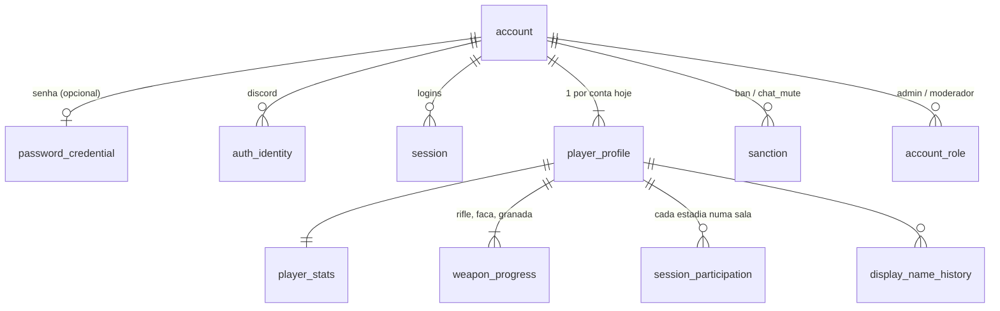

# Player Data

Tudo o que se sabe sobre um jogador, onde fica e quem altera. Jogar online **exige conta**; sem conta (treino e bots offline) tudo fica no nível 1 e nada é salvo além das [[Settings]] locais.

## Modelo

Colunas e índices em [[Database]].

## Identidade e perfil

| Dado | Onde | Regras |
|---|---|---|
| Conta (id UUIDv7, e-mail, status) | `account` | `status`: `active`, `suspended`, `pending_deletion`, `deleted`. E-mail `citext` único, nulo em contas só-Discord |
| Tag `Nome#1234` | `player_profile.display_name` + `discriminator` (1–9999) | Nome: 3–16 caracteres, letras/números e ` _.-` no meio (`NAME_RULE`). Tag única sem diferenciar maiúsculas. Discriminador sorteado (20 tentativas) e depois varredura |
| Troca de nome | `name_changed_at`, `display_name_history` | Primeira troca grátis, depois 1 a cada **7 dias** (`NAME_COOLDOWN_DAYS`). Mantém o número se possível |
| Sexo / corpo | `player_profile.sex` (`m`/`f`) | Trocar mantém a aparência (sanitizada para o novo corpo) |
| Aparência | `player_profile.appearance` (jsonb, versão `v: 2`) | Sempre passa por `sanitizeAppearance` na leitura e escrita; `NULL` = padrão. Ver [[Character Customization]] |
| `avatar_url`, `bio` | `player_profile` | Existem no schema; não usados pelo código atual (só zerados na anonimização) |

## Progresso e estatísticas

| Dado | Onde | Como muda |
|---|---|---|
| XP e nível da conta | `player_stats.xp`, `level` | XP só online: 10/minuto vivo, 25/abate, 50/humilhação (`shared/data/nivel_conta.json`), +XP por carpa. Nível recalculado na gravação (`accountLevel`) |
| XP por arma | `weapon_progress.xp` | Pontos do abate (com bônus) vão para a arma que matou (`weaponOfKill`) |
| Nível equipado por arma | `weapon_progress.equipped_level` | `PATCH /api/perfil {equipado}` ou mensagem `loadout`; só níveis desbloqueados |
| Totais | `player_stats` (kills, deaths, headshots, groin_kills, knife_kills, backstabs, grenade_kills, humiliations, seconds_played, matches_played) | Somados a partir do delta de cada gravação |
| MMR | `player_stats.mmr` (padrão 1000) | **Não usado** ("unused until ranked play exists") |
| Participações | `session_participation` (nome da sala, entrada/saída, kills, deaths, score, humiliations, account_xp) | Aberta no `join`; somada a cada gravação; `left_at` ao sair |

Regras de progressão: [[Progression]].

## Em memória no servidor (`LiveAccount`)

Criado no handshake do WebSocket (`liveAccount(loadGameProfile(...), chatMutedUntil)`):

- `profile: GameProfile` — `accountId`, `profileId`, `tag`, `sex`, `appearance`, `xp`, `weapons{xp, equipped}`.
- `delta: ProgressDelta` — o que foi ganho desde a última gravação (accountXp, weaponXp por arma, kills, deaths, headshots, groinKills, knifeKills, backstabs, grenadeKills, humiliations, secondsPlayed, score).
- `participation` — promessa do id da linha de participação atual.
- `aliveCarry` — segundos vivos acumulados para o próximo "minuto vivo".
- `chatMutedUntil` — ms epoch (0 = pode falar, `Infinity` = permanente).

O perfil em memória é a fonte de verdade durante a conexão; a gravação aplica o delta. Ver [[Save System]].

## No cliente

- `GET /api/me` → `MeResponse` (tag, nível, sexo, provedores, data de exclusão).
- `GET /api/perfil` → `ProfileResponse` (tag, nome, sexo, aparência, nível/XP, armas, totais, **últimas 10 participações**, `nomeLiberaEm`, provedores, `exclusaoEm`).
- `client/gameplay/progress.ts` (`Progress`) guarda XP/equipado das armas: inicia do perfil, é atualizado por `progresso` do servidor e salva trocas de equipamento via `PATCH /api/perfil`. Nada disso vai para `localStorage` (as chaves antigas `oc.name`, `oc.sex`, `oc.profile` são apagadas na home).

## Ciclo de vida da conta (LGPD)

1. `DELETE /api/conta` → `status = pending_deletion`, outras sessões revogadas, conexão de jogo fechada; online bloqueado (ticket recusado com `conta_em_exclusao`).
2. `POST /api/conta/cancelar-exclusao` desfaz durante a carência de **30 dias** (`DELETION_GRACE_DAYS`).
3. Após 30 dias, o job diário `anonymizeExpired` apaga e-mail, credenciais, identidades e sessões; renomeia o perfil para "Jogador excluído" e apaga o histórico de nomes. **Ids, estatísticas e participações ficam** (sustentam o histórico de partidas de outros). Ver [[Sensitive Data]].

## Código relacionado

- `server/accounts.ts` — `createAccount`, `pickDiscriminator`, `me`, `fullProfile`, `changeName`, `setSex`, `setAppearance`, `setEquipped`, `loadGameProfile`, `openParticipation`, `flushProgress`, `anonymizeExpired`.
- `server/progress.ts` — `LiveAccount`, `addWeaponXp`, `addAccountXp`, `addTime`, `equip`, `progressMsg`, `mergeDelta`.
- `shared/account.ts` — regras e tipos de resposta.
- Ver também [[Authentication]], [[Moderation]], [[Data Architecture]].
