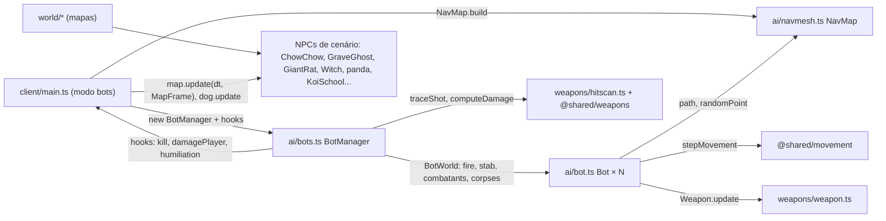

# AI Overview

> Índice da área **12 - AI & NPCs**.

## Resumo (nível 1)

O jogo tem dois tipos bem diferentes de personagens não controlados por humanos:

1. **Bots** (`client/ai/`): jogadores completos dirigidos por código, usados só no modo **Contra bots** (offline). Usam o mesmo movimento, a mesma arma, as mesmas hitboxes e as mesmas regras de pontos de um humano; só as decisões são artificiais. Andam por uma **malha de navegação Recast** gerada na hora a partir dos colisores do mapa.
2. **NPCs de cenário** (`client/world/...`): criaturas roteirizadas e cosméticas ou de mecânica de mapa — a cadela **Amora** (Rua dos Vizinhos), o **panda** e as **carpas** (Jardim do Dragão), a **bruxa**, o **fantasma**, o **rato gigante**, morcegos, espantalhos e patos do caldeirão (Vila Assombrada) — além dos **bonecos de treino** (`client/entities/dummy.ts`). Nenhum deles navega nem toma decisões de combate: reagem a proximidade, tiros ou ao relógio.

Toda a IA roda **no cliente**. O servidor não simula bots nem NPCs; ele só valida as recompensas ligadas a alguns NPCs (rato, peixes, poção da bruxa) por posição e tempo (`server/session.ts`).

## Mapa da área

| Nota | Conteúdo |
| --- | --- |
| [[NPC Behavior]] | Comportamento de cada personagem: bots, bonecos e NPCs de cenário |
| [[Navigation]] | `NavMap`: geração da navmesh com Recast, consultas, desvio de perigos, depuração |
| [[States]] | Máquinas de estado (modos do bot, fantasma, rato, boneco, cão) |
| [[AI Decisions]] | Percepção, escolha de alvo, mira, disparo, fuga, perseguição, opressão e níveis de dificuldade |

## Arquitetura (nível 2)

- **Tick**: `bots.fixedUpdate(dt, simTime)` roda no passo fixo de 60 Hz (`stepInner` em `client/main.ts`); cada `Bot` pensa a cada 0,12 s e age a cada passo. `bots.render(alpha, dt)` interpola no quadro.
- **NPCs de cenário** são atualizados no `render` (por quadro) via `map.update(frameDt, mapFrame)` e `dog.update(frameDt, near)`.
- **Bonecos**: `dummies.fixedUpdate(dt, simTime, occupied)` no passo fixo.

## Onde a IA existe por modo

| Modo | Bots | Bonecos | NPCs de cenário |
| --- | --- | --- | --- |
| Treino offline ([[Training]]) | não | sim (`map.dummies`) | sim |
| Contra bots ([[Versus Bots]]) | sim: 3, 5, 7 ou 9 (padrão 7, `client/ui/home.ts`) | não (`DummyManager` recebe lista vazia) | sim |
| Online ([[Free For All]]) | **não** | não | sim (gags sincronizados por `PropBus`/servidor) |

> [!warning]
> Bots online não existem: o README diz que "bots nas sessões online precisam de simulação no servidor". Ver [[Problem - Bots só existem offline]].

## Decisões importantes

- Bots são **jogadores completos**, sem atalhos (sem "aimbot" perfeito, sem atravessar paredes): [[ADR - Bots como jogadores completos]].
- A navmesh vem dos **colisores**, não da malha visual, e funciona para mapas em código e glTF (`client/ai/navmesh.ts`). Ver [[Navigation]].

## Limitações conhecidas (código/README)

- Bots não pegam a cereja (README) e, pelo código, não usam granadas, minas, poções nem coletáveis: o `BotWorld` só oferece `fire` e `stab`.
- Bots sorteiam uma arma de fogo a cada vida (`pickGun` em `client/ai/bot.ts`: rifle 60%, submetralhadora 25%, pistola 15%) e usam a faca base (`MELEE.faca`), sempre **sem melhorias** (`gunStats(arma)`). Não trocam de arma durante a vida.
- NPCs de cenário (bruxa, rato, fantasma) reagem à posição da **câmera local** (`listener`), não à de bots ou jogadores remotos. A Amora é exceção: olha para o mais próximo entre jogador, bots e remotos.

## Código relacionado

- `client/ai/bot.ts`, `client/ai/bots.ts`, `client/ai/navmesh.ts`
- `client/main.ts` (seção "Bots", `dogTick`, chamadas de `bots.fixedUpdate`/`render`)
- `client/entities/dummy.ts`, `client/world/dog.ts`, `client/world/halloween.ts`, `client/world/jardim/panda.ts`, `client/world/jardim/peixes.ts`

Ver também: [[Code Architecture Overview]], [[Combat]], [[Map Gags]].
