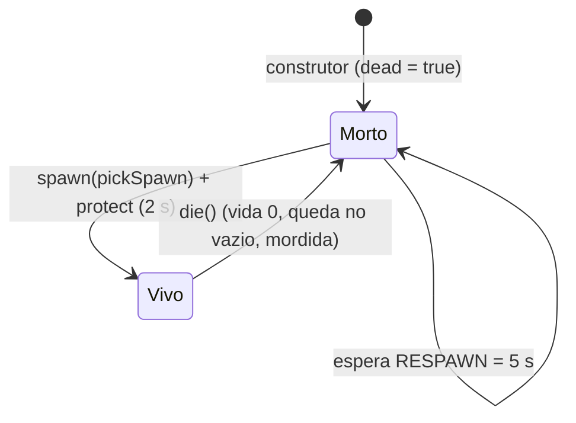
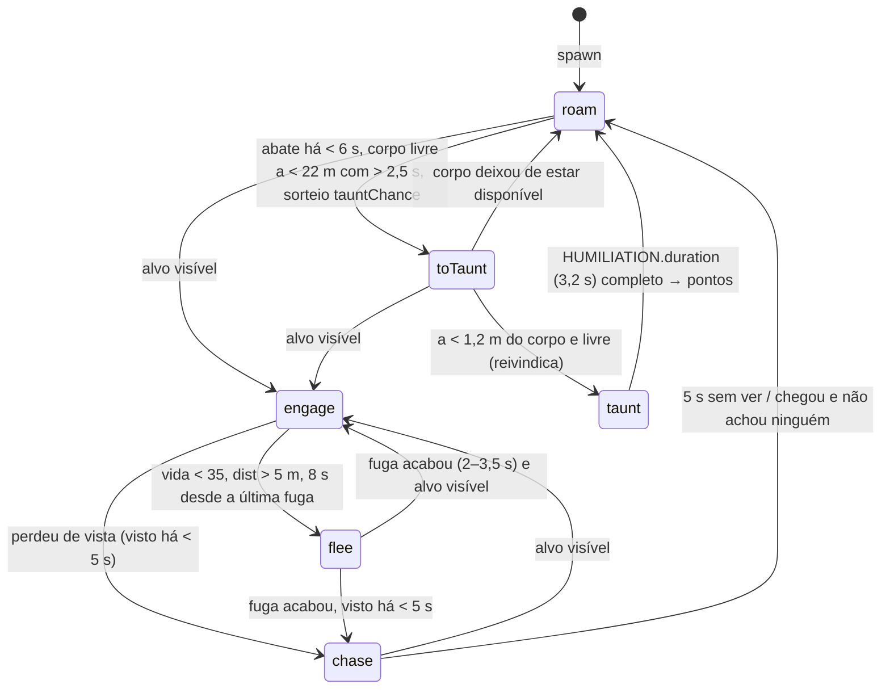
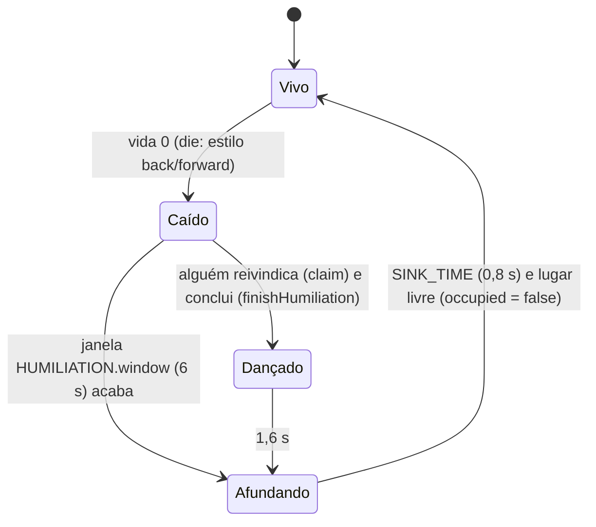
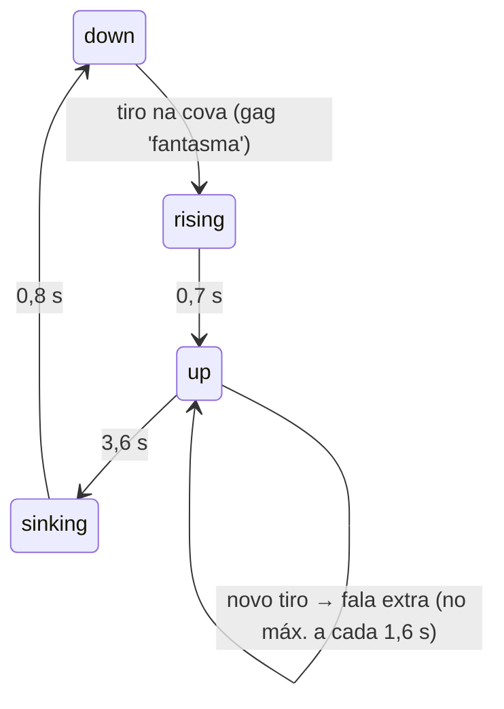

# States

Máquinas de estado dos personagens controlados por código. Não há biblioteca de FSM nem árvore de comportamento formal: os estados são **campos de string** (`mode`, `state`) ou combinações de flags/temporizadores, trocados dentro de `fixedUpdate`/`update`. O comentário de `client/ai/bot.ts` cita o plano de "árvore de comportamento simples" (seção 14 do documento de design), mas a implementação é uma FSM com prioridades.

## Bot — ciclo de vida

`dead` (booleano) + `deathAt` em `Bot`; transições comandadas pelo `BotManager`:

## Bot — modos de decisão (`Mode`)

`type Mode = 'roam' | 'engage' | 'chase' | 'flee' | 'toTaunt' | 'taunt'` (`client/ai/bot.ts`). `decide()` roda a cada 0,12 s; `taunt` termina dentro de `fixedUpdate`.

Prioridades efetivas em `decide()` (ordem do código): `taunt` não é interrompido por decisão (só pela morte) → alvo visível (`flee` ou `engage`) → fuga ainda ativa → `chase` → oportunidade de `toTaunt` → `toTaunt` em andamento → `roam`.

Estados auxiliares paralelos (temporizadores, não modos): `reactionLeft`, `burstLeft`/`pauseLeft` (rajadas), `strafeUntil`/`crouchUntil`, `knifeCooldown`/`knifeAnim`, o golpe em andamento (`swingTarget`/`swingT`, acerta no `impacto` da faca), a chance da faca por alvo (`BotKnife`), `stuckCount`. Detalhes em [[AI Decisions]].

## Proteção de spawn (bots e jogador no modo bots)

`BotManager.protectedUntil`: protegido por 2 s após nascer; durante a proteção não recebe dano (exceto de si mesmo), some da lista `combatants()` que os bots enxergam e pisca. Atirar (`fire` → `unprotect`) encerra antes.

## Boneco de treino (`Dummy`)

`releaseClaim` (dança interrompida) estende a janela em pelo menos 1,5 s.

## Fantasma (`GraveGhost.state`)

`'down' | 'rising' | 'up' | 'sinking'`:

## Rato gigante (`GiantRat.state`)

`'alive' | 'dying' | 'dead'`: `alive` → (`hp` ≤ 0 e o jogo confirma) `kill(ready)` → `dying` (~3 s, colisores desligados) → `dead` (invisível) → quando o relógio do jogo passa de `ready`, `alive` de novo com vida cheia, crescendo de 1% até o tamanho. `set(ready)` coloca direto em `dead` (ao entrar numa sessão online com o rato morto). A reivindicação (`onDown`) se repete a cada 2 s se ninguém responder.

## Amora (`ChowChow`)

Sem campo de estado nomeado: **calma** (ninguém a < 6 m) vs **alerta** (alguém perto: ofega e abana) e uma **animação de mordida** opcional (`biteT` não nulo por 0,5 s). Latido com cooldown de 1,2 s.

## Bruxa e panda

Sem estados discretos: animações contínuas (`t`), mais `shake` (gargalhada após uma poção) na bruxa; o panda segue um ciclo fixo de 4,5 s (morder/mastigar).

## Código relacionado

- `client/ai/bot.ts` (`Mode`, `decide`, `fixedUpdate`, `spawn`, `die`)
- `client/ai/bots.ts` (`fixedUpdate`, `protect`, `isProtected`, `unprotect`)
- `client/entities/dummy.ts` (`die`, `canHumiliate`, `claim`, `releaseClaim`, `finishHumiliation`, `fixedUpdate`)
- `client/world/halloween.ts` (`GraveGhost`, `GiantRat`), `client/world/dog.ts` (`ChowChow.update`, `bite`)

Ver também: [[NPC Behavior]], [[Humiliation]], [[Respawn]].
