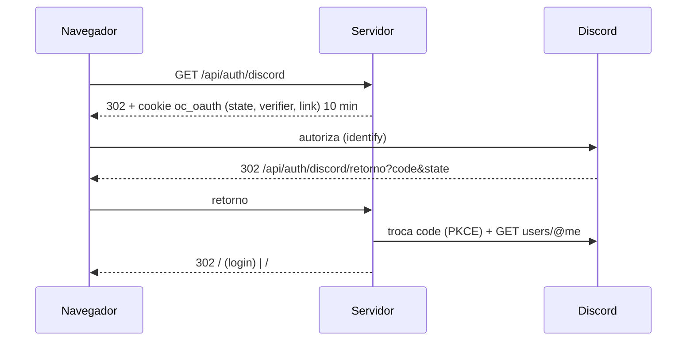

# Authentication

Jogar **online** exige conta; treino e contra bots funcionam sem conta (ver [[Game Modes Index]]). Há duas formas de entrar: **e-mail + senha** e **Discord**. Uma conta pode ter as duas.

## Resumo

| Mecanismo | Implementação | Arquivo |
| --- | --- | --- |
| Hash de senha | Argon2id via `Bun.password` (19 MiB, 2 passes — mínimo OWASP, segundo o comentário) | `server/auth/password.ts` |
| Sessão do navegador | Token aleatório de 32 bytes num cookie `oc_sessao` HttpOnly, SameSite=Lax, `Secure` só em HTTPS; o banco guarda só o SHA-256 | `server/auth/sessions.ts` |
| Validade | 30 dias, deslizante (renovação gravada no máximo 1×/hora) | `server/auth/sessions.ts` |
| Discord | OAuth 2 Authorization Code + PKCE (lib `arctic`), escopo `identify`; chave = id do usuário Discord (nunca o e-mail) | `server/auth/discord.ts` |
| Recuperação de senha | Token de 32 bytes em link `/#redefinir=<token>`, guardado no Redis como hash, válido 24 h, uso único | `server/auth/password.ts` |
| Entrada no jogo | Ticket de uso único (Redis, 30 s) trocado na abertura do WebSocket | `server/api.ts`, `server/app.ts` |
| Revogação | Canal Redis `oc:revogacao` fecha a conexão de jogo da conta (código `4001`) | `server/redis.ts`, `server/app.ts` |

> [!info] Decisão registrada
> O servidor atua como **BFF**: o navegador nunca guarda token legível por script (nada em `localStorage`). Ver [[ADR - Sessão em cookie HttpOnly com servidor como BFF]].

## Fluxos

### Cadastro e login por senha

1. Limite por IP: `rl:<bucket>:ip:<ip>` no Redis, janela de 60 s, máximo **5** (`429 muitas_tentativas`).
2. Validação (`shared/account.ts`): e-mail com formato básico, senha de 8 a 128 caracteres, nome de 3 a 16 caracteres pela regra `NAME_RULE`.
3. Login: e-mail inexistente e senha errada dão a **mesma resposta** (`401 credenciais_invalidas`) e custam o mesmo tempo (verificação contra um hash fictício).
4. **Bloqueio da conta**: 10 falhas seguidas (`rl:login:conta:<id>`) bloqueiam por 900 s, sempre com a mesma mensagem genérica. O login certo zera o contador.
5. Conta banida: `403 conta_suspensa` com `ate`.
6. Cada evento vai para a auditoria `auth_event` (`register`, `login_ok`, `login_fail`, `lockout`...).

### Sessões

- `createSession` grava `session(account_id, token_hash, device_label, ip, expires_at)`.
- `authenticate` exige sessão não revogada, não expirada e conta não `deleted`.
- `revokeSession` (sair) e `revokeAll` (redefinição de senha, banimento, exclusão) marcam `revoked_at` e publicam em `oc:revogacao`.

### Discord

- O botão só aparece se `DISCORD_CLIENT_ID`/`DISCORD_CLIENT_SECRET` existirem **e** o endereço atual + `/api/auth/discord/retorno` estiver em `DISCORD_RETORNOS` (`GET /api/auth/provedores`).
- Primeira visita cria conta com o nome do Discord (ou "Recruta") e leva o jogador a escolher um nome.
- Vincular (`?vincular=1`) só com sessão ativa; um Discord já usado por outra conta dá `discord_ja_vinculado`.
- Desvincular é recusado se for a única forma de entrar (`409 unica_forma_de_entrar`).

### Recuperação de senha

1. `POST /api/auth/recuperar` sempre responde 204 (não revela se o e-mail existe).
2. Máximo 3 e-mails por hora por conta. O link vai por [[External Services|SMTP do Gmail]] ou, sem SMTP configurado, aparece no log do servidor.
3. `POST /api/auth/redefinir` consome o token (`GETDEL`), grava o novo hash, marca o e-mail como verificado, zera o bloqueio e **revoga todas as sessões**.

### Abertura do WebSocket

1. Cliente chama `POST /api/ws-ticket` (exige sessão; recusa conta em exclusão).
2. Servidor grava `ws:ticket:<sha256(ticket)>` → `accountId` com TTL de 30 s.
3. Cliente abre `/ws?ticket=...`. O servidor, nessa ordem: exige cabeçalho `upgrade: websocket` (senão 426, sem gastar o ticket), checa `Origin` (403), consome o ticket com `GETDEL` (401 se ausente), confere conta ativa e sem banimento (403).
4. Uma conta só tem **uma conexão de jogo**: a nova derruba a antiga com código `4002`.

Cenário testado: [[Scenario - Ticket do WebSocket]]. Decisão: [[ADR - Ticket de uso único para o WebSocket]].

### Exclusão de conta (LGPD)

`DELETE /api/conta` marca `pending_deletion`, revoga as outras sessões e derruba o jogo; durante a carência de **30 dias** não há ticket de WebSocket. Depois, o job diário anonimiza a conta (ver [[Player Data]] e [[Scenario - Exclusão de conta e anonimização]]).

## Chaves no Redis

| Chave | Conteúdo | TTL |
| --- | --- | --- |
| `rl:cadastro:ip:<ip>`, `rl:login:ip:<ip>`, `rl:recuperar:ip:<ip>` | contador | 60 s |
| `rl:login:conta:<id>` | falhas seguidas | 900 s |
| `rl:rec:conta:<id>` | e-mails de recuperação | 3600 s |
| `rec:<sha256(token)>` | id da conta | 86400 s |
| `ws:ticket:<sha256(ticket)>` | id da conta | 30 s |

## Configurações relacionadas

`DISCORD_CLIENT_ID`, `DISCORD_CLIENT_SECRET`, `DISCORD_RETORNOS`, `SMTP_*`, `ORIGENS_PERMITIDAS` — ver [[Configuration Reference]]. Limites em `LIMITS` (`server/auth/password.ts`) e constantes em `shared/account.ts` (ver [[Constants Reference]]).

## Código relacionado

- `server/auth/password.ts` — `register`, `login`, `requestReset`, `resetPassword`, `LIMITS`.
- `server/auth/sessions.ts` — `createSession`, `authenticate`, `revokeSession`, `revokeAll`, `SESSION_COOKIE`.
- `server/auth/discord.ts` — `startDiscord`, `discordCallback`, `unlinkDiscord`.
- `server/api.ts` — `POST /api/ws-ticket`, `TICKET_TTL_SECONDS`, `ticketKey`.
- `server/app.ts` — `upgrade()` do WebSocket e assinatura de `REVOCATION_CHANNEL`.
- `server/migrations/001_contas.sql` — tabelas `account`, `password_credential`, `auth_identity`, `session`, `auth_event`.

Ver também: [[Security Overview]], [[Sensitive Data]], [[Flow - First Access]], [[Sessions]].
