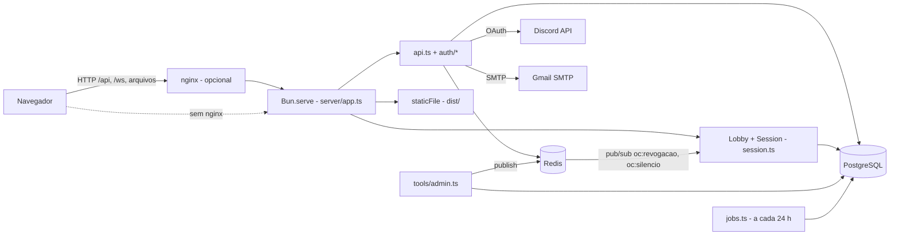

# Backend Overview

## Visão geral (nível 1)

O backend do Offensive Combat é **um único processo Bun** (`server/index.ts` → `startServer()` em `server/app.ts`) que atende, na mesma porta (padrão `8787`):

- a **API de contas** em `/api/*` (JSON, cookie de sessão) — ver [[APIs]] e [[Authentication]];
- o **WebSocket do jogo** em `/ws` (lobby + sessões de mata-mata livre) — ver [[Match Services]] e [[Networking Overview]];
- os **arquivos estáticos** do build (`dist/`) quando não há nginx na frente.

Ele depende de dois serviços de dados:

- **PostgreSQL** — contas, perfis, progresso, estatísticas, sanções, auditoria ([[Database]]);
- **Redis** — limites de tentativas, bloqueios, tickets do WebSocket, links de recuperação de senha e canais pub/sub de revogação e silêncio ([[Cache]]).

E, opcionalmente, de dois serviços externos: **Discord OAuth** e **SMTP do Gmail** ([[External Services]]).

> [!info] Código confirmado
> Não existe separação em microsserviços. Contas, lobby e partidas rodam no mesmo processo e compartilham o mesmo pool de banco (`pg.Pool`, `max: 10`) e a mesma conexão Redis (mais uma segunda conexão só para *subscribe*).

## Componentes (nível 2)

| Peça | Arquivo | Responsabilidade |
| --- | --- | --- |
| Ponto de entrada | `server/index.ts` | Lê `PORT`/`HOST`, chama `startServer`, trata `SIGTERM`/`SIGINT` (fecha sockets e grava progresso, com saída forçada em 3 s). |
| Servidor | `server/app.ts` | `Bun.serve` com `fetch` (API → estáticos) e `websocket`; abre as salas sob demanda; grava progresso a cada 60 s; assina os canais Redis (revogação, silêncio, perfil). |
| API | `server/api.ts` | Tabela de rotas `"MÉTODO /caminho"`, checagem de origem em métodos que mudam estado, erros `{ erro: código }`. |
| Autenticação | `server/auth/*.ts` | Senha (Argon2id), sessões por cookie, Discord OAuth (PKCE). |
| HTTP utilitário | `server/http.ts` | Leitura de JSON e de bytes com limite (16 KiB por padrão), cookies, IP do cliente, checagem de `Origin`, tokens aleatórios. |
| Dados | `server/db.ts`, `server/accounts.ts`, `server/progress.ts` | Pool Postgres, migrations, SQL de contas e progresso. |
| Redis | `server/redis.ts` | Cliente ioredis, contador de janela fixa (`hit`), nomes dos canais. |
| Tarefas | `server/jobs.ts` | Partições mensais de `auth_event` e anonimização de contas, na partida e a cada 24 h. |
| E-mail | `server/email.ts` | Envio via Gmail SMTP ou fallback no log (`outbox`). |
| Moderação | `server/moderacao.ts` + `tools/admin.ts` | Banir, silenciar, papéis, histórico — ver [[Moderation]]. |

## Ciclo de vida (nível 3)

1. `startServer()` cria o pool Postgres, duas conexões Redis, roda as **migrations** (`migrate`, ver [[Data Migrations]]) e agenda os **jobs** (desligáveis com `jobs: false`, usado nos testes).
2. Semeia a versão 1 dos mapas oficiais que o banco ainda não tem (`seedOfficialMaps`, `server/maps.ts`). Não cria sala nenhuma: elas abrem sob demanda.
3. Assina `oc:revogacao` e `oc:silencio` no Redis.
4. Sobe o `Bun.serve`. Cada requisição registra o IP do par (`setPeer`) para `clientIp()`.
5. No `close()` (SIGTERM ou fim dos testes): para o timer de gravação e os jobs, grava o progresso de quem está jogando, fecha sockets com código `1001`, descarta sessões, para o servidor e fecha Redis e Postgres.

Se o servidor não sobe (banco ou Redis fora do ar), `index.ts` imprime `[servidor] não subiu: ...` e a dica `docker compose up -d banco redis`, saindo com código 1 (ver [[Troubleshooting]]).

## Dependências

- [[Server Architecture]] — organização interna do código do servidor.
- [[Client Server Model]] — o que é autoridade do servidor.
- [[Infrastructure Overview]] — como o processo é empacotado e exposto.
- [[Configuration Reference]] — variáveis de ambiente.

## Código relacionado

- `server/index.ts`, `server/app.ts`, `server/api.ts`, `server/http.ts`
- `server/auth/password.ts`, `server/auth/sessions.ts`, `server/auth/discord.ts`
- `server/db.ts`, `server/redis.ts`, `server/jobs.ts`, `server/email.ts`, `server/moderacao.ts`
- `tools/admin.ts`
