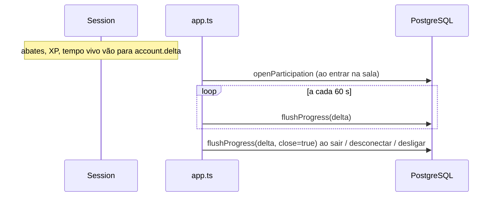

# Match Services

"Serviço de partidas" aqui não é um serviço separado: é a parte do processo Bun (`server/app.ts`) que mantém o **lobby** e as **sessões** de mata-mata livre, e a classe `Session` (`server/session.ts`) que roda cada sala. Esta nota descreve o lado de serviço (ciclo de vida, persistência, limites). Regras de jogo ficam em [[Free For All]]; protocolo e sincronização em [[Sessions]], [[Matchmaking]] e [[Replication]].

## O que o servidor mantém em memória

| Estrutura | Conteúdo |
| --- | --- |
| `sessions: Map<id, Session>` | Todas as salas abertas. |
| `conns: Set<Conn>` | Todas as conexões de jogo (no lobby ou numa sala). |
| `byAccount: Map<accountId, Conn>` | Uma conexão por conta (a nova substitui a antiga, código `4002`). |

Nada disso é persistido: reiniciar o processo encerra todas as partidas (o progresso é gravado antes, ver abaixo).

## Sessões permanentes e temporárias

- Na partida do servidor são criadas **três sessões permanentes**, uma por mapa: `principal` (Rua dos Vizinhos — o id vem de quando só havia a rua), `jardim` e `halloween`.
- Qualquer jogador pode **criar** uma sala com nome (sanitizado, até 24 caracteres; padrão "Sala de <nome>") e mapa; mapa desconhecido cai no padrão `rua`.
- Salas não permanentes vazias são **descartadas** na próxima atualização do lobby.
- Limite de **10 jogadores** por sala (`NET.maxPlayers`): "Sessão lotada.".
- A lista do lobby é ordenada: permanentes primeiro, depois por número de jogadores. Atualizações em rajada são **agrupadas em 100 ms** antes de enviar `sessions` a quem está no lobby.

## Mensagens tratadas no nível do lobby

`hello` (nome vem **da conta**, nunca da mensagem), `list`, `create`, `join`, `leave` e `ping` fora de sala. Todo o resto é repassado a `Session.handle`. Ver [[Remote Calls]].

## Proteções no socket

- `maxPayloadLength` de 16 KiB por mensagem.
- **Token bucket** de 150 mensagens/s por conexão: excedentes são descartados silenciosamente.
- JSON inválido ou sem campo `t` é ignorado.

## Persistência do progresso

- O progresso (XP de armas e conta, estatísticas, participação) acumula num **delta** em memória (`server/progress.ts`).
- `FLUSH_EVERY_MS = 60_000`: grava de todos que estão em sala a cada minuto; também ao sair da sala, ao fechar o socket e no desligamento.
- Se a gravação falhar, o delta é **mesclado de volta** e tentado no próximo ciclo (log `[progresso] gravação falhou...`).

Detalhes do modelo de dados: [[Save System]] e [[Player Data]].

## Integração com moderação

- `oc:revogacao` → fecha a conexão da conta (`4001`).
- `oc:silencio` → recarrega `chatMutedUntil` da conta na conexão viva; o silêncio vale na partida em andamento. Ver [[Moderation]] e [[Chat]].

## Limitações conhecidas

- Uma sala é um `setInterval` de 20 Hz por sessão no mesmo processo; não há balanceamento entre processos/máquinas.
- Sem fim de partida (limite de abates/tempo) nem votação de mapa — listado como "ainda não feito" no `README.md`.
- Bots existem só offline (ver [[Versus Bots]]).

## Código relacionado

- `server/app.ts` — `createSession`, `sessionsChanged`, `flush`, `leaveSession`, handlers `websocket`.
- `server/session.ts` — classe `Session` (tick, broadcast via pub/sub, regras).
- `server/progress.ts` — `LiveAccount`, delta e mensagens de progresso.
- `server/accounts.ts` — `openParticipation`, `flushProgress`, `loadGameProfile`.
- `shared/maps.ts` — `MAPS`, `DEFAULT_MAP`, `isMapId`.
