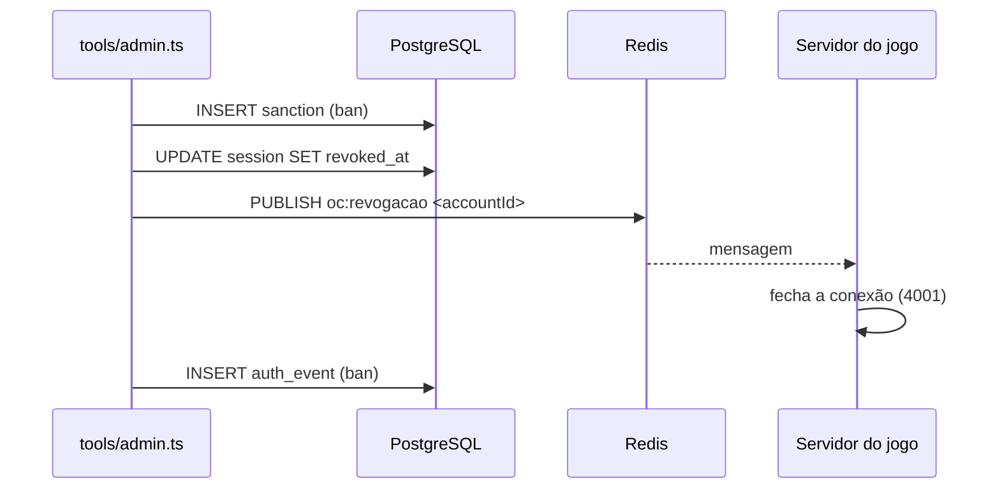

# Moderation

A moderação é feita **pelo console do servidor** (`tools/admin.ts`), que fala direto com o mesmo PostgreSQL e Redis do jogo. Não há painel web nem comandos de moderação dentro do jogo.

## Comandos

| Comando | Efeito |
| --- | --- |
| `admin banir <Nome#1234> <motivo> <duração>` | Cria sanção `ban`, revoga **todas** as sessões e derruba a partida (`oc:revogacao`). Login e API passam a responder `conta_suspensa`. |
| `admin desbanir <Nome#1234>` | Revoga os banimentos ativos. |
| `admin silenciar <Nome#1234> <motivo> <duração>` | Cria sanção `chat_mute`; publica em `oc:silencio`. A pessoa continua jogando, mas as falas são recusadas (`chatRefused: muted`), inclusive na partida em andamento. |
| `admin dessilenciar <Nome#1234>` | Revoga silêncios ativos e avisa a partida. |
| `admin papel <Nome#1234> <admin\|moderador> [--remover]` | Concede/remove papel de staff. |
| `admin sancoes <Nome#1234>` | Lista papéis e histórico de sanções. |

Duração: `7d`, `12h`, `30m` ou `permanente` (`parseDuration`). Formato inválido gera erro com a dica de uso.

Execução:

- Desenvolvimento: `bun run admin <comando> ...`
- Docker: `docker compose exec jogo bun build/admin.js <comando> ...` (o `build/admin.js` é gerado por `bun run build:server`).

## Modelo de dados

| Tabela | Uso |
| --- | --- |
| `sanction` | Histórico: `type` (`ban`/`chat_mute`), `reason`, `issued_by`, `starts_at`, `expires_at` (nulo = permanente), `revoked_at`. |
| `role` | Papéis semeados pela migration: `admin` ("Gerencia papéis e aplica qualquer sanção") e `moderador` ("Aplica e revoga sanções"). |
| `account_role` | Papéis por conta. |
| `auth_event` | Trilha de auditoria (`ban`, `unban`, `chat_mute`, `chat_unmute`, `role_grant`, `role_revoke`, além dos eventos de login). Particionada por mês. |

## Fluxo de um banimento

## Outras proteções de comunidade (no jogo)

- Chat: texto sanitizado (`sanitizeChat`), até 120 caracteres, limite de rajada de 4 mensagens e depois 1 a cada 1,5 s (`chatRefused: slow`). Ver [[Chat]].
- Nomes: caracteres de controle e `<`/`>` removidos; regra de nome em `shared/account.ts`.

> [!warning] Papéis sem efeito
> Os papéis `admin` e `moderador` são gravados, mas **nenhum código os consulta** (verificado: `account_role` só aparece em `server/moderacao.ts`). Quem tem acesso ao console do servidor pode tudo; o campo `issued_by` é sempre nulo no console atual. Ver [[Problem - Papéis de staff sem uso no código]].

Não há filtro de palavrões, denúncia por jogadores, nem detecção automática de trapaça além das validações do servidor (ver [[Anti Cheat]]).

## Testes

`server/tests/game.test.ts` cobre: "banimento encerra a partida e bloqueia o login" e "silenciar vale na partida em andamento, e dessilenciar devolve o chat". Ver [[Integration Tests]].

## Código relacionado

- `server/moderacao.ts` — `ban`, `unban`, `mute`, `unmute`, `setRole`, `sanctions`, `parseDuration`.
- `tools/admin.ts` — CLI.
- `server/accounts.ts` — `activeBan`, `chatMutedUntil`, `audit`, `accountByTag`.
- `server/session.ts` — recusa de chat silenciado.
- `server/migrations/001_contas.sql` — tabelas `sanction`, `role`, `account_role`, `auth_event`.
