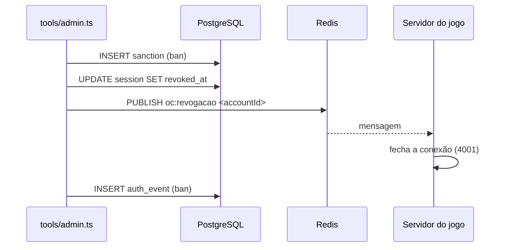

# Moderation

A moderação é feita por dois caminhos que chamam as mesmas funções (`server/moderacao.ts`, que recebem o **id da conta** e `by`, quem agiu):

- **API de Gerenciamento** (`/api/gestao/...`, PF-6 fase 2), para admins e moderadores, com as regras de `shared/roles.ts` conferidas a cada pedido. A tela Gerenciamento que a usa é da fase 4 da PF-6. Ver [[ADR - Papéis da equipe conferidos no servidor]].
- **Console do servidor** (`tools/admin.ts`), que fala direto com o mesmo PostgreSQL e Redis do jogo e acha a conta pela tag (`resolveTag`).

## Papéis

| Papel | Pode |
| --- | --- |
| `admin` | Tudo: punir, editar e mudar papéis de qualquer conta, conceder e tirar `admin`. |
| `moderador` | Tudo o que o admin pode, **menos** agir sobre a conta de um admin (editar, punir, rebaixar) e promover alguém a admin. |
| (sem papel) | Nada de equipe. |

Ninguém se pune, e o último admin não pode ser removido. Os papéis são lidos do banco em todo pedido (`server/roles.ts`): um papel tirado vale na hora.

## API de Gerenciamento

| Rota | Efeito |
| --- | --- |
| `GET /api/gestao/contas?q=&pagina=` | Busca por nome (parte) ou tag exata, 20 por página: tag, nível, papéis, banida/silenciada. |
| `GET /api/gestao/contas/:id` | Detalhes (nome, corpo, aparência, XP, armas, histórico de sanções com quem aplicou) e `permissoes` de quem pergunta (`editar`, `punir`, `conceder`, `remover`). |
| `PATCH /api/gestao/contas/:id` | `{ nome?, sexo?, aparencia?, xp?, armas? }`: o nome sem o tempo de espera (e sem mexer no tempo de espera do jogador); `xp` e `armas` são os pontos absolutos. Publica `oc:perfil`: o progresso novo chega na partida em andamento. |
| `POST /api/gestao/contas/:id/sancoes` | `{ tipo: banimento \| silencio, motivo, duracao }` (duração como no console). |
| `DELETE /api/gestao/contas/:id/sancoes/:tipo` | Revoga as sanções ativas desse tipo. |
| `PUT` / `DELETE /api/gestao/contas/:id/papeis/:papel` | Concede / tira `admin` ou `moderador`. |

Recusas: `403 sem_permissao` (com `motivo: ultimo_admin` ao tentar tirar o último admin), `404` para conta inexistente.

## Comandos do console

| Comando | Efeito |
| --- | --- |
| `admin banir <Nome#1234> <motivo> <duração>` | Cria sanção `ban`, revoga **todas** as sessões e derruba a partida (`oc:revogacao`). Login e API passam a responder `conta_suspensa`. |
| `admin desbanir <Nome#1234>` | Revoga os banimentos ativos. |
| `admin silenciar <Nome#1234> <motivo> <duração>` | Cria sanção `chat_mute`; publica em `oc:silencio`. A pessoa continua jogando, mas as falas são recusadas (`chatRefused: muted`), inclusive na partida em andamento. |
| `admin dessilenciar <Nome#1234>` | Revoga silêncios ativos e avisa a partida. |
| `admin papel <Nome#1234> <admin\|moderador> [--remover]` | Concede/remove papel de staff. |
| `admin sancoes <Nome#1234>` | Lista papéis e histórico de sanções. |

Duração: `7d`, `12h`, `30m` ou `permanente` (`parseDuration`). Formato inválido gera erro com a dica de uso.

Execução:

- Desenvolvimento: `bun run admin <comando> ...`
- Docker: `docker compose exec jogo bun build/admin.js <comando> ...` (o `build/admin.js` é gerado por `bun run build:server`).

## Modelo de dados

| Tabela | Uso |
| --- | --- |
| `sanction` | Histórico: `type` (`ban`/`chat_mute`), `reason`, `issued_by`, `starts_at`, `expires_at` (nulo = permanente), `revoked_at`. |
| `role` | Papéis semeados pela migration: `admin` ("Gerencia papéis e aplica qualquer sanção") e `moderador` (desde a 004: "Tudo o que o admin faz, menos agir sobre contas de admin e promover alguém a admin"). |
| `account_role` | Papéis por conta (`granted_by`: quem concedeu, pela API). |
| `auth_event` | Trilha de auditoria (`ban`, `unban`, `chat_mute`, `chat_unmute`, `role_grant`, `role_revoke`, `staff_edit`, `map_hide`, `map_unhide`, `map_delete`, além dos eventos de login), com `actor_id` (quem da equipe agiu; migration 004). Particionada por mês. |

## Fluxo de um banimento

## Outras proteções de comunidade (no jogo)

- Chat: texto sanitizado (`sanitizeChat`), até 120 caracteres, limite de rajada de 4 mensagens e depois 1 a cada 1,5 s (`chatRefused: slow`). Ver [[Chat]].
- Nomes: caracteres de controle e `<`/`>` removidos; regra de nome em `shared/account.ts`.

> [!note] Console sem autor
> O console age com acesso direto ao banco e grava `by = null` (não sabe quem o executa). Pela API, `issued_by`, `granted_by` e `actor_id` guardam o membro da equipe. O antigo [[Problem - Papéis de staff sem uso no código]] foi resolvido na PF-6.

Não há filtro de palavrões, denúncia por jogadores, nem detecção automática de trapaça além das validações do servidor (ver [[Anti Cheat]]).

## Testes

`server/tests/game.test.ts` cobre: "banimento encerra a partida e bloqueia o login" e "silenciar vale na partida em andamento, e dessilenciar devolve o chat". `server/tests/management.test.ts` cobre a matriz de papéis da API (moderador não mexe em admin nem promove a admin; admin concede e tira; o último admin fica; ninguém se pune), o banimento derrubando a conexão com o autor na auditoria, e silêncio e progresso chegando à partida em andamento; `client/tests/roles.test.ts` as regras puras. Ver [[Integration Tests]].

## Código relacionado

- `server/moderacao.ts` — `ban`, `unban`, `mute`, `unmute`, `setRole`, `sanctions`, `parseDuration`, `resolveTag`.
- `server/gestao.ts` — rotas `/api/gestao`; `server/roles.ts` — `rolesOf`, `requireRole`, `adminCount`; `shared/roles.ts` — as regras.
- `tools/admin.ts` — CLI.
- `server/accounts.ts` — `activeBan`, `chatMutedUntil`, `audit`, `accountByTag`.
- `server/session.ts` — recusa de chat silenciado.
- `server/migrations/001_contas.sql` — tabelas `sanction`, `role`, `account_role`, `auth_event`.
