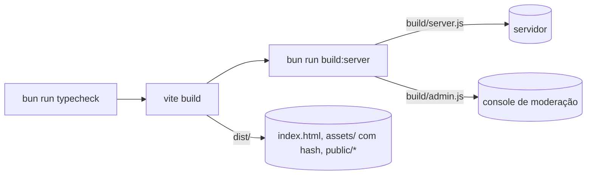

# Build Pipeline

## `bun run build`

| Etapa | Comando | Saída | Detalhes |
| --- | --- | --- | --- |
| 1. Typecheck | `tsc --noEmit && tsc --noEmit -p server` | — | Dois programas: navegador (`client`, `shared`; exclui `client/tests`) e Bun (`server`, `shared`, `tools`, `client/tests`). Falha de tipos interrompe o build. |
| 2. Cliente | `vite build` | `dist/` | `target: 'es2022'`, `chunkSizeWarningLimit: 6000` (KB). Copia `public/` (texturas, `.glb`, transcoder Basis/KTX2, manifest). |
| 3. Servidor | `bun build server/index.ts --target=bun --packages=external --outfile=build/server.js` | `build/server.js` | Dependências **não** são empacotadas (`--packages=external`): o runtime precisa de `node_modules` de produção. |
| 3b. Admin | `bun build tools/admin.ts ... --outfile=build/admin.js` | `build/admin.js` | Mesmo esquema. |

`dist/` e `build/` estão no `.gitignore` e no `.dockerignore`.

> [!info] Tamanho do bundle
> O `chunkSizeWarningLimit` de 6000 KB e a menção de `docs/DEPLOY.md` ("o JavaScript de ~5 MB vai com ~1,8 MB" com gzip) indicam um bundle principal grande, sem code splitting configurado. Ver [[Loading Performance]] e [[Problem - Bundle JavaScript único de ~5 MB]].

## Imagem Docker (multi-stage)

| Estágio | Base | O que faz |
| --- | --- | --- |
| `build` | `oven/bun:1.4-alpine` | `bun install --frozen-lockfile`, copia o projeto, `bun run build`. |
| `server` | `oven/bun:1.4-alpine` | `bun install --frozen-lockfile --production` + `bun pm cache rm`; copia `build/`, `dist/` e `server/migrations`; `USER bun`; `EXPOSE 8787`; `CMD bun build/server.js`. |
| `web` | `nginx:1.27-alpine` | Copia `deploy/nginx/docker.conf` como `default.conf` e `dist/` para `/usr/share/nginx/html`. |

As migrations são copiadas porque `server/db.ts` resolve `../server/migrations` relativo ao arquivo em execução — funciona tanto em `server/db.ts` (dev) quanto em `build/server.js` (produção). O mesmo vale para `dist/` em `server/app.ts`.

## Reprodutibilidade

- `bun.lock` + `--frozen-lockfile` no Docker e no CI.
- Versão do Bun fixada por `packageManager` (CI usa `bun-version-file: package.json`).
- Não há versionamento do artefato (sem tags git; `package.json` em `0.1.0`). Ver [[Updates]].

## Código relacionado

- `package.json` (`build`, `build:server`, `typecheck`, `start`)
- `vite.config.ts`, `tsconfig.json`, `server/tsconfig.json`
- `Dockerfile`, `.dockerignore`

Decisão: [[ADR - Build do servidor com bun build e pacotes externos]].
