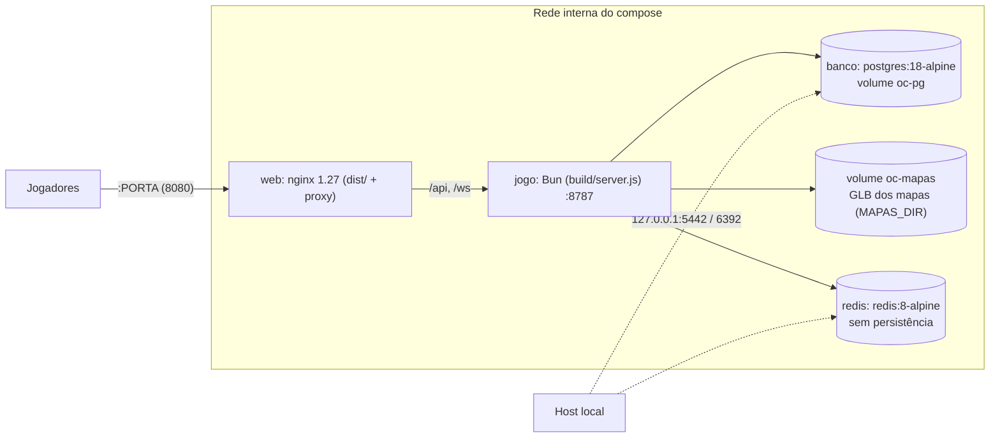

# Infrastructure Overview

O jogo roda no navegador; quem hospeda roda **quatro peças**: nginx, servidor do jogo (Bun), PostgreSQL e Redis. O projeto é pensado para ser hospedado por um jogador no próprio PC (Docker Desktop + Radmin/túnel) ou numa VPS. Não há nuvem gerenciada, Kubernetes nem CDN.

## Topologia com Docker (padrão)

| Serviço compose | Imagem | Exposição | Observações |
| --- | --- | --- | --- |
| `web` | `Dockerfile` alvo `web` (nginx 1.27-alpine) | `${PORTA:-8080}:80` — única porta pública | Serve `dist/`, repassa `/api` e `/ws`. |
| `jogo` | `Dockerfile` alvo `server` (oven/bun:1.4-alpine) | só `expose 8787` (rede interna) | Usuário `bun`, `NODE_ENV=production`. Depende de `banco` saudável. Volume `oc-mapas` em `/app/dados/mapas` (`MAPAS_DIR`: os GLB enviados para os mapas). A imagem leva também `client/`, `shared/`, `tools/headless.ts`, `server/mapWorker.ts` e `tsconfig.json`: a thread que monta os mapas ao salvar roda do código-fonte. |
| `banco` | `postgres:18-alpine` | `127.0.0.1:${PG_PORTA:-5442}` | Volume `oc-pg`; healthcheck `pg_isready`. |
| `redis` | `redis:8-alpine` | `127.0.0.1:${REDIS_PORTA:-6392}` | `--save '' --appendonly no`: nada sobrevive a reinício (por decisão). |

## Topologia sem Docker (VPS Linux)

- `deploy/offensive-combat.service` (systemd): `bun build/server.js` em `/var/www/offensive-combat`, `HOST=127.0.0.1 PORT=8787`, usuário `www-data`, `Restart=on-failure`, `NoNewPrivileges=true`.
- `deploy/nginx/offensive-combat.conf`: mesmo conteúdo do nginx do Docker, com `root /var/www/offensive-combat/dist` e linhas de `certbot` para HTTPS.
- PostgreSQL 18 e Redis próprios (ou os do compose) via `DATABASE_URL` e `REDIS_URL`.

## Modo "porta única"

`bun run build && bun start` sobe o servidor em `:8787` servindo **também** `dist/` (função `staticFile` em `server/app.ts`), sem nginx. Útil para teste local de produção.

## Notas desta área

- [[Environments]] — quais ambientes existem.
- [[Local Development]] — como rodar em desenvolvimento.
- [[Build Pipeline]] — typecheck, Vite, `bun build`, Docker multi-stage.
- [[CI CD]] — GitHub Actions (só CI).
- [[Hosting]] — nginx, formas de expor, HTTPS.
- [[Monitoring]] — o que existe (pouco).
- [[Logging]] — logs no console.
- [[Troubleshooting]] — problemas comuns.

Decisão: [[ADR - nginx na frente do servidor do jogo com Docker Compose]].

## Código relacionado

- `Dockerfile`, `docker-compose.yml`, `.dockerignore`
- `deploy/nginx/docker.conf`, `deploy/nginx/offensive-combat.conf`, `deploy/offensive-combat.service`
- `tools/offensive.ts` (comando `offensive`)
- `docs/DEPLOY.md`
