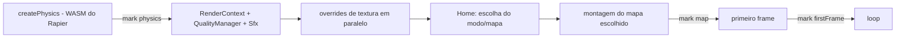

# Loading Performance

## Sequência de boot (`client/main.ts`)

- O tempo de cada etapa é registrado em `boot` (`mark('physics')`, `mark('map')`, `mark('firstFrame')`) e `mapBuildMs`; ambos aparecem em `__oc.perf()` (dev) e o tempo do mapa no F3.
- **O mapa só é montado depois da escolha na home** (README: "O mapa só é montado depois da escolha"), então a tela inicial não paga o custo dos três mapas.
- O carregamento das texturas substitutas (`loadTextureOverrides`) roda em paralelo com a montagem do mapa (`Promise.all`).
- Mensagens WebSocket que chegam durante a montagem são retidas (`conn.hold()`/`release()`) e despachadas depois que todos os handlers existem.

## Otimizações

### Texturas KTX2 (Basis)

- **Problema:** texturas PNG/JPG grandes ocupam banda e VRAM descomprimidas.
- **Solução:** `KTX2Loader` com transcoder em `public/basis/` (`basis_transcoder.js` + `.wasm`) é usado pelo carregador glTF (`gltfMap.ts`) e pelas superfícies (`surfaces.ts`, carregado sob demanda). Formatos aceitos de fato dependem do que existir em `public/textures/manifest.json` (hoje só o leia-me: todas as texturas são procedurais — ver [[Procedural Textures]]).
- **Métrica:** não registrada.

### Compressão e cache HTTP

- **Problema:** bundle JavaScript grande.
- **Solução:** `gzip` no nginx (JS, CSS, JSON, WASM, glTF, SVG); `docs/DEPLOY.md`: "o JavaScript de ~5 MB vai com ~1,8 MB". `/assets/` com cache de 1 ano (`immutable`), `.glb`/`.ktx2` com 1 h, `index.html` sempre revalidado.
- **Trade-off:** o primeiro acesso ainda baixa o bundle inteiro; não há code splitting (`chunkSizeWarningLimit: 6000` só silencia o aviso). Ver [[Problem - Bundle JavaScript único de ~5 MB]].
- **Como medir novamente:** DevTools → Network (tamanho transferido e tempo) e `__oc.perf().boot`.

### Geometria procedural em vez de downloads

Mapas, personagens e texturas são majoritariamente **gerados por código** no cliente (só alguns `.glb` em `public/`). Isso troca bytes de download por CPU na montagem (`mapBuildMs`). Não há medição comparativa.

## Custos conhecidos na carga

- Inicialização do WASM do Rapier.
- Montagem do mapa (fusão de lotes, colisores) — medido em `mapBuildMs`.
- Contra bots: geração da malha de navegação (recast-navigation) a partir dos colisores na hora (README "Bots"). Ver [[Navigation]].
- Personagens: bake de 3 LODs por aparência.

## Código relacionado

- `client/main.ts` (`boot`, `mark`, `mapBuildMs`), `client/net/connection.ts` (`hold`/`release`)
- `client/world/gltfMap.ts`, `client/world/surfaces.ts`, `public/basis/`
- `vite.config.ts`, `deploy/nginx/docker.conf`, `docs/DEPLOY.md`

Ver também: [[Asset Pipeline]], [[Texture System]].
