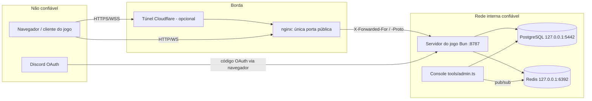

# Trust Boundaries

Onde os dados passam de "não confiável" para "confiável", e o que é checado em cada fronteira.

## Diagrama

## Fronteiras

### 1. Navegador → servidor (HTTP `/api`)
- Tudo que vem do navegador é não confiável: corpo JSON, cookies, cabeçalhos.
- Checagens: `Origin` em métodos que mudam estado; cookie de sessão validado contra o hash no banco; banimento ativo; corpo ≤ 16 KiB; validação de campo. Ver [[Validation]] e [[Authentication]].

### 2. Navegador → servidor (WebSocket `/ws`)
- O handshake só aceita: `Upgrade: websocket`, `Origin` permitido, ticket válido de uso único, conta `active` e não banida.
- Depois do handshake, **a identidade é fixa** (vem do ticket); nada do que o cliente envia altera nome, conta ou aparência.
- Cada mensagem de jogo é **relatório do cliente**: checada em `Session.handle` ([[Anti Cheat]]). Dados confiados hoje: posição (`state`), ponto de respawn, região do acerto, `behind` da facada, posição de explosão de granada com pavio.

### 3. Proxy → servidor (cabeçalhos encaminhados)
- `X-Forwarded-For` só é usado se a conexão direta veio de **endereço privado/loopback** (nginx, Vite); pega o **último** endereço (o que o nginx anexou). Caso contrário, usa o IP da conexão (`clientIp`).
- `X-Forwarded-Proto` decide se o cookie recebe `Secure` e o esquema da origem pública (`publicOrigin`, usado em links de e-mail e no retorno do Discord).
- `Host` é usado na checagem de `Origin` (mesmo host = permitido) e para montar a origem pública.

> [!warning]
> Inferência: se o servidor do jogo for exposto diretamente (sem nginx), um cliente pode enviar `X-Forwarded-Proto: https` e um `Host` arbitrário, afetando a flag `Secure` e o link de redefinição de senha. O deploy documentado expõe só o nginx (`HOST=127.0.0.1` ou rede interna do Docker), que sobrescreve esses cabeçalhos.

### 4. Discord → servidor
- Fluxo Authorization Code com **PKCE** e `state` aleatório num cookie `oc_oauth` (10 min, `Path=/api/auth/discord`).
- A identidade é o **id imutável** do usuário Discord, nunca o e-mail. Vincular a uma conta existente só com o usuário já logado.
- URLs de retorno precisam constar em `DISCORD_RETORNOS`. Ver [[External Services]].

### 5. Servidor → banco e Redis
- Internos e confiáveis; publicados só em `127.0.0.1` no Docker. Consultas parametrizadas.
- Quem tem acesso ao banco/Redis tem poder total (é o modelo do console de moderação).

### 6. Console de administração
- `tools/admin.ts` roda no servidor (`docker compose exec jogo ...`) e fala direto com banco e Redis. Não há API de moderação nem checagem de papel: o controle de acesso é o acesso ao servidor. Ver [[Moderation]].

## Exposição de rede (produção)

| Serviço | Exposição | Fonte |
|---|---|---|
| nginx (`web`) | porta pública `${PORTA:-8080}` | `docker-compose.yml` |
| Servidor do jogo (`jogo`) | só rede interna (`expose: 8787`) ou `HOST=127.0.0.1` | `docker-compose.yml`, `server/index.ts` |
| PostgreSQL | `127.0.0.1:${PG_PORTA:-5442}` | `docker-compose.yml` |
| Redis | `127.0.0.1:${REDIS_PORTA:-6392}` | `docker-compose.yml` |

Em desenvolvimento (`bun run server`), o servidor escuta em `0.0.0.0` por padrão e o Vite faz proxy com `xfwd` (amigos na LAN acessam a porta 5173). Ver [[Local Development]].

## Código relacionado

- `server/http.ts` — `originAllowed`, `clientIp`, `isHttps`, `publicOrigin`, `PRIVATE`.
- `server/app.ts` — `upgrade()`, `setPeer`.
- `server/auth/discord.ts`, `deploy/nginx/*.conf`, `docker-compose.yml`, `vite.config.ts`.
- Ver também [[Security Overview]], [[Client Server Model]], [[Infrastructure Overview]].
