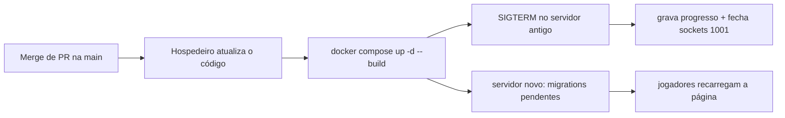

# Updates

Como uma nova versão chega aos jogadores e o que acontece com quem está jogando.

## Fluxo de atualização

1. **Código:** tudo entra por merge de PR na `main` (histórico em [[Release Notes - Histórico]]); CI roda typecheck e testes no PR ([[CI CD]]).
2. **Publicação:** manual no host — `docker compose up -d --build` (ou `offensive`). Sem CD.
3. **Desligamento gracioso:** `server/index.ts` trata `SIGTERM`/`SIGINT`: `game.close()` grava o progresso de todos, fecha sockets com `1001` ("servidor reiniciando"); saída forçada após 3 s.
4. **Banco:** na subida, `migrate()` aplica migrations novas, cada uma numa transação (ver [[Data Migrations]]). Não há rollback automático (os `.down.sql` são manuais).
5. **Cliente:** `index.html` com `Cache-Control: no-cache` e `/assets/` com hash e cache de 1 ano — "uma atualização chega a todos no próximo recarregamento" (`docs/DEPLOY.md`).

## Compatibilidade

- Não há verificação de versão entre cliente e servidor: um cliente com página antiga aberta continua usando o protocolo antigo até recarregar. Se o protocolo mudou, o resultado depende de como o servidor trata mensagens desconhecidas (ignoradas no `switch`) — **inferência**.
- Dados salvos têm versionamento pontual: a aparência tem `v` e é convertida de versões antigas (`shared/appearance.ts`, testado em [[Unit Tests]]).

## Versionamento

- `package.json` em `0.1.0`, sem tags git e sem changelog no repositório. As notas de versão deste Vault são reconstruídas do histórico de merges.

## Código relacionado

- `server/index.ts` (sinais), `server/app.ts` (`close`), `server/db.ts` (`migrate`)
- `deploy/nginx/*.conf` (cache), `docs/DEPLOY.md`, `package.json`

Ver também: [[Build Pipeline]], [[Hosting]].
